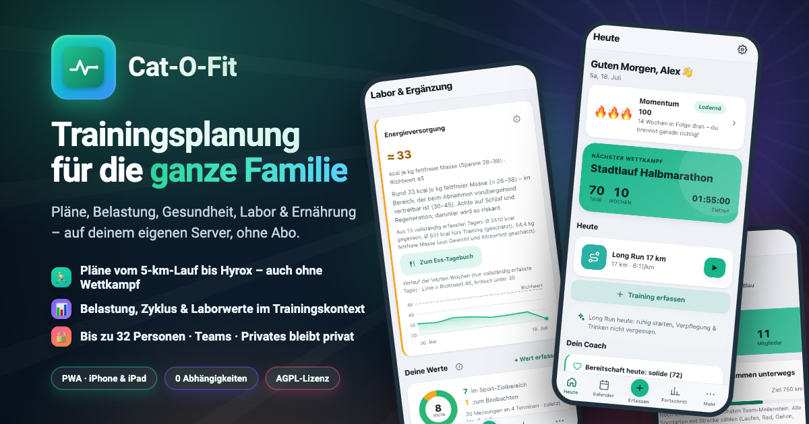
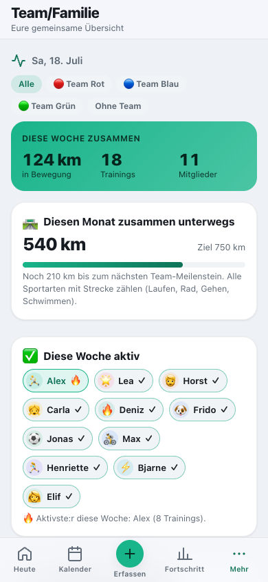
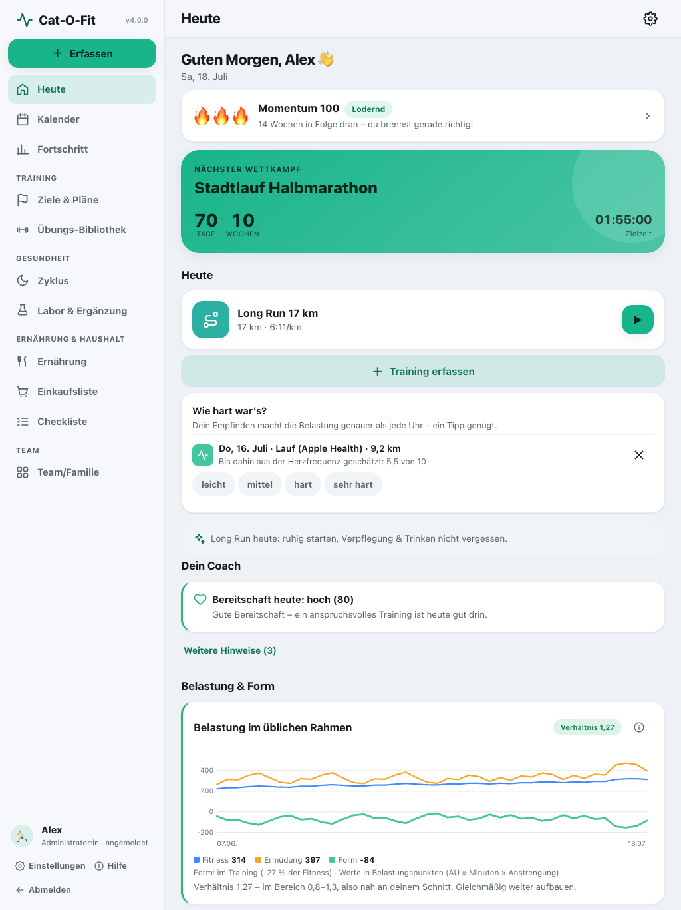
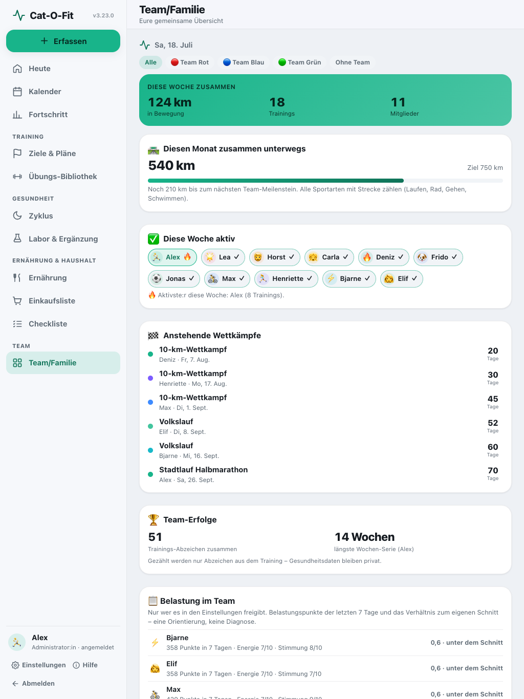

<div align="center">



# Cat-O-Fit

**Cat-O-Fit plant und steuert das Training deiner ganzen Familie** – vom 5-km-Lauf bis zu Hyrox und
Triathlon, mit Ernährung, Zyklus und Laborwerten im Trainingskontext. Ohne Abo, unter AGPL-Lizenz, auf
deinem eigenen Server.

[](https://github.com/Bingerminger/cat-o-fit/actions/workflows/ci.yml)
[](LICENSE)
[](package.json)
[](docs/de/operations/installation.md)
[](manifest.webmanifest)
[](#sprachen)

[English](README.md) · **Deutsch**

**[Demo ausprobieren](https://bingerminger.github.io/cat-o-fit/?lang=de)** – läuft im Browser, nichts wird gespeichert.

</div>

## Sprachen

Die App spricht **Deutsch, English, Français, Español, Italiano, Português (Brasil) und Nederlands**.
Sie startet in der Sprache deines Browsers, und jede Person in der Familie wählt in den Einstellungen
ihre eigene. Kalenderdateien und importierte Trainings folgen der Sprache der Person. Die Doku gibt es
auf [Deutsch](docs/de/README.md) und [Englisch](docs/README.md).

Französisch, Spanisch, Italienisch, Portugiesisch und Niederländisch sind maschinell übersetzt und gegen
die App geprüft, aber noch nicht von Muttersprachlern gegengelesen – Korrekturen sind sehr willkommen
([so hilfst du](CONTRIBUTING.md#translations)). Die Ansagen im Workout sind in jeder Sprache
aufgenommene Clips, gesprochen von freien synthetischen Stimmen ([Nachweise](CREDITS.md#voice-clips));
die neuen hat noch keine Muttersprachlerin angehört. Einheiten sind metrisch (imperiale sind geplant).

## Warum Cat-O-Fit?

- **Pläne, die passen.** Periodisierte Wettkampfpläne vom 5-km-Lauf bis zum Marathon (Triathlon und
  Hyrox als Beta) oder Programme ganz ohne Wettkampf – eingerichtet nach Niveau und Lauftagen, Umfang ab
  deinem aktuellen Stand, Renntempo aus deiner Zielzeit, ab heute neu berechenbar, ohne die
  Vergangenheit anzufassen. Vereinstraining und Spiele sind feste Termine, um die sich der Plan legt.
  Zu Kraft- und Mobility-Einheiten gibt es über 90 animierte Übungen zum Mitmachen im richtigen Takt –
  oder die ganze Einheit am Stück wie ein Video, mit Musik im Takt und Ansagen.
- **Belastung, die man versteht.** Belastungspunkte (Minuten × Anstrengung) über alle Sportarten,
  Lastverhältnis, Fitness/Ermüdung/Form – und **eine** Tagesempfehlung mit „Warum?“. Ohne
  Schutzversprechen, mit Rückgängig.
- **Für die ganze Familie.** Bis zu 32 Personen mit eigenen Zielen und Plänen, Teams, ein gemeinsames
  Dashboard, Admins planen auch für Kinder. Zyklus, Labor und Ergänzungen bleiben privat – auch am
  Server, der sie nur nach der PIN-Anmeldung der Person herausgibt.
- **Gesundheit im Kontext.** Körperwerte aus Apple Health (automatisch, kostenlos per Kurzbefehl oder per
  Datei) oder Android Health Connect, Aktivitäten aus den Dateien deiner Uhr (GPX, TCX, FIT – auch der
  ganze Garmin- oder Strava-Export), zyklusbewusste Planung, Laborwerte gegen den Bereich **deines** Labors plus einen
  sportlichen Zielkorridor und eine Einschätzung der Energieversorgung.
- **Die Küche gehört dazu.** Rezepte, Kalorienbilanz, Ess-Tagebuch mit Strichcode-Suche und eine
  gemeinsame Einkaufsliste mit Vorrat.
- **Wirklich deins.** JSON-Dateien auf deinem Server, Export als Tabelle, offline-fähig auf jedem
  Gerät, keine Abhängigkeiten, kein Build-Schritt, keine Datenbank, über 850 automatisierte Tests,
  AGPL-3.0-or-later.

<p align="center">
  
  
  
  
</p>
<p align="center">
  
  
</p>

> **Zweckbestimmung:** Cat-O-Fit dient der **Dokumentation und allgemeinen Information für gesunde
> Erwachsene**. Es ist **kein Medizinprodukt** und stellt keine Diagnose; Hinweise zu Laborwerten,
> Energieversorgung oder Ergänzung ersetzen keine ärztliche Beurteilung.

## Schnellstart

**Docker** (am schnellsten):

```bash
docker run -d --name cat-o-fit -p 8080:80 \
  -v cat-o-fit-data:/var/www/html/data \
  -e TZ=Europe/Berlin \
  ghcr.io/bingerminger/cat-o-fit:latest
```

Dann **http://localhost:8080** öffnen – die Ersteinrichtung legt die Admin-Person mit eigener PIN an
und lädt auf Wunsch eine Beispiel-Familie. **Synology** (Container Manager oder Web Station) und jeder
andere PHP-Host: Schritt für Schritt unter [Installation](docs/de/operations/installation.md).

> ⚠️ **Sicherheit:** Cat-O-Fit ist für das eigene, vertrauenswürdige Netz gebaut. Die PIN schützt die
> Profile und die privaten Bereiche; alles andere (Trainings, Pläne, Körperwerte) kann jedes Gerät
> lesen, das den Server erreicht. Aus dem Internet nur mit Anmeldung davor (VPN, Reverse-Proxy mit
> Anmeldung oder die eingebaute Basic-Auth) und HTTPS – siehe
> [Betrieb außerhalb des Heimnetzes](docs/de/operations/installation.md#betrieb-außerhalb-des-heimnetzes).
>
> 💾 **Sicherung:** Den Server-Ordner `data/` nach der 3-2-1-Regel sichern – das Vollbackup in der App
> lässt die privaten Bereiche bewusst aus und ersetzt das nicht ([Backup](docs/de/operations/backup.md)).

**Anforderungen:** Docker (amd64/arm64) oder PHP ab 8.1 mit Schreibrechten auf `data/`; ein aktuelles
Safari (iPhone/iPad), Chrome, Edge oder Firefox. Aufs iPhone: Safari → Teilen → „Zum Home-Bildschirm“.

## Cat-O-Fit im Vergleich

Selbst gehostete Projekte und bekannte Apps nebeneinander – Stand 30. September 2026 (openGym und
die Zeile Krafttraining: 3. Oktober 2026), aus der Dokumentation, den Preisseiten und den Store-Einträgen der Anbieter selbst.

| | <sub>**Cat-O-Fit**</sub> | <sub>Sparky&shy;Fitness</sub> | <sub>wger</sub> | <sub>Fit&shy;Trackee</sub> | <sub>openGym</sub> | <sub>Garmin Connect</sub> | <sub>Strava + Runna</sub> | <sub>MyFitness&shy;Pal</sub> |
| --- | :---: | :---: | :---: | :---: | :---: | :---: | :---: | :---: |
| <sub>Selbst gehostet, deine Daten bleiben bei dir</sub> | <sub>⭐ ohne Daten&shy;bank</sub> | <sub>✅</sub> | <sub>✅</sub> | <sub>✅</sub> | <sub>✅ ohne Daten&shy;bank</sub> | <sub>❌</sub> | <sub>❌</sub> | <sub>❌</sub> |
| <sub>Open Source (OSI-anerkannte Lizenz)</sub> | <sub>✅ AGPL</sub> | <sub>❌</sub> | <sub>✅ AGPL</sub> | <sub>✅ AGPL</sub> | <sub>✅ AGPL</sub> | <sub>❌</sub> | <sub>❌</sub> | <sub>❌</sub> |
| <sub>Ohne Abo, ohne Werbung</sub> | <sub>✅</sub> | <sub>✅</sub> | <sub>✅</sub> | <sub>✅</sub> | <sub>✅</sub> | <sub>🟡</sub> | <sub>🟡</sub> | <sub>🟡 Werbung</sub> |
| <sub>Wettkampf&shy;pläne, die sich anpassen</sub> | <sub>⭐</sub> | <sub>❌</sub> | <sub>❌</sub> | <sub>❌</sub> | <sub>❌</sub> | <sub>✅ mit Uhr</sub> | <sub>💰 Runna</sub> | <sub>❌</sub> |
| <sub>Krafttraining: Übungs&shy;bibliothek, Sätze, Steige&shy;rung</sub> | <sub>✅ animiert, mit Musik</sub> | <sub>✅ geführt + Steige&shy;rung</sub> | <sub>✅ Steige&shy;rung</sub> | <sub>❌</sub> | <sub>⭐ größte Biblio&shy;thek</sub> | <sub>✅ mit Uhr</sub> | <sub>💰 Runna</sub> | <sub>🟡 nur Protokoll</sub> |
| <sub>Belastungs&shy;steuerung mit einer Tages&shy;empfehlung</sub> | <sub>⭐ alle Sport&shy;arten</sub> | <sub>🟡 von der Uhr</sub> | <sub>❌</sub> | <sub>❌</sub> | <sub>🟡 Muskel&shy;karte</sub> | <sub>✅ mit Uhr</sub> | <sub>💰</sub> | <sub>❌</sub> |
| <sub>Familie und Teams: Rollen, für andere planen, gemeinsames Dashboard</sub> | <sub>⭐ bis zu 32 Personen</sub> | <sub>✅ 7 Rechte</sub> | <sub>🟡 Trainer im Studio</sub> | <sub>🟡 Follower</sub> | <sub>🟡 Profile + Admin-Ansicht</sub> | <sub>🟡 Garmin Jr.</sub> | <sub>🟡 Familien&shy;abo</sub> | <sub>🟡 Tagebuch teilen</sub> |
| <sub>Zyklus&shy;bewusstes Training</sub> | <sub>✅</sub> | <sub>🟡 Erfas&shy;sung + Tipps</sub> | <sub>❌</sub> | <sub>❌</sub> | <sub>❌</sub> | <sub>🟡 Erfas&shy;sung + Tipps</sub> | <sub>❌</sub> | <sub>❌</sub> |
| <sub>Laborwerte gegen den Referenz&shy;bereich deines Labors</sub> | <sub>⭐</sub> | <sub>🟡 freie Mess&shy;werte</sub> | <sub>🟡 freie Mess&shy;werte</sub> | <sub>❌</sub> | <sub>❌</sub> | <sub>❌</sub> | <sub>❌</sub> | <sub>❌</sub> |
| <sub>Ess-Tagebuch mit Strichcode-Suche und Rezepten</sub> | <sub>✅</sub> | <sub>⭐ 8 Quellen</sub> | <sub>🟡</sub> | <sub>❌</sub> | <sub>❌</sub> | <sub>💰 Connect+</sub> | <sub>❌</sub> | <sub>🟡 Strichcode im Abo</sub> |
| <sub>Gemein&shy;same Einkaufs&shy;liste mit Vorrat</sub> | <sub>⭐</sub> | <sub>❌</sub> | <sub>❌</sub> | <sub>❌</sub> | <sub>❌</sub> | <sub>❌</sub> | <sub>❌</sub> | <sub>💰 nicht in Deutsch&shy;land</sub> |
| <sub>Daten von Uhr und Gesundheits-Apps</sub> | <sub>✅ per Import</sub> | <sub>⭐ 8+ Dienste</sub> | <sub>🟡</sub> | <sub>🟡 Dateien</sub> | <sub>🟡 Gewicht aus Apple Health</sub> | <sub>✅</sub> | <sub>✅</sub> | <sub>✅</sub> |
| <sub>Funktioniert offline</sub> | <sub>✅</sub> | <sub>❌</sub> | <sub>✅ App</sub> | <sub>❌</sub> | <sub>✅</sub> | <sub>✅</sub> | <sub>✅</sub> | <sub>🟡</sub> |
| <sub>Native Apps für iPhone und Android</sub> | <sub>🟡 Web-App (PWA)</sub> | <sub>✅</sub> | <sub>✅</sub> | <sub>❌</sub> | <sub>🟡 Android-APK</sub> | <sub>✅</sub> | <sub>✅</sub> | <sub>✅</sub> |

⭐ herausragend &nbsp;•&nbsp; ✅ ja &nbsp;•&nbsp; 🟡 teilweise &nbsp;•&nbsp; 💰 nur im Bezahl-Abo &nbsp;•&nbsp; ❌ nein

<details>
<summary>Anmerkungen und Quellen</summary>

- **Cat-O-Fit** läuft auf einfachem PHP-Webspace (etwa der Web Station eines NAS) oder in Docker und
  speichert JSON-Dateien statt einer Datenbank. Wettkampfpläne reichen vom 5-km-Lauf bis zum Marathon;
  Triathlon und Hyrox sind Beta. Daten von der Uhr kommen über Apple Health (automatisch per kostenlosem
  Kurzbefehl), Android Health Connect (über eine Brücken-App) sowie GPX-, TCX- und FIT-Dateien oder den
  ganzen Garmin- bzw. Strava-Export – eine direkte Verbindung zur Garmin- oder Strava-Cloud gibt es
  nicht. Die App ist eine installierbare Web-App, keine App aus dem Store. Krafttraining: 93 animierte
  Übungen, Sätze mit Wiederholungen und Gewicht samt Hinweis für den nächsten Schritt, und ganze
  Einheiten, die mit Musik im Takt und Ansagen von selbst durchlaufen.
- **Freie Messwerte** heißt: selbst benannte Messgrößen ohne Referenzbereich.
- **SparkyFitness** nennt seine Lizenz selbst „source-available, not open source“; kommerzielle Nutzung
  nur mit Erlaubnis. Bereitschaft und Belastung übernimmt es von Garmin, Polar oder Oura; die
  Familienfreigabe ist Beta. Der Zyklusbereich erfasst die Periode und zeigt allgemeine Tipps je Phase,
  Trainingspläne berücksichtigen den Zyklus nicht. Laut eigener Doku gibt es keine Einkaufslisten und
  mobil kein Erfassen ohne Verbindung. Beim Krafttraining gibt es eine Übungsbibliothek (Free Exercise
  DB, wger), Vorlagen, Steigerung je Satz, angepasste Gewichtsvorschläge, geführte Workouts mit Ansage
  und Intervallformate wie Tabata, EMOM und AMRAP.
  [Lizenz](https://github.com/CodeWithCJ/SparkyFitness/blob/main/LICENSE) ·
  [README](https://github.com/CodeWithCJ/SparkyFitness) ·
  [eigene Vergleichsseite](https://codewithcj.github.io/SparkyFitness/features/comparison) ·
  [Familienfreigabe](https://github.com/CodeWithCJ/SparkyFitness/blob/main/docs/src/features/family-friends-sharing.md) ·
  [Zyklus](https://github.com/CodeWithCJ/SparkyFitness/blob/main/docs/src/features/cycle-hub/index.md) ·
  [geführte Workouts](https://github.com/CodeWithCJ/SparkyFitness/blob/main/docs/src/features/exercises/guided-workouts.md) ·
  [Steigerung](https://github.com/CodeWithCJ/SparkyFitness/blob/main/docs/src/features/exercises/progression-and-per-set-ramp.md)
- **wger** hat Kraft-Routinen mit Steigerung, aber keine Wettkampfpläne; Trainer im Studio-Modul sehen
  ihre Mitglieder. Ernährungspläne und Tagebuch nutzen Open Food Facts, in der App mit Strichcode-Scan;
  Rezepte gibt es nur als Planmahlzeiten. Import aus Apple Health und Health Connect seit 2.7,
  Offline-Modus in der App seit 2.6.
  [README](https://github.com/wger-project/wger) ·
  [Studio-Modul](https://github.com/wger-project/docs/blob/master/docs/administration/gym.rst) ·
  [2.6](https://github.com/wger-project/wger/releases/tag/2.6) ·
  [2.7](https://github.com/wger-project/wger/releases/tag/2.7)
- **FitTrackee** erfasst Aktivitäten mit Karten aus GPX-, FIT-, TCX- und KML-Dateien; keine eingebaute
  Anbindung, keine offizielle App. Mehrere Personen teilen sich eine Instanz und folgen einander, mit
  Sichtbarkeit je Training. Die 29 Sportarten sind Ausdauer- und Outdoorsport – Krafttraining gehört
  nicht dazu.
  [Funktionen](https://docs.fittrackee.org/en/features/index.html) ·
  [Werkzeuge Dritter](https://docs.fittrackee.org/en/third_party_tools.html) ·
  [Sportarten](https://docs.fittrackee.org/en/features/workout.html)
- **openGym** ist ein Krafttraining-Tagebuch, kein Wettkampfplaner, und beim Krafttraining hier das
  stärkste: Übungsbibliothek mit 1.324 Einträgen und animierten Vorführungen, Steigerungsregeln von
  linear bis Doppelprogression, geschätztes 1RM, Muskelkarte für Balance, Ermüdung und Kraft, Import aus
  FitNotes, Strong und Hevy. Es speichert JSON-Dateien ohne
  Datenbankserver und läuft mit Docker Compose; Profile für Freunde und Familie melden sich per Passkey
  an, ein optionales Admin-Dashboard zeigt, wer gerade trainiert. Das Körpergewicht lässt sich aus einem
  Apple-Health-Export übernehmen. Für Android gibt es eine App zum Selbstinstallieren (nicht im Play
  Store), auf dem iPhone die installierbare Web-App. Bilder und Animationen der Übungen sind Inhalte
  Dritter, die jede Instanz beim ersten Start lädt.
  [README](https://github.com/DuarteSantos8/openGym) ·
  [Lizenz](https://github.com/DuarteSantos8/openGym/blob/main/LICENSE) ·
  [Mobil](https://github.com/DuarteSantos8/openGym/blob/main/docs/MOBILE.md)
- **Garmin Connect** ist mit einem Garmin-Gerät kostenlos; Garmin-Coach-Pläne und Belastungswerte
  brauchen eine passende Uhr. Ernährung (seit Januar 2026) und KI-Auswertungen gibt es nur mit Connect+.
  Die Zykluserfassung gibt Tipps je Phase, die Pläne passen sich nicht daran an. Eltern verwalten die
  Garmin-Geräte ihrer Kinder in der eigenen App Garmin Jr. Eigene Workouts – auch Krafttraining –
  entstehen in Connect und gehen auf die Uhr.
  [Connect+](https://www.garmin.com/de-DE/p/1565777) ·
  [Garmin Jr.](https://apps.apple.com/us/app/id1122225740) ·
  [Garmin Coach](https://www.garmin.com/en-US/garmin-coach/overview/) ·
  [Belastung](https://www.garmin.com/en-US/garmin-technology/running-science/physiological-measurements/training-load/) ·
  [Zyklus](https://www.garmin.com/en-US/garmin-technology/health-science/womens-health/) ·
  [Ernährung](https://www.garmin.com/en-US/newsroom/press-release/sports-fitness/stay-on-top-of-nutrition-goals-in-garmin-connect/) ·
  [App](https://apps.apple.com/us/app/garmin-connect/id583446403)
- **Strava + Runna:** Die kostenlose Strava-Stufe zeichnet Aktivitäten auf; Relative Effort und Fitness
  & Freshness brauchen ein Abo. Laufpläne kommen von Runna, das keine kostenlose Stufe hat (auch im
  Paket mit Strava). Runna baut auch Kraft- und Mobility-Pläne für Läufer:innen. Das Strava-Familienabo
  teilt ein Abo auf vier Konten.
  [Preise](https://www.strava.com/pricing) ·
  [Trainingspläne](https://support.strava.com/en-us/articles/15401942-training-plans-for-runners) ·
  [Fitness & Freshness](https://support.strava.com/en-us/articles/15402032-how-fitness-freshness-is-calculated) ·
  [Familienabo](https://support.strava.com/en-us/articles/15401631-what-is-strava-s-family-plan) ·
  [Runna-Preise](https://www.runna.com/pricing) ·
  [Runna-Kraft](https://www.runna.com/)
- **MyFitnessPal** zeigt in der kostenlosen Stufe Werbung; Strichcode-Scan und CSV-Export gibt es nur mit
  Premium. Der Essensplaner mit Einkaufsliste und Vorratsabgleich gehört zu Premium+ und wird nur in
  einigen englischsprachigen Ländern angeboten. Workouts werden für den Kalorienverbrauch erfasst. Das
  Tagebuch lässt sich mit Freunden oder Trainern
  teilen; offline Erfasstes wird später abgeglichen, die Lebensmittelsuche braucht eine Verbindung.
  [Premium](https://www.myfitnesspal.com/premium) ·
  [Strichcode](https://support.myfitnesspal.com/hc/en-us/articles/360032624771) ·
  [Essensplaner](https://support.myfitnesspal.com/hc/en-us/articles/34603055097869) ·
  [Tagebuch teilen](https://support.myfitnesspal.com/hc/en-us/articles/360032623371) ·
  [offline](https://support.myfitnesspal.com/hc/en-us/articles/360032622851)

Etwas veraltet? Bitte [ein Issue anlegen](https://github.com/Bingerminger/cat-o-fit/issues).

</details>

## Wann passt Cat-O-Fit – und wann nicht?

| Du willst … | Schau dir an |
|---|---|
| periodisierte Pläne und Belastungssteuerung für mehrere Personen, selbst gehostet, quelloffen (AGPL) | **Cat-O-Fit** |
| native Apps und automatische Anbindung vieler Uhren und Ringe, KI-Funktionen | [SparkyFitness](https://github.com/CodeWithCJ/SparkyFitness) (familienorientiert; die Lizenz ist laut dessen README quelloffen einsehbar, aber nur nicht-kommerziell nutzbar) |
| einen Trainings- und Ernährungsmanager in vielen Sprachen | [wger](https://github.com/wger-project/wger) |
| GPS-Aufzeichnungen mit Karten | [FitTrackee](https://github.com/SamR1/FitTrackee) |
| tiefe Leistungs- und Herzfrequenz-Analysen als Online-Dienst | [intervals.icu](https://intervals.icu) |

## Dokumentation

Alles auf einen Blick: **[Dokumentation](docs/de/README.md)** – nach Zielgruppen sortiert.

- **Nutzen:** [Erste Schritte](docs/de/usage/getting-started.md) · [Training](docs/de/usage/training.md) ·
  [Coach & Belastung](docs/de/usage/coach-and-load.md) · [Gesundheit](docs/de/usage/health.md) ·
  [Labor](docs/de/usage/labs.md) · [Ernährung](docs/de/usage/nutrition.md) ·
  [Team & Familie](docs/de/usage/family.md) · [Apple Health](docs/de/usage/apple-health.md) ·
  [Häufige Fragen](docs/de/usage/faq.md)
- **Verstehen:** [Trainingswissen](docs/de/knowledge/training-science.md) ·
  [Methodik & Quellen](docs/de/knowledge/methods-and-sources.md)
- **Betreiben:** [Installation](docs/de/operations/installation.md) · [Update](docs/de/operations/update.md) ·
  [Backup](docs/de/operations/backup.md) · [Datenschutz](docs/de/operations/privacy.md) ·
  [Fehlersuche](docs/de/operations/troubleshooting.md)
- **Mitentwickeln** (englisch, wie Code und Commits): [Architecture](docs/ARCHITECTURE.md) ·
  [Development](docs/DEVELOPMENT.md) · [Contributing](CONTRIBUTING.md) · [API](docs/API.md) ·
  [Changelog](CHANGELOG.md) · [Roadmap](docs/ROADMAP.md)
- **In der App:** Mehr → Hilfe & Wissen, dazu das ⓘ neben jeder Kennzahl.

## Datenschutz und externe Dienste

Kein Konto, kein Tracking. Nach außen gehen nur zwei abschaltbare Dienste: die **Wetterabfrage bei
Open-Meteo** (vom Gerät, mit Ort bzw. Koordinaten; die kostenlose Schnittstelle ist nur für
nicht-kommerzielle Nutzung) und die **Nährwertsuche bei Open Food Facts** (vom Server, nur mit dem
Zutatennamen bzw. Strichcode; für neue Profile anfangs aus; Daten unter ODbL). Was wo liegt und wer was lesen kann:
[Datenschutz im Betrieb](docs/de/operations/privacy.md).

## Tests und Qualität

Logik **und** Ansichten sind durch über 850 automatisierte Tests abgesichert – mit dem Node-eigenen
Test-Runner, ohne Abhängigkeiten (`npm test`), dazu PHP-Tests für Speicherung, Schnittstelle,
Health-Import und Kalender. Die Sprachkataloge prüft die Testsuite mit: jeder Schlüssel, jeder
Platzhalter und jede Pluralform in allen sieben Sprachen, dazu Trainingspläne und Rezepte je Sprache. Die CI führt alles bei jedem Push aus; ein Lasttest der PHP-Persistenz ist
in der [Entwicklungsdoku](docs/DEVELOPMENT.md#load-test--performance) beschrieben.

## Open Source – und das ernst gemeint

[GNU AGPL v3.0 oder neuer](LICENSE): nutzen, ändern, weitergeben; wer eine geänderte Fassung als
Dienst im Netz anbietet, legt auch deren Quellcode offen. Kein Open-Core-Modell, keine Pro-Version.
Drittanbieter-Hinweise in [CREDITS.md](CREDITS.md), Markenhinweise in [TRADEMARKS.md](TRADEMARKS.md).
Schwachstellen bitte vertraulich melden ([SECURITY.md](SECURITY.md)); es gilt unser
[Verhaltenskodex](CODE_OF_CONDUCT.md). Fehler und Ideen gern über die
[Issue-Vorlagen](.github/ISSUE_TEMPLATE/).
