<div align="center">

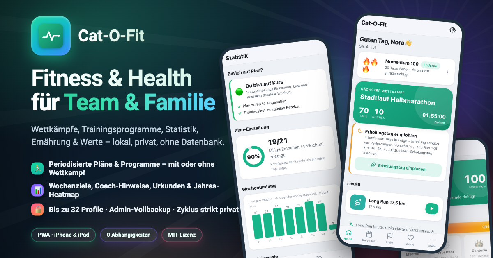

# Cat-O-Fit · Fitness & Health

**Fitness, Health & Training für Team und Familie – lokal, ohne Datenbank, als installierbare PWA.**

[](https://github.com/Bingerminger/cat-o-fit/actions/workflows/ci.yml)
[](LICENSE)
[](package.json)
[](manifest.webmanifest)
[](docker-compose.yml)

</div>

> **English:** Cat-O-Fit is a self-hosted fitness, health & training PWA for teams and
> families (up to 32 people) — periodized race plans, adaptive training-load management,
> strength workouts, nutrition, body metrics and Apple Health import. Vanilla JS plus a
> slim PHP backend: zero dependencies, no build step, no database, no cloud. Runs on any
> PHP host (e.g. Synology Web Station) or via the multi-arch Docker image (amd64/arm64).
> UI and documentation are currently German-only.

Eine **Fitness-, Health- & Trainings-App für Team & Familie** (bis zu 32 Personen, jede mit
eigenen Zielen) – für **Wettkämpfe** (Lauf, Triathlon, Hyrox) **und Trainingsprogramme ganz ohne
Wettkampf** (allgemeine Fitness, Kraft, Abnehmen, Beweglichkeit). Gebaut für den Betrieb auf
**eigener Hardware** – Synology Web Station, jeder PHP-Host oder **Docker** (amd64 & arm64) –
und die primäre Nutzung auf **iPhone & iPad** (auch während des Trainings).
Installierbar als PWA, offline-fähige App-Shell, lokale Daten als JSON (keine Datenbank),
Hintergrund-Sync zwischen den Geräten.

> Vom periodisierten Wettkampfplan über Kraft- und Gesundheitsprogramme bis zu Ernährung,
> Werte-Tracking und Statistik – jede Person im Haushalt mit eigenem Profil, Zyklusdaten strikt privat.

## Schnellstart

Cat-O-Fit läuft **bei dir zu Hause** – nichts landet in einer fremden Cloud. Wähle den
Weg, der zu dir passt; danach führt dich die App selbst durch die Ersteinrichtung.

### Weg 1 · Docker am Mac/PC oder Server (am schnellsten)

Voraussetzung: [Docker Desktop](https://www.docker.com/products/docker-desktop/)
(Mac/Windows) bzw. Docker (Linux) ist installiert. Dann genügt ein Befehl:

```bash
docker run -d --name cat-o-fit -p 8080:80 \
  -v cat-o-fit-data:/var/www/html/data \
  ghcr.io/bingerminger/cat-o-fit:latest
```

Jetzt im Browser **http://localhost:8080** öffnen – fertig. Das Image läuft auf
Intel/AMD **und** Apple Silicon/ARM.

### Weg 2 · Synology NAS per Container Manager (ohne Kommandozeile)

1. Im **Paket-Zentrum** den **Container Manager** installieren (falls noch nicht vorhanden).
2. Container Manager öffnen → **Projekt** → **Erstellen**.
3. Projektname `cat-o-fit`; als Pfad z. B. `/docker/cat-o-fit` anlegen/auswählen.
4. Quelle „**docker-compose.yml erstellen**" wählen und diesen Inhalt einfügen:

   ```yaml
   services:
     cat-o-fit:
       image: ghcr.io/bingerminger/cat-o-fit:latest
       ports:
         - "8080:80"
       volumes:
         - /volume1/docker/cat-o-fit/data:/var/www/html/data
       restart: unless-stopped
   ```

5. **Weiter → Fertig.** Die App läuft nun unter `http://<ip-deiner-synology>:8080`.
   (Ist Port 8080 schon belegt, einfach die erste Zahl ändern, z. B. `8081:80`.)
6. Deine Daten liegen als normale Dateien unter `/volume1/docker/cat-o-fit/data` –
   ideal für die Synology-Datensicherung (z. B. Hyper Backup).

### Weg 3 · Ohne Docker: Webspace oder Synology Web Station

Alle Projektdateien in einen PHP-fähigen Web-Ordner kopieren und dem Webserver
Schreibrechte auf `data/` geben – die ausführliche Klick-Anleitung steht unter
[Einrichtung auf der Synology Web Station](#einrichtung-auf-der-synology-web-station).

### Die ersten 5 Minuten in der App

1. Beim ersten Öffnen startet der **Ersteinrichtungs-Assistent**: Namen eingeben,
   PIN wählen – fertig.
2. Neugierig? **„Mit Demodaten starten"** füllt die App mit einer Beispiel-Familie zum
   Ausprobieren; „App zurücksetzen" (Einstellungen, Admin) macht alles wieder leer.
3. Aufs **iPhone/iPad** holen: Adresse in Safari öffnen → **Teilen → „Zum
   Home-Bildschirm"** – Cat-O-Fit startet dann wie eine echte App im Vollbild.
4. Von unterwegs nutzbar & PWA-Installation: **HTTPS** einrichten (Synology:
   Anwendungsportal → Reverse-Proxy mit Zertifikat).

## 📖 Dokumentation

- **[Benutzerhandbuch](docs/BENUTZERHANDBUCH.md)** – Schritt-für-Schritt-Anleitungen mit
  Screenshots, Beschreibung aller Bereiche und Trainingswissen.
- **In der App:** dieselben Inhalte durchsuchbar unter **Mehr → Hilfe & Wissen**.
- **Für Entwickler:innen:** [Architektur](docs/ARCHITEKTUR.md) · [Entwicklung](docs/ENTWICKLUNG.md) ·
  [Mitwirken](CONTRIBUTING.md)
- **[Changelog](CHANGELOG.md)** · **[Roadmap](docs/ROADMAP.md)**

---

## Was die App kann

- **Ziele: Wettkämpfe *und* Programme** – Zielwettkämpfe (Lauf, Triathlon, Hyrox) mit Countdown,
  Priorität (A/B/C) und Status, **oder** Trainingsprogramme **ohne Wettkampf** (allgemeine Fitness,
  Kraft & Muskelaufbau, Abnehmen & Gewicht, Beweglichkeit & Gesundheit) mit wiederkehrendem Wochenplan.
- **Automatischer Plan**: für Wettkämpfe **periodisiert** (Grundlage → Aufbau → Spitze → Tapering)
  mit Long-Run-Progression, Deload-Wochen und **Zielpaces aus der Zielzeit**; für Programme ein
  wiederkehrender Wochenplan aus Kraft, Cardio, Mobility und zügigem Gehen (3–5 Tage/Woche, 4–12 Wochen).
- **Kalender** (Monat & Woche) mit **Drag & Drop** zum Verschieben von Einheiten (touch-tauglich).
  Jeder Eintrag verlinkt per Deep-Link auf seine Session (`#/session/…`).
- **Session-View** in drei Zuständen: geplant (Soll) · Workout-Modus · Auswertung (Soll-Ist-Vergleich,
  Splits, Zeit-in-HF-Zonen, RPE/Gefühl).
- **Workout-Modus** (Vollbild): große Bedienelemente, Intervall-Engine mit Ton+Vibration,
  Satz-Zähler & Pausentimer fürs Krafttraining, Bildschirm-wach-halten, absturzsichere Zwischenspeicherung.
- **Team & Familie** (bis zu 32 Personen): **Ersteinrichtung** per Assistent (Admin anlegen → Demodaten
  oder leer starten), danach **Anmelde-Dialog** mit Profilauswahl und **PIN-Login** (Pflicht, Standard
  `0000`; kein Auto-Login). Der Menüpunkt **„Team/Familie"** ist die gemeinsame **Übersicht** mit
  Team-Badges: **Monats-km & Meilenstein**, **Wochen-Aktivität** (wer war aktiv + aktivste Person),
  **anstehende Wettkämpfe** aller und **Team-Erfolge**. **Verwaltung & App-Reset** liegen in den
  Einstellungen und sind **nur für Admins** sichtbar – Zyklusdaten bleiben strikt privat.
- **Adaptiver Plan**: Wochen-Ausgleich beim Hinzufügen eigener Einheiten, **automatischer
  Wochenumfang-Ausgleich** (liegen gebliebene km behutsam nachholen), **automatische Progressions-
  steuerung** aus dem RPE-Trend (steigern/halten/lockern), Hinweise beim Verschieben, Woche neu berechnen.
- **Distanzspezifischer Plan**: Schlüsseleinheiten je Wettkampfdistanz – 5 km → kurze, schnelle VO₂max;
  10 km/HM → VO₂max & Schwelle; Marathon → Schwelle & Renntempo.
- **Coach-Hinweise**: Readiness (HRV/Ruhepuls/Schlaf), RPE-Belastung, Formprognose, HF-/Pace-Abgleich.
- **Belastungssteuerung nach Profistandard** (Dashboard-Karte „Belastung & Form"): **ACWR** (7:28-Tage-Ratio,
  Sweet-Spot 0,8–1,3), **Fitness/Ermüdung/Form** (CTL/ATL/TSB nach Banister) und **Monotonie/Strain** (Foster)
  aus der Belastungspunkt-Last (Dauer × RPE) – über alle Sportarten hinweg.
- **Feste Termine**: Fußball-Trainingstage konfigurierbar (Tage, Dauer, **Intensität** leicht/normal/intensiv)
  + **wiederkehrende Spiele mit Startdatum** – der Trainingsplan legt sich darum herum (an einem Spieltag
  entfällt die Trainingseinheit). Fußball zählt ab „normal" als **fordernder Tag** und entlastet den Folgetag.
- **Rollierende Planung**: **automatischer Erholungstag** aus der Belastung (ACWR-Sprung / harte Tage in Folge) –
  bei zwei Zielen wird der **ganze Tag** ruhig gestellt oder eine Einheit **entzerrt**; **zyklusbewusst**
  entschärft der Coach das Training am 1. Periodentag. Alles im **Transparenz-Log** mit **Rückgängig**.
- **Wochen-Check (Ziel-Triage) & What-if**: Kollisionen der Woche transparent priorisiert (feste Termine →
  Schlüssel-Läufe → Kraft → Umfang); vor dem Verschieben/Hinzufügen zeigt die App die Auswirkung auf die Woche.
- **Ziel-Cockpit (zwei Ziele in einem Plan)**: Halbmarathon-Leistung **und** Abnehmen auf einen Blick, mit
  phasenabhängigem Schwerpunkt und Defizit-Empfehlung.
- **Teams**: Mitglieder in Teams gruppieren (auch **mehrere Teams** je Person, Teamwechsel), das Team/Familie-
  Dashboard lässt sich **je Team** auswerten.
- **Übungs-Bibliothek**: 29 Übungen für Kraft, Rumpf & Beweglichkeit mit **symbolhaften Illustrationen**
  (selbst gezeichnet), Schritt-für-Schritt-Anleitung, Muskelgruppen, Suche & Filter – auch **während des
  Workouts** erreichbar.
- **Gesundheits-/Gewichtsziele**: Zielwerte (Gewicht, Körperfett, Ruhepuls, HRV, VO₂max) mit Frist und
  **Fortschrittsbalken** auf „Heute" – ergänzend zu den Wochen-Aktivitätszielen.
- **Körperwerte** (Gewicht, Körperfett, Muskelmasse, Ruhepuls, HRV, VO₂max, Schlaf …) als wertfreie
  Trends mit **Y-Skala**, Zielmarkierung (z. B. 65 kg) und **Scrubber-Tooltip** – Finger/Maus übers
  Diagramm zeigt Datum + Wert. Metriken einzeln abschaltbar.
- **Apple Health – automatischer Import** ([Anleitung](docs/APPLE-HEALTH.md)): Gewicht, Ruhepuls, HRV,
  VO₂max, Schlaf, Schritte, aktive Energie & Workouts fließen **inkrementell** über die App
  „Health Auto Export" (REST-Automation) ein – kein 300-MB-Upload, token-gesichert je Nutzer/Umgebung.
  Zusätzlich weiterhin **manueller Voll-Import** (Export-ZIP/`export.xml`, serverseitiges Streaming) und
  **GPX-/TCX-Einzelimport** (clientseitig) für einzelne Aufzeichnungen aus Garmin/Strava & Co.
- **.ics-Kalenderexport** (serverseitig, RFC 5545) mit VALARM-Erinnerungen für iOS.
- **Statistik**: Ampel „Bin ich auf Plan?", Plan-Einhaltung, Wochenumfang, **Trainingsjahr-Heatmap**
  (GitHub-Stil), Trainingslast, ausgefallene Einheiten nach Grund, Einheiten-Verteilung,
  **Werte & Ziele** (halten/verbessern) und **Wettkampfprognose** (Riegel-Schätzung).
- **Ernährung**: ~48 fertige deutsche **Rezepte** (per „Rezept-Ideen laden") plus eigene Gerichte,
  **Kalorienbilanz** und kcal-/Eiweiß-**Schätzung** aus den Zutaten (kuratierte Nährwerttabelle +
  optional Open Food Facts). Daraus entsteht die **Einkaufsliste** mit gemeinsamem Lager.
- **Tages-Checkliste**, **Zykluskalender** sowie **Erfolge & Momentum** (Badges) – optional, abschaltbar.
- **Sicherung & Recovery**: persönliches **Backup** (JSON, inkl. eigener Zyklusdaten) für alle;
  zusätzlich ein **Admin-Vollbackup** der ganzen Familie (alle Mitglieder, Rollen, Urkunden/Reports)
  mit **autoritativer Wiederherstellung** – ohne private Zyklusdaten, die bleiben beim Mitglied.
- Helles/dunkles Theme, wählbare Akzentfarbe – alles lokal, **ohne Datenbank und ohne Cloud**.

---

## Bildschirmfotos

**iPhone**

<p>
  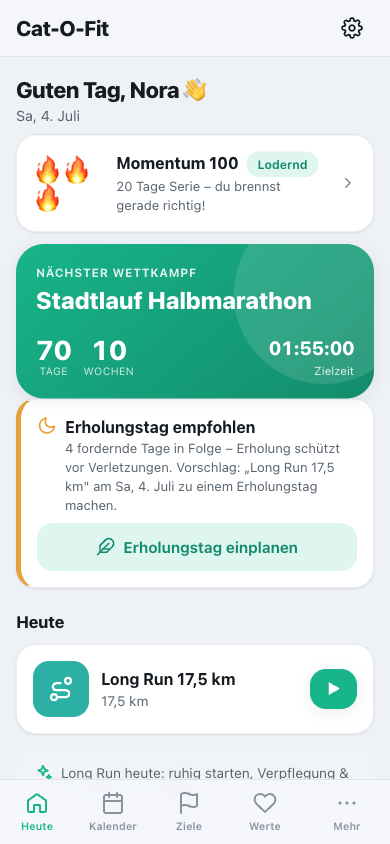
  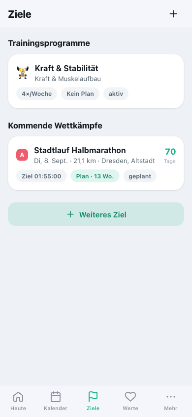
  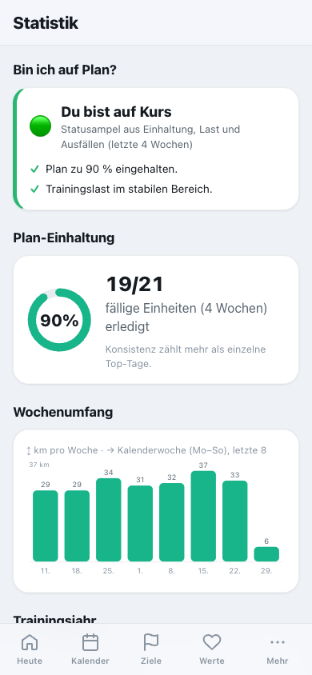
</p>
<p>
  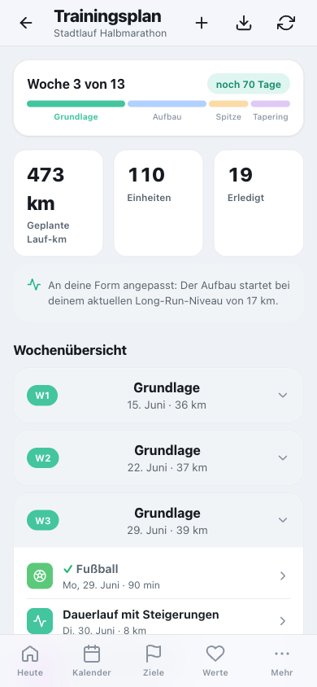
  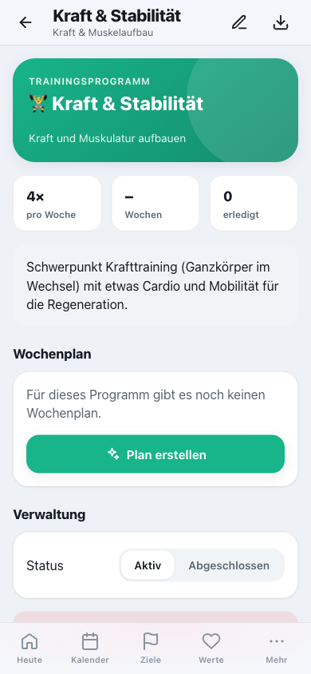
  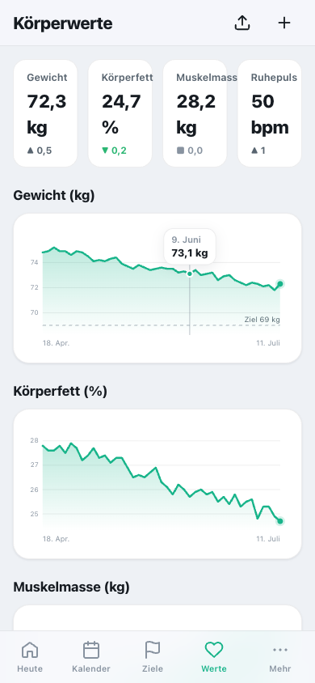
</p>
<p>
  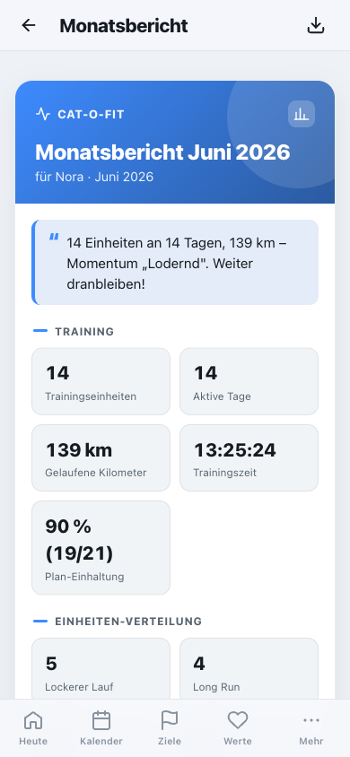
  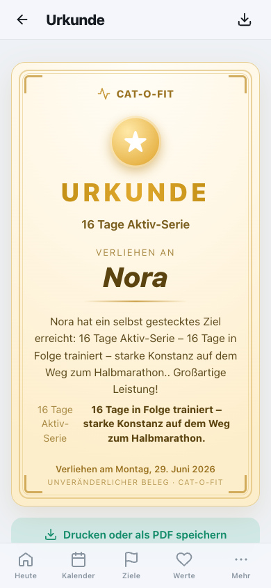
  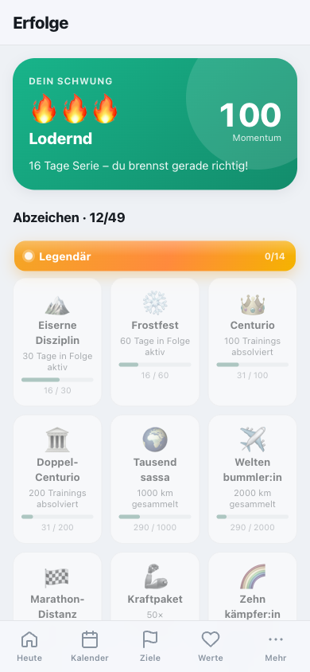
</p>
<p>
  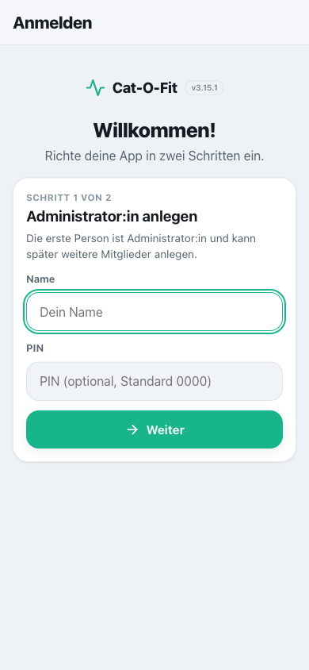
  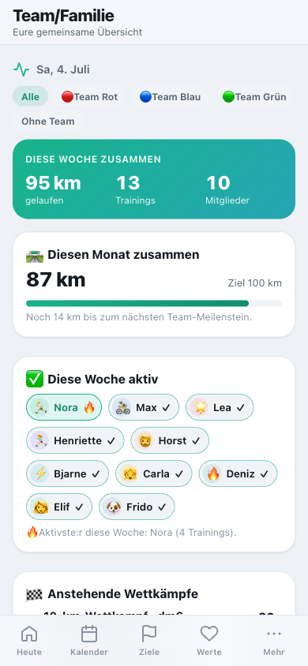
  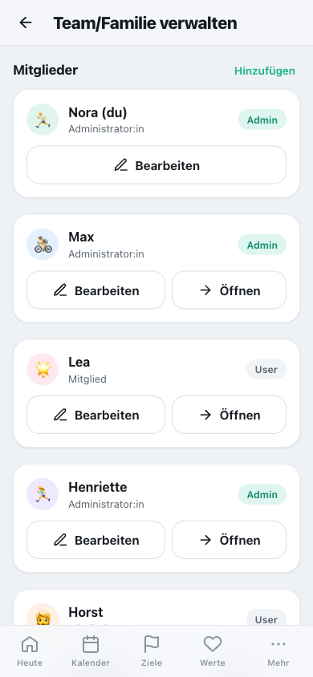
  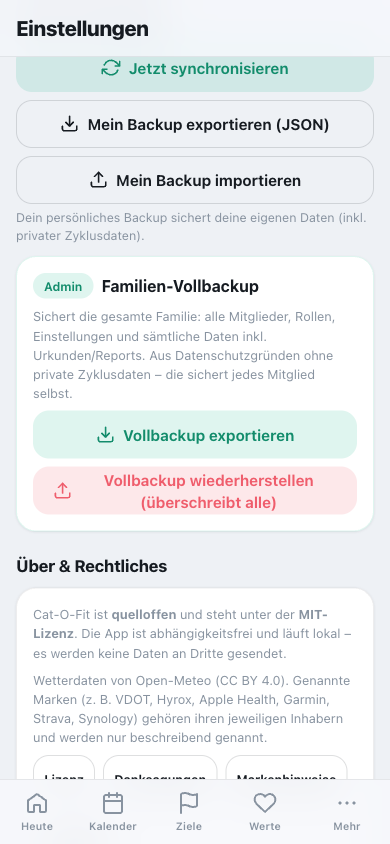
</p>
<p>
  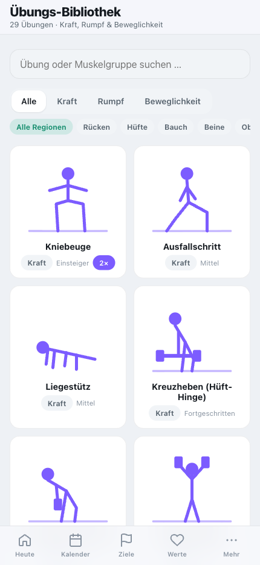
  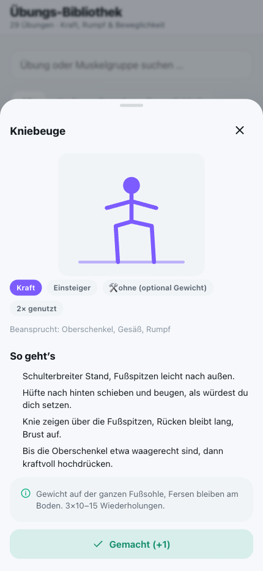
  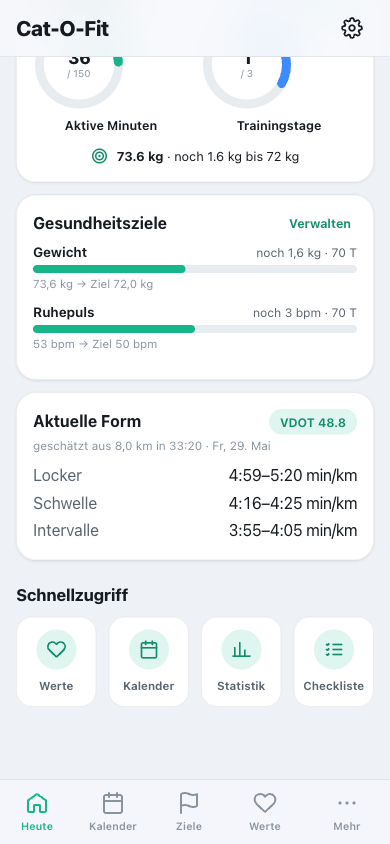
</p>

**iPad** (Sidebar-Layout)

<p>
  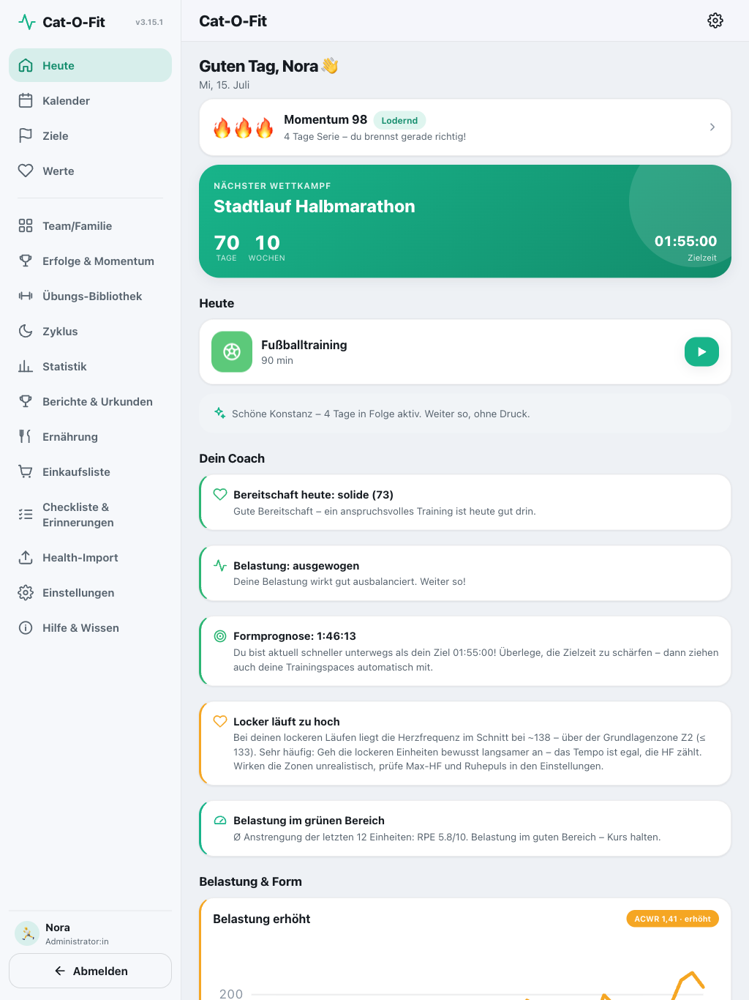
  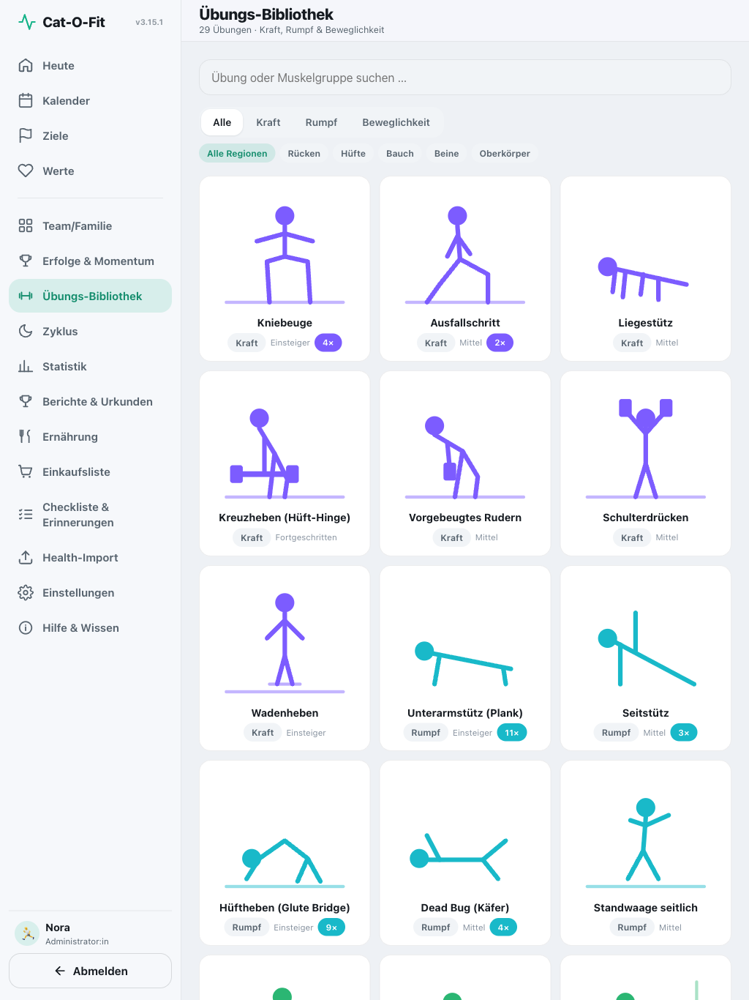
</p>
<p>
  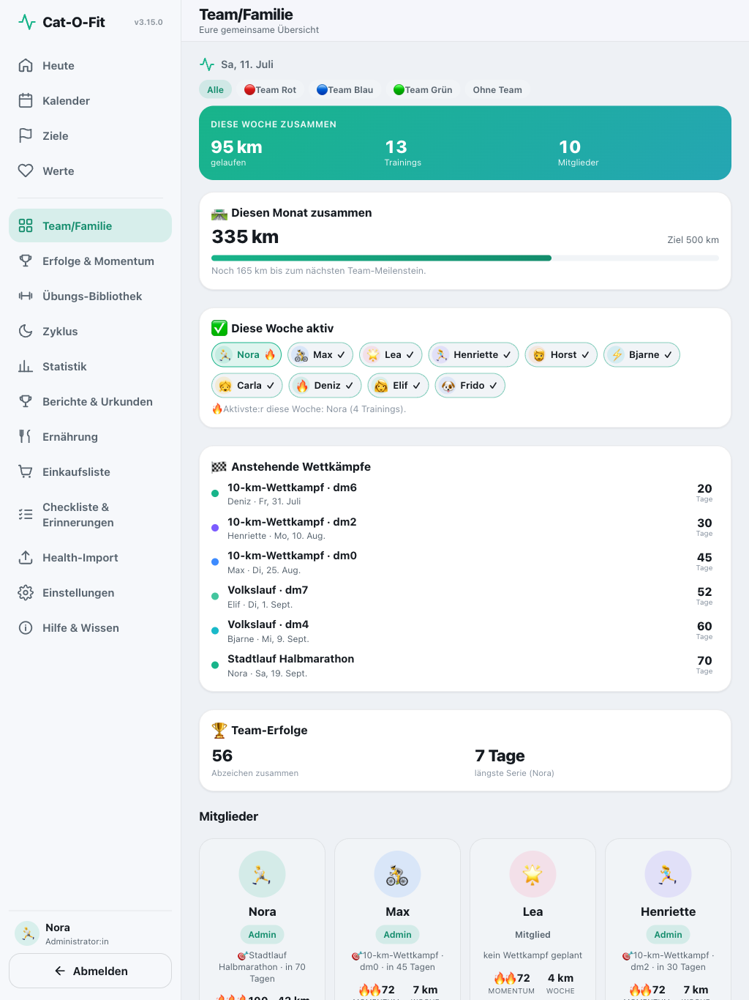
  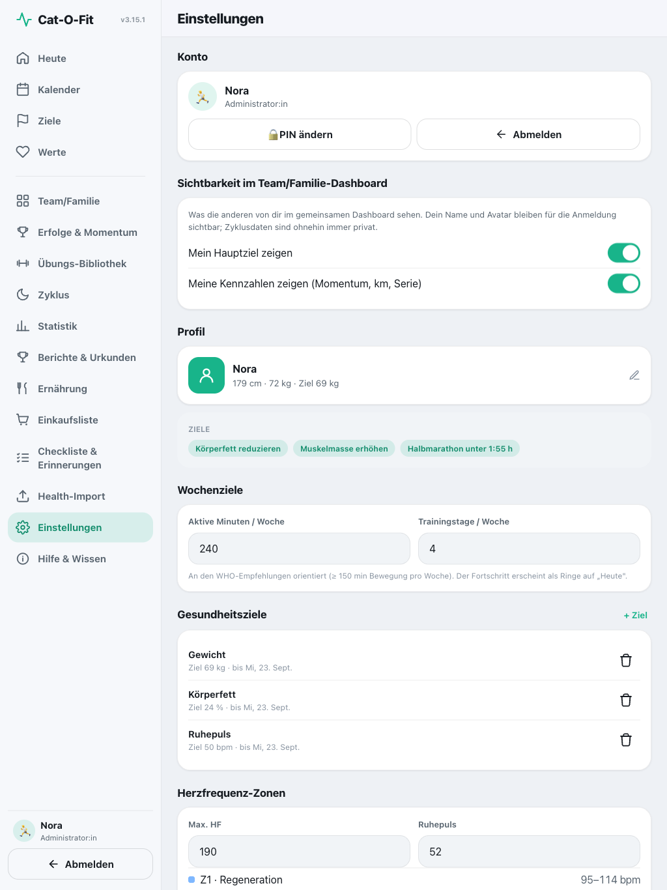
</p>

> Weitere Ansichten im [Benutzerhandbuch](docs/BENUTZERHANDBUCH.md).

---

## Technik

- **Frontend:** HTML5, CSS3, Vanilla JS (ES6-Module). **Kein Build-Schritt.** Hash-Routing (`#/…`).
- **Backend:** PHP (Persistenz + Merge, .ics, Health-Import). **Keine Datenbank.** JSON-Dateien in `/data`.
- **Local-first mit server-autoritativem Merge (seit v3.0.0):** Jede Änderung landet sofort im
  LocalStorage; im Hintergrund schickt der Client **Operationen**, und der **Server** führt sie unter
  Lock zusammen und vergibt je Datensatz eine fortlaufende Nummer. Dadurch gehen bei gleichzeitigen
  Änderungen auf iPhone **und** iPad **keine Daten verloren** – unabhängig von der Geräte-Uhr.
  Löschungen über Tombstones, Offline-Operationen werden nachgereicht. (Per [Lasttest](docs/ENTWICKLUNG.md#lasttest--performance)
  belegt: auch bei 10.000 nebenläufigen Schreibvorgängen kein verlorener Update.)
- **Sitzung übersteht Reloads (seit v3.4.0):** Die Anmeldung liegt in `sessionStorage` – Theme-/Profil-/
  Plan-Änderungen, die die Seite neu laden, melden **nicht** mehr ab; beim App-Neustart gilt weiter
  „immer neu anmelden". Module sind in den Einstellungen abschaltbar und blenden dann ihren Menüpunkt aus.
- **Sicherheit (bewusst schlank, für vertrauenswürdiges Heimnetz):** keine serverseitige
  Authentifizierung; die PIN ist Frontend-Schutz (überall identischer SHA-256). Eingaben werden als
  Text gerendert (kein HTML), Backend mit Nutzer-/Bereichs-Whitelist und atomaren Schreibvorgängen.
- **Keine externen CDNs** – alle Bibliotheken/Charts sind lokal bzw. selbst gezeichnet (SVG).

---

## Docker im Detail

Das Image ist **Multi-Arch** (`linux/amd64` + `linux/arm64`) und wird bei jedem Release
automatisch gebaut und in die GitHub Container Registry veröffentlicht
(`ghcr.io/bingerminger/cat-o-fit`, Tags: `latest`, `3.15`, `3.15.0`, …). Der schnellste
Einstieg steht oben im [Schnellstart](#schnellstart).

- **Selbst bauen statt ziehen:** Repo klonen und `docker compose up -d` – die
  `docker-compose.yml` im Repo nutzt bei Bedarf das `Dockerfile`.
- **Leerer Erststart:** Der Container enthält bewusst keine Demo-Daten und startet mit
  der **Ersteinrichtung** (Admin anlegen, optional Demodaten laden).
- **Daten:** liegen im Volume bzw. im gebundenen Ordner (`/var/www/html/data`) und
  überstehen Updates; `data/` ist im Container zusätzlich serverseitig gegen direkten
  Webzugriff gesperrt.
- **Update:** `docker compose pull && docker compose up -d` – die Daten bleiben erhalten.
- **PHP-Voreinstellungen:** Uploads bis 1 GB (Apple-Health-Voll-Import) und Zeitzone
  Europe/Berlin sind vorkonfiguriert (`docker/php.ini`).
- **Healthcheck** ist eingebaut (API-Ping) – der Status erscheint z. B. in `docker ps`.
- **HTTPS:** für die PWA-Installation den Container hinter einen Reverse-Proxy mit gültigem
  Zertifikat legen (Synology: Anwendungsportal → Reverse-Proxy).

---

## Einrichtung auf der Synology Web Station

1. **Web Station & PHP installieren**
   - Paket-Zentrum → **Web Station** installieren.
   - Ebenfalls ein **PHP** (z. B. PHP 8.4) installieren.

2. **Virtuellen Host / Portal anlegen**
   - Web Station → **Webdienst-Portal** → neuer Portaltyp „Webdienst" oder einen Ordner unter
     `/web` (bzw. `/volume1/web`) verwenden.
   - Ordner anlegen, z. B. `/web/cat-o-fit`, und **alle Dateien dieses Projekts** dorthin kopieren.
   - PHP für diesen Webdienst auf die installierte Version setzen.
   - Sicherstellen, dass die nötigen PHP-Erweiterungen aktiv sind: **XMLReader** (für den Health-Import)
     und – falls ZIP-Uploads direkt verarbeitet werden sollen – **ZipArchive**. (Andernfalls vor dem
     Upload das ZIP entpacken und nur `export.xml` hochladen.)

3. **Schreibrechte für `/data`**
   - Der Webserver-Nutzer (meist `http`) muss in den Ordner `data/` schreiben dürfen:
     - DSM → **Systemsteuerung → Gemeinsame Ordner**, beim `web`-Ordner dem Nutzer/der Gruppe `http`
       Lese-/Schreibrechte auf `cat-o-fit/data` geben, **oder** per SSH:
       ```
       chown -R http:http /volume1/web/cat-o-fit/data
       chmod -R 775 /volume1/web/cat-o-fit/data
       ```
   - Die Datei `data/.htaccess` (Deny from all) schützt die JSON-Dateien vor direktem Webzugriff;
     der Zugriff läuft ausschließlich über `api/api.php`.
   - Falls die Web Station mit **nginx** statt Apache läuft, greift `.htaccess` nicht. Dann im
     Web-Portal eine Regel ergänzen, die `/data/` von außen blockt (der Pfad wird ohnehin nur
     serverseitig gelesen).

4. **Aufrufen**
   - Im Browser des iPhones/iPads: `https://<synology-adresse>/cat-o-fit/`
     (bzw. die im Portal konfigurierte URL). Ein gültiges HTTPS-Zertifikat wird empfohlen, damit
     PWA-Funktionen und „Zum Home-Bildschirm" sauber laufen.

5. **Funktionstest**
   - `https://<synology-adresse>/cat-o-fit/api/api.php?action=ping` muss ein JSON `{"ok":true,…}` liefern.

---

## Auf den Home-Bildschirm legen (PWA)

1. App-URL in **Safari** öffnen.
2. **Teilen-Symbol** → **„Zum Home-Bildschirm"**.
3. Die App startet danach im Vollbild (eigenes Icon, ohne Browser-Leiste).

---

## Apple-Health-Import (Ablauf)

> Eine Web-App auf der Synology kann **nicht live** auf Apple Health zugreifen – das ist ein
> **Import auf Knopfdruck**, so oft du exportierst.

1. iPhone → **Health-App** → oben aufs **Profilbild** tippen.
2. **„Alle Gesundheitsdaten exportieren"** → es entsteht eine **ZIP-Datei**.
3. ZIP auf iPad/Rechner legen (AirDrop/Dateien) oder direkt in der App hochladen.
4. In der App: **Mehr → Health-Import → Datei auswählen** (ZIP oder die enthaltene `export.xml`).
5. Übernommen werden Lauf-Workouts (→ durchgeführte Sessions, automatisch den geplanten Einheiten
   zugeordnet) sowie Gewicht, Ruhepuls, Schlaf, HRV, VO₂max (→ Körperwerte). Doppelte Einträge werden
   per Zeitstempel erkannt und übersprungen.

---

## Erinnerungen (ehrlich zu iOS)

Der **zuverlässigste** Weg für Push-Hinweise auf iPhone/iPad ist der **native Kalender via .ics +
VALARM**. In jeder Session bzw. im Plan gibt es **„In Kalender exportieren"** – die erzeugte
`.ics`-Datei enthält Erinnerungen (1 Std. vorher und am Vorabend) und einen Deep-Link zurück in die App.
In-App-Hinweise greifen nur bei geöffneter App; Web-Push für installierte PWAs (ab iOS 16.4) ist
bewusst als optionale Erweiterung offengehalten, nicht als Hauptmechanismus.

---

## Tests

Logik **und** Views sind durch **394 Unit-, View- und Regressionstests** (46 Testdateien) abgesichert –
ohne Build und ohne Abhängigkeiten, mit dem Node-eigenen Test-Runner:

```bash
npm test
```

Abgedeckt sind u. a. die Mengen-Engine der Einkaufsliste, der Plan-Generator, die Zyklus-Phasen,
die Status-/Überfällig-Logik, das Wetter-Mapping, die Wettkampfprognose, der Coach, Badges/Momentum,
die Statistik-Auswertung (`fitness.js`), die **Nährwert-Schätzung** (kuratierte Tabelle + Open-Food-Facts-
Gate, `energy.js`), der adaptive Plan (`planflow.js`), Sync-/Sitzungs- und Modul-Logik – plus durchgängige
Flows (Einkauf Plan→Lager→Kochen, „schadfrei" an Zyklustagen) **und UI-/View-Tests** gegen ein
abhängigkeitsfreies Mini-DOM (`el()`/Charts sowie ganze `render()`-Funktionen). Eine **GitHub-Actions-CI**
(`.github/workflows/ci.yml`) führt sie bei jedem Push und Pull Request aus (Node 22 & 24).

Zusätzlich gibt es einen **Lasttest** der PHP-Persistenz (10 Nutzer, paralleler Write/Read/Backup/Import-Mix)
mit Integritätsprüfung – Generator `tools/loadtest.py`, Methode + Messwerte + Referenz-Plattform in der
**[Entwicklungsdoku › Lasttest & Performance](docs/ENTWICKLUNG.md#lasttest--performance)**.

---

## Projektstruktur

```
cat-o-fit/
  index.html              App-Shell (PWA, Apple-Meta-Tags)
  manifest.webmanifest    PWA-Manifest
  service-worker.js       Offline-Shell (network-first mit Revalidierung)
  api/
    api.php               GET/POST-Routing + Sonderaktionen
    storage.php           Laden/Speichern, flock, atomares Schreiben
    ics.php               .ics-Generierung (RFC 5545, TZID Europe/Berlin)
    health-import.php     Apple-Health-Export (XMLReader-Streaming)
  data/                   JSON-Daten (durch .htaccess geschützt)
  css/                    style, cards, dashboard, calendar, session, workout-mode, family, report, responsive
  js/                     app, router, storage, api-client, ui, charts + alle View-Module
  assets/icons/           App-Icons (SVG + PNG)
  test/                   Unit- & Regressionstests (node:test, *.test.js)
  test-setup.js           Browser-Globals-Shim für die Node-Tests
  package.json            type:module + npm test (keine Abhängigkeiten)
  Dockerfile              Docker-Image (Apache + PHP, Multi-Arch amd64/arm64)
  docker-compose.yml      Compose-Setup (Port 8080, data/-Volume)
  docker/                 Entrypoint, Apache-/PHP-Konfiguration, Healthcheck
  .github/workflows/      ci.yml (Tests) + docker.yml (Multi-Arch-Image nach GHCR)
```

## Hinweise für spätere Updates

- Bei Änderungen an Frontend-Dateien holt der Service Worker online automatisch die neueste Version
  (Revalidierung). Für ein erzwungenes Cache-Reset die `VERSION` in `service-worker.js` erhöhen.
- Eine echte Live-Anbindung an Apple Health (native App) oder Garmin (API + OAuth) ist
  architektonisch offengehalten, aber bewusst nicht umgesetzt.

---

## Mitwirken & Lizenz

- **Mitwirken:** Bug- und Ideen-Meldungen über die [Issue-Vorlagen](.github/ISSUE_TEMPLATE/),
  Code-Beiträge gemäß [CONTRIBUTING.md](CONTRIBUTING.md). Es gilt unser
  [Verhaltenskodex](CODE_OF_CONDUCT.md).
- **Sicherheit:** Schwachstellen bitte vertraulich melden – siehe [SECURITY.md](SECURITY.md).
- **Lizenz:** [MIT](LICENSE). Drittanbieter-Hinweise in [CREDITS.md](CREDITS.md),
  Markenhinweise in [TRADEMARKS.md](TRADEMARKS.md).

---

*Cat-O-Fit läuft vollständig auf deiner eigenen Hardware – deine Daten bleiben bei dir.*
