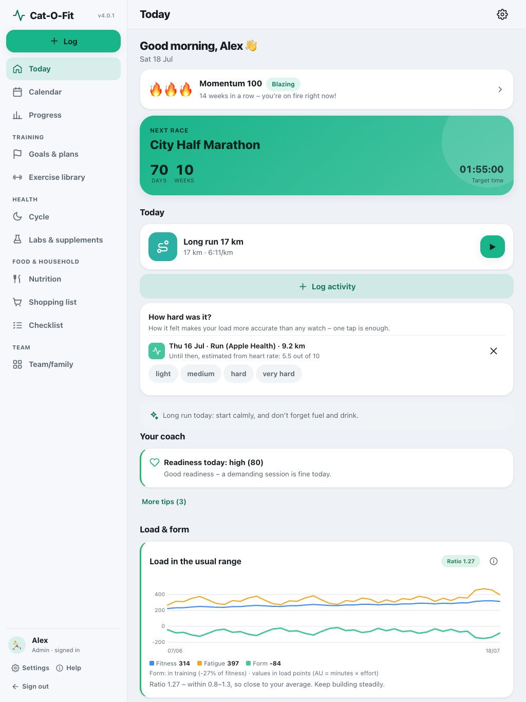
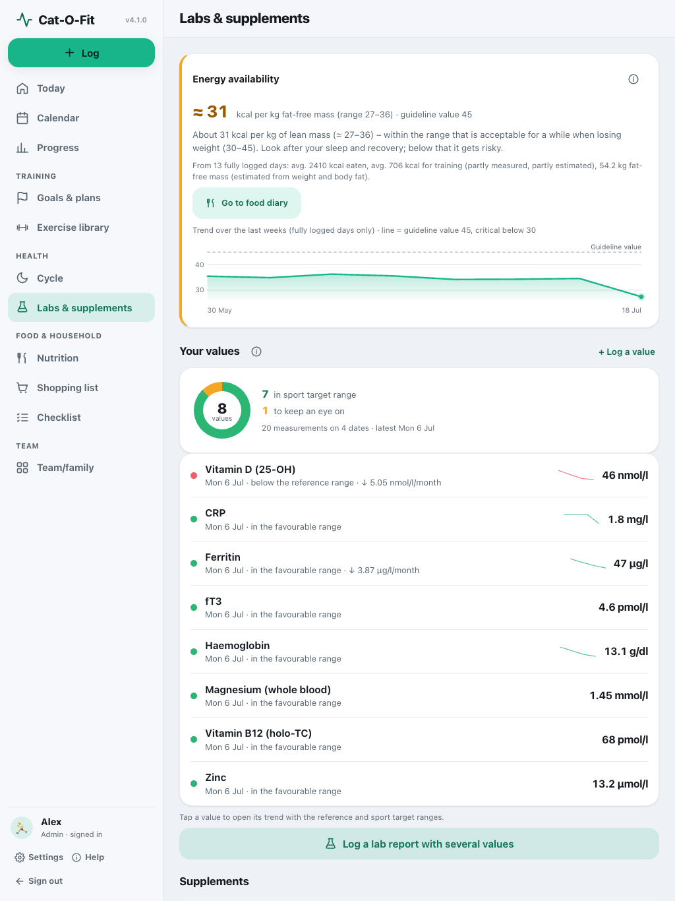

<div align="center">


# Cat-O-Fit

**The subscription-free, self-hosted training planner for the whole family.**<br>
Periodized plans and load management with nutrition, cycle and lab values in context –
AGPL licensed, on your own hardware.

[](https://github.com/Bingerminger/cat-o-fit/actions/workflows/ci.yml)
[](LICENSE)
[](package.json)
[](docs/operations/installation.md)
[](#languages)

**English** · [Deutsch](README.de.md)

**[Try the live demo](https://bingerminger.github.io/cat-o-fit/)** – runs in your browser, nothing is saved.

</div>

## Languages

The app speaks **English, Deutsch, Français, Español, Italiano, Português (Brasil) and Nederlands**. It
starts in your browser's language, and every person in the family can pick their own in the settings.
Calendar files and imported workouts follow that person's language, too. The documentation is in
[English](docs/README.md) and [German](docs/de/README.md).

French, Spanish, Italian, Portuguese and Dutch were machine-translated and checked against the app,
but not yet by native speakers – corrections are very welcome ([how to help](CONTRIBUTING.md#translations)).
Recorded voice cues during workouts are German for now; in the other languages your device's own
speech output reads them. Units are metric (imperial is planned).

## Why Cat-O-Fit?

- **Plans that fit.** Periodized race plans from 5 km to the marathon (triathlon and Hyrox in beta) or
  programs without a race – set up by level and running days, volume starting from your history, race
  pace from your goal time, recalculated from today without touching the past. Club sessions are fixed
  appointments the plan works around. Strength and mobility sessions come with over 90 animated exercises
  you can follow along in time – or play the whole session hands-free like a workout video, with music
  on the beat and voice cues.
- **Load management you can read.** Session-RPE load (minutes × effort) across all sports, a decoupled
  acute:chronic ratio, fitness/fatigue/form – and **one** coach recommendation per day with its “why”.
  No injury-prevention promises.
- **Built for the whole family.** Up to 32 people with their own goals and plans, teams, a shared
  dashboard, admins who can plan for kids. Cycle, lab values and supplements stay private – also on the
  server, which hands them out only after that person's PIN login.
- **Health in context.** Body metrics from Apple Health (automatic, via a free Shortcut or by file) or
  Android Health Connect, activity files from your watch (GPX, TCX, FIT – even a whole Garmin or Strava
  export), cycle-aware planning, lab values judged against **your** lab's reference range plus a sports corridor,
  and an energy-availability estimate – for documentation and general information, not diagnosis.
- **Kitchen included.** Recipes, calorie balance, a food diary with barcode lookup and a shared shopping
  list with pantry.
- **Truly yours.** JSON files on your own server, CSV export, offline-first on every device, zero
  dependencies, no build step, no database, 850+ automated tests, AGPL-3.0-or-later.

<div align="center">


<br><sub>“Today” and lab values on an iPad.</sub>
</div>

## Quick start

```bash
docker run -d --name cat-o-fit -p 8080:80 \
  -v cat-o-fit-data:/var/www/html/data \
  -e TZ=Europe/Berlin \
  ghcr.io/bingerminger/cat-o-fit:latest
```

Open **http://localhost:8080** – a setup wizard creates the first admin (with PIN) and optionally loads
a demo family. Synology Container Manager, plain PHP hosts (Web Station) and all options:
[installation guide](docs/operations/installation.md).

> ⚠️ **Security:** Cat-O-Fit is built for your own, trusted network. PINs protect profiles and the
> private areas; everything else (training, plans, body metrics) can be read by any device that
> reaches the server. Exposing it to the internet requires authentication in front (VPN, reverse proxy
> with login, or the built-in basic auth) and HTTPS.
>
> 💾 **Backups:** back up the server's `data/` folder following the 3-2-1 rule. The in-app full backup
> deliberately leaves out the private areas and does not replace it.

## Requirements

- **Docker** (amd64 or arm64), or a web server with **PHP 8.1+** (`json`; `XMLReader`/`zip` for the
  Apple Health full import) and write access to `data/`.
- Current Safari (iPhone/iPad), Chrome, Edge or Firefox. Installable as a PWA via “Add to Home Screen”.
- Node.js 22+ only for running the tests.

## How Cat-O-Fit compares

Self-hosted projects and popular apps side by side – as of 30 September 2026 (openGym and the
strength-training row: 3 October 2026), taken from each product's own documentation, pricing pages and store listings.

| | <sub>**Cat-O-Fit**</sub> | <sub>Sparky&shy;Fitness</sub> | <sub>wger</sub> | <sub>Fit&shy;Trackee</sub> | <sub>openGym</sub> | <sub>Garmin Connect</sub> | <sub>Strava + Runna</sub> | <sub>MyFitness&shy;Pal</sub> |
| --- | :---: | :---: | :---: | :---: | :---: | :---: | :---: | :---: |
| <sub>Self-hosted, your data stays with you</sub> | <sub>⭐ no database needed</sub> | <sub>✅</sub> | <sub>✅</sub> | <sub>✅</sub> | <sub>✅ no database</sub> | <sub>❌</sub> | <sub>❌</sub> | <sub>❌</sub> |
| <sub>Open source (OSI-approved license)</sub> | <sub>✅ AGPL</sub> | <sub>❌</sub> | <sub>✅ AGPL</sub> | <sub>✅ AGPL</sub> | <sub>✅ AGPL</sub> | <sub>❌</sub> | <sub>❌</sub> | <sub>❌</sub> |
| <sub>No subscription, no ads</sub> | <sub>✅</sub> | <sub>✅</sub> | <sub>✅</sub> | <sub>✅</sub> | <sub>✅</sub> | <sub>🟡</sub> | <sub>🟡</sub> | <sub>🟡 ads</sub> |
| <sub>Race plans that adapt</sub> | <sub>⭐</sub> | <sub>❌</sub> | <sub>❌</sub> | <sub>❌</sub> | <sub>❌</sub> | <sub>✅ with watch</sub> | <sub>💰 Runna</sub> | <sub>❌</sub> |
| <sub>Strength training: exercise library, sets, pro&shy;gression</sub> | <sub>✅ 93 animated, with music</sub> | <sub>✅ guided + pro&shy;gression</sub> | <sub>✅ pro&shy;gression rules</sub> | <sub>❌</sub> | <sub>⭐ 1,324 exercises</sub> | <sub>✅ with watch</sub> | <sub>💰 Runna</sub> | <sub>🟡 logging</sub> |
| <sub>Load manage&shy;ment with one daily recom&shy;mendation</sub> | <sub>⭐ all sports</sub> | <sub>🟡 from wearables</sub> | <sub>❌</sub> | <sub>❌</sub> | <sub>🟡 muscle map</sub> | <sub>✅ with watch</sub> | <sub>💰</sub> | <sub>❌</sub> |
| <sub>Family and teams: roles, planning for others, shared dashboard</sub> | <sub>⭐ up to 32 people</sub> | <sub>✅ 7 permissions</sub> | <sub>🟡 gym trainers</sub> | <sub>🟡 followers</sub> | <sub>🟡 profiles + admin view</sub> | <sub>🟡 Garmin Jr.</sub> | <sub>🟡 family plan</sub> | <sub>🟡 diary sharing</sub> |
| <sub>Cycle-aware training</sub> | <sub>✅</sub> | <sub>🟡 tracking + tips</sub> | <sub>❌</sub> | <sub>❌</sub> | <sub>❌</sub> | <sub>🟡 tracking + tips</sub> | <sub>❌</sub> | <sub>❌</sub> |
| <sub>Lab values against your lab's reference range</sub> | <sub>⭐</sub> | <sub>🟡 free-form</sub> | <sub>🟡 free-form</sub> | <sub>❌</sub> | <sub>❌</sub> | <sub>❌</sub> | <sub>❌</sub> | <sub>❌</sub> |
| <sub>Food diary with barcode lookup and recipes</sub> | <sub>✅</sub> | <sub>⭐ 8 food sources</sub> | <sub>🟡</sub> | <sub>❌</sub> | <sub>❌</sub> | <sub>💰 Connect&shy;+</sub> | <sub>❌</sub> | <sub>🟡 barcode paid</sub> |
| <sub>Shared shopping list with pantry</sub> | <sub>⭐</sub> | <sub>❌</sub> | <sub>❌</sub> | <sub>❌</sub> | <sub>❌</sub> | <sub>❌</sub> | <sub>❌</sub> | <sub>💰 not in Germany</sub> |
| <sub>Wearable and health data</sub> | <sub>✅ import</sub> | <sub>⭐ 8+ services</sub> | <sub>🟡</sub> | <sub>🟡 files</sub> | <sub>🟡 weight from Apple Health</sub> | <sub>✅</sub> | <sub>✅</sub> | <sub>✅</sub> |
| <sub>Works offline</sub> | <sub>✅</sub> | <sub>❌</sub> | <sub>✅ app</sub> | <sub>❌</sub> | <sub>✅</sub> | <sub>✅</sub> | <sub>✅</sub> | <sub>🟡</sub> |
| <sub>Native apps for iPhone and Android</sub> | <sub>🟡 web app (PWA)</sub> | <sub>✅</sub> | <sub>✅</sub> | <sub>❌</sub> | <sub>🟡 Android APK</sub> | <sub>✅</sub> | <sub>✅</sub> | <sub>✅</sub> |

⭐ standout &nbsp;•&nbsp; ✅ yes &nbsp;•&nbsp; 🟡 partly &nbsp;•&nbsp; 💰 paid tier only &nbsp;•&nbsp; ❌ no

<details>
<summary>Notes and sources</summary>

- **Cat-O-Fit** runs on a plain PHP web host (e.g. a NAS web station) or in Docker and keeps JSON
  files instead of a database. Race plans cover 5 km to the marathon; triathlon and Hyrox are in beta.
  Wearable data arrives via Apple Health (automatic with a free Shortcut), Android Health Connect (via a
  bridge app) and GPX/TCX/FIT files or complete Garmin/Strava exports – there is no direct connection to
  the Garmin or Strava cloud. The app is an installable web app, not an app-store app. Strength
  training: 93 animated exercises, sets with reps and weight plus a hint for the next step, and whole
  sessions that play hands-free with music on the beat and voice cues.
- **Free-form** lab values means custom measurements you name yourself, without reference ranges.
- **SparkyFitness** describes its license as “source-available, not open source”; commercial use needs
  permission. Readiness and load values come from Garmin, Polar or Oura; family sharing is in beta. Its
  cycle hub tracks periods and shows general tips per phase; workout plans don't use the cycle. Its own
  docs list no shopping lists and no offline logging on mobile. Strength training brings an exercise
  library (Free Exercise DB, wger), presets, progression per set, adaptive weight suggestions, guided
  workouts with voice and interval formats such as Tabata, EMOM and AMRAP.
  [License](https://github.com/CodeWithCJ/SparkyFitness/blob/main/LICENSE) ·
  [README](https://github.com/CodeWithCJ/SparkyFitness) ·
  [its comparison page](https://codewithcj.github.io/SparkyFitness/features/comparison) ·
  [family sharing](https://github.com/CodeWithCJ/SparkyFitness/blob/main/docs/src/features/family-friends-sharing.md) ·
  [cycle](https://github.com/CodeWithCJ/SparkyFitness/blob/main/docs/src/features/cycle-hub/index.md) ·
  [guided workouts](https://github.com/CodeWithCJ/SparkyFitness/blob/main/docs/src/features/exercises/guided-workouts.md) ·
  [progression](https://github.com/CodeWithCJ/SparkyFitness/blob/main/docs/src/features/exercises/progression-and-per-set-ramp.md)
- **wger** has strength routines with progression but no race plans; trainers in its gym module see
  their members. Nutrition plans and a diary use Open Food Facts with barcode scanning in the app;
  recipes exist only as plan meals. Apple Health/Health Connect import since 2.7, offline mode in the
  app since 2.6.
  [README](https://github.com/wger-project/wger) ·
  [gym](https://github.com/wger-project/docs/blob/master/docs/administration/gym.rst) ·
  [2.6](https://github.com/wger-project/wger/releases/tag/2.6) ·
  [2.7](https://github.com/wger-project/wger/releases/tag/2.7)
- **FitTrackee** tracks activities with maps from GPX/FIT/TCX/KML files; no built-in sync, no official
  mobile app. Several people share an instance and follow each other, with visibility settings per
  workout. Its 29 sports are endurance and outdoor sports – no strength training.
  [Features](https://docs.fittrackee.org/en/features/index.html) ·
  [sports](https://docs.fittrackee.org/en/features/workout.html) ·
  [third-party tools](https://docs.fittrackee.org/en/third_party_tools.html)
- **openGym** is a gym log rather than a race planner, and the strongest here at strength training:
  1,324 exercises with animated demos, progression rules from linear to double progression, estimated
  1RM, a muscle map for balance, fatigue and strength, import from FitNotes, Strong and Hevy. It stores JSON files without a database server and runs with
  Docker Compose; profiles for friends and family sign in with passkeys, and an optional admin dashboard
  shows who is training. Body weight can be imported from an Apple Health export. Android gets a
  sideloadable app (not in the Play Store), iPhone the installable web app. The exercise images and
  animations are third-party content each instance downloads on first run.
  [README](https://github.com/DuarteSantos8/openGym) ·
  [License](https://github.com/DuarteSantos8/openGym/blob/main/LICENSE) ·
  [mobile](https://github.com/DuarteSantos8/openGym/blob/main/docs/MOBILE.md)
- **Garmin Connect** is free with a Garmin device; Garmin Coach plans and load metrics need a
  compatible watch. Nutrition (since January 2026) and AI insights require Connect+. Cycle tracking
  gives tips per phase, the plans don't adapt to it. Parents manage their kids' Garmin wearables in the
  separate Garmin Jr. app. Custom workouts – strength workouts included – are built in Connect and
  sent to the watch.
  [Connect+](https://www.garmin.com/en-US/p/1565777/) ·
  [Garmin Jr.](https://apps.apple.com/us/app/id1122225740) ·
  [Garmin Coach](https://www.garmin.com/en-US/garmin-coach/overview/) ·
  [training load](https://www.garmin.com/en-US/garmin-technology/running-science/physiological-measurements/training-load/) ·
  [women's health](https://www.garmin.com/en-US/garmin-technology/health-science/womens-health/) ·
  [nutrition](https://www.garmin.com/en-US/newsroom/press-release/sports-fitness/stay-on-top-of-nutrition-goals-in-garmin-connect/) ·
  [app](https://apps.apple.com/us/app/garmin-connect/id583446403)
- **Strava + Runna:** Strava's free tier records activities; Relative Effort and Fitness & Freshness
  need a subscription. Running plans come from Runna, which has no free tier (also sold bundled with
  Strava). Runna also builds strength and mobility plans for runners. Strava's Family Plan shares one
  subscription among four accounts.
  [Pricing](https://www.strava.com/pricing) ·
  [training plans](https://support.strava.com/en-us/articles/15401942-training-plans-for-runners) ·
  [Fitness & Freshness](https://support.strava.com/en-us/articles/15402032-how-fitness-freshness-is-calculated) ·
  [Family Plan](https://support.strava.com/en-us/articles/15401631-what-is-strava-s-family-plan) ·
  [Runna pricing](https://www.runna.com/pricing) ·
  [Runna strength](https://www.runna.com/)
- **MyFitnessPal** shows ads in its free tier; barcode scanning and CSV export need Premium. The meal
  planner with grocery list and pantry check is Premium+ and offered only in a few English-speaking
  countries. Workouts are logged for their calorie burn. You can share your diary with a friend or
  trainer. Diary entries made offline sync later;
  the food search needs a connection. [Premium](https://www.myfitnesspal.com/premium) ·
  [barcode](https://support.myfitnesspal.com/hc/en-us/articles/360032624771) ·
  [meal planner](https://support.myfitnesspal.com/hc/en-us/articles/34603055097869) ·
  [diary sharing](https://support.myfitnesspal.com/hc/en-us/articles/360032623371) ·
  [offline](https://support.myfitnesspal.com/hc/en-us/articles/360032622851)

Found something outdated? Please [open an issue](https://github.com/Bingerminger/cat-o-fit/issues).

</details>

## When Cat-O-Fit fits – and when it doesn't

| You want … | Look at |
|---|---|
| periodized plans and load management for several people, self-hosted, open source (AGPL) | **Cat-O-Fit** |
| native apps and automatic sync with many wearables, AI features | [SparkyFitness](https://github.com/CodeWithCJ/SparkyFitness) (family-oriented; its README describes the license as source-available, non-commercial) |
| a workout and nutrition manager in many languages | [wger](https://github.com/wger-project/wger) |
| GPS activity tracking with maps | [FitTrackee](https://github.com/SamR1/FitTrackee) |
| in-depth power and heart-rate analytics as a hosted service | [intervals.icu](https://intervals.icu) |

## Documentation

Everything at a glance: **[documentation](docs/README.md)**, sorted by what you want to do
([Deutsch](docs/de/README.md)).

- **Use:** [getting started](docs/usage/getting-started.md) · [training](docs/usage/training.md) ·
  [coach & load](docs/usage/coach-and-load.md) · [health](docs/usage/health.md) ·
  [labs](docs/usage/labs.md) · [nutrition](docs/usage/nutrition.md) ·
  [team & family](docs/usage/family.md) · [Apple Health](docs/usage/apple-health.md) ·
  [FAQ](docs/usage/faq.md)
- **Understand:** [training science](docs/knowledge/training-science.md) ·
  [methods & sources](docs/knowledge/methods-and-sources.md)
- **Run:** [installation](docs/operations/installation.md) · [update](docs/operations/update.md) ·
  [backup](docs/operations/backup.md) · [privacy](docs/operations/privacy.md) ·
  [troubleshooting](docs/operations/troubleshooting.md)
- **Develop:** [architecture](docs/ARCHITECTURE.md) · [development](docs/DEVELOPMENT.md) ·
  [contributing](CONTRIBUTING.md) · [API](docs/API.md) · [changelog](CHANGELOG.md) ·
  [roadmap](docs/ROADMAP.md)

## Privacy and external services

No account, no telemetry. Only two optional services leave your home, both can be switched off:
**Open-Meteo** for the weather (the device asks with a place name or coordinates; the free API is for
non-commercial use) and **Open Food Facts** for nutrition values (your server sends only the
ingredient name or a barcode; data under the ODbL). Details: [privacy in operation](docs/operations/privacy.md).

## Intended purpose

Cat-O-Fit is for **documentation and general information for healthy adults**. It is **not a medical
device** and does not diagnose; hints on lab values, energy availability or supplements do not replace
a medical assessment.

## License and community

[GNU AGPL v3.0 or later](LICENSE) – use, change, share; whoever offers a modified version as a
network service shares its source code too. Third-party notes in [CREDITS.md](CREDITS.md), trademarks in
[TRADEMARKS.md](TRADEMARKS.md). Please report vulnerabilities confidentially as described in
[SECURITY.md](SECURITY.md); our [Code of Conduct](CODE_OF_CONDUCT.md) applies. Bug reports and ideas
are welcome via the [issue templates](.github/ISSUE_TEMPLATE/).
