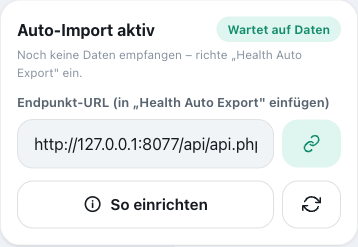
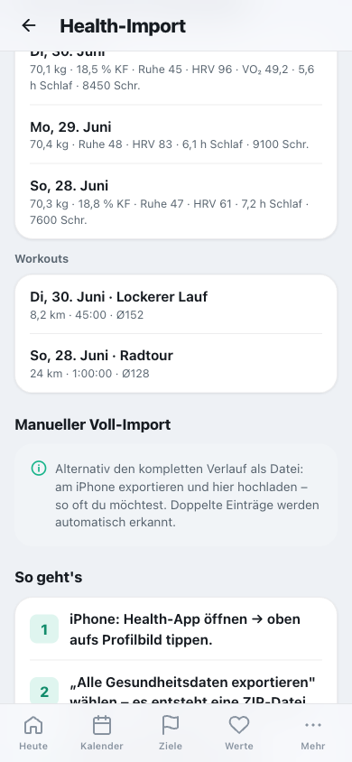

# Apple Health automatisch importieren

Cat-O-Fit kann **Gewicht, Ruhepuls, HRV, VO₂max, Schlaf, Schritte, aktive Energie und Workouts**
automatisch und **inkrementell** aus Apple Health übernehmen – ohne den 300-MB-Vollexport. Dein
iPhone schickt täglich kleine JSON-Pakete an einen persönlichen Endpunkt. Möglich macht das die
kostenlose App **Health Auto Export – JSON+CSV** (App Store).

> Der alte manuelle Weg (Export-ZIP hochladen) bleibt als einmaliges Fallback bestehen. Für den
> laufenden Betrieb ist der automatische Weg gedacht.

<p align="center"></p>

## Voraussetzungen
- iPhone mit Apple Health, in dem deine Quellen (Garmin, Apple Watch, Withings …) schreiben.
- App **Health Auto Export – JSON+CSV** installiert, mit Health-Zugriff.
- Du bist in Cat-O-Fit als der betreffende Nutzer angemeldet.

## Schritt 1 — In Cat-O-Fit den Endpunkt holen
1. Menü **Health-Import → „Auto-Import aktivieren"** (ganz oben, „Automatisch aus Apple Health").
   Das erzeugt dein persönliches Token.
2. **Endpunkt-URL kopieren** (Button neben dem Feld). Sie sieht so aus:
   ```
   https://<deine-server-adresse>/cat-o-fit/api/api.php?action=health-ingest&user=<deine-id>&token=<geheim>
   ```
   Sie enthält deine Nutzer-ID und dein Token – **nicht weitergeben**.

## Schritt 2 — In „Health Auto Export" die Automation anlegen
1. Unten **„Automations" → „+"**.
2. Als Typ **„REST API"** wählen.
3. **URL**: die kopierte Endpunkt-URL einfügen.
4. **Method** `POST`, **Format** `JSON`.
5. **Headers → hinzufügen**:
   - Schlüssel `Authorization`, Wert `Basic <base64>` – das ist die **Anmeldung der Website**
     (der `.htpasswd`-Login, mit dem ihr auch die Seite öffnet). `<base64>` = `benutzer:passwort`
     Base64-kodiert, z. B. im Terminal: `printf 'benutzer:passwort' | base64`.
6. **Health Metrics** auswählen: Weight/Body Mass, Body Fat %, Lean Body Mass, Resting Heart Rate,
   Heart Rate Variability, VO₂ Max, Sleep Analysis, Step Count, Active Energy.
7. **Workouts** einschalten.
8. **Aggregation** `Daily`, **Schedule** `Daily`, **Period** `Since last sync` (schickt nur Neues).
9. **Speichern → „Run now"** zum Testen.

## Schritt 3 — Kontrolle
Nach „Run now" antwortet der Endpunkt mit einer Zusammenfassung, z. B.:
```json
{"ok":true,"received":{"metrics":8,"workouts":1},"health":{"days":1},"sessions":{"imported":1},"ignoredMetrics":[],"warnings":[]}
```
- `health.days` bzw. `sessions.imported` > 0 → es kam an.
- **`ignoredMetrics`** listet Metrik-Namen, die (noch) nicht zugeordnet werden. Fehlt dir hier etwas
  Wichtiges, gib den Namen durch – dann wird das Mapping ergänzt.
- In Cat-O-Fit erscheinen die Werte nach dem nächsten Sync unter **Körperwerte** bzw. im **Kalender**.
- Direkt in der **Health-Import**-Ansicht zeigt **„Zuletzt importiert"** die letzten übernommenen
  Tageswerte (Gewicht, Puls, HRV, Schlaf …) und Workouts – so siehst du sofort, was angekommen ist.

<p align="center"></p>

## 10-Jahre-Historie nachladen (Backfill)
Der laufende Import schickt nur Neues. Für die Vergangenheit einmalig:
- **Gewicht** kann komplett rein (winzig): eine zusätzliche Automation/Export mit Period „Custom"
  je **Monat** (oder größere Bereiche) senden.
- Dichte Werte (Puls/Schlaf/HRV): die letzten **1–2 Jahre** reichen für die Trends.
- Bei großen Zeiträumen **„Batch requests"** in der App aktivieren, damit die Pakete klein bleiben.

## Was landet wo
| Apple Health | Cat-O-Fit |
|---|---|
| Weight / Body Mass | Körperwerte → Gewicht |
| Body Fat % | Körperfett |
| Lean Body Mass | Muskelmasse |
| Resting Heart Rate | Ruhepuls |
| Heart Rate Variability | HRV |
| VO₂ Max | VO₂max |
| Sleep Analysis | Schlaf (h) |
| Step Count | Schritte |
| Active Energy | Aktive Energie (kcal) |
| Workouts | Trainingseinheit (Session), dedupliziert per HealthKit-UUID |

Vorhandene **manuelle** Einträge/Einheiten werden nicht überschrieben: Tageswerte werden feldweise
gemergt (deine Stimmung/Energie/Notizen bleiben), und ein manuell geloggtes Training „gewinnt" gegen
ein deckungsgleiches importiertes.

## Sicherheit & Umgebungen
- Der Endpunkt liegt **hinter dem `.htpasswd`** der Seite; zusätzlich schützt ihn dein
  **persönliches Token**.
- **Produktion und Abnahme sind strikt getrennt.** Die in den Einstellungen angezeigte URL zeigt
  jeweils auf die eigene Umgebung; Token und Daten sind pro Nutzer **und** pro Umgebung isoliert.
  Für die Produktion die PROD-URL (`…/cat-o-fit/…`) verwenden, für Tests die Abnahme
  (`…/cat-o-fit-acc/…`).
- **Token neu erzeugen** (Health-Import → Apple Health → ⟳) macht die alte URL ungültig – dann in
  „Health Auto Export" die URL ersetzen.

## Fehlersuche
- **401 „Ungültiges Token"** – URL/Token passt nicht (nach „neu erzeugen" die URL ersetzen).
- **403 „kein Token"** – in Cat-O-Fit erst unter **Health-Import** „Auto-Import aktivieren".
- **Es kommt gar nichts an** – den Header `Authorization: Basic …` prüfen (ein 401 direkt vom Server
  deutet auf falsche `.htpasswd`-Anmeldung), URL exakt kopiert?, in der App „Run now" testen.
- **HealthFit** deckt Workouts als FIT/GPX ab – für Cat-O-Fit genügt „Health Auto Export"; HealthFit
  ist optional für detaillierte Aktivitätsdateien.
