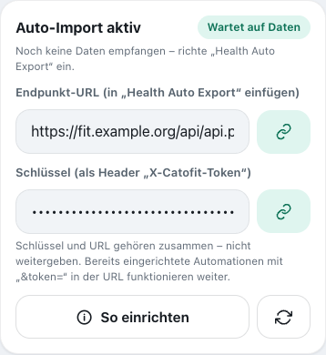
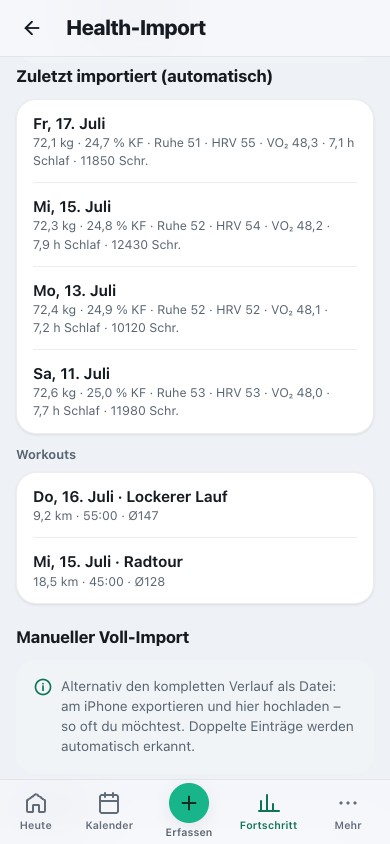

# Apple Health übernehmen

Cat-O-Fit übernimmt **Gewicht, Körperfett, fettfreie Masse, Ruhepuls, HRV, VO₂max, Schlaf, Schritte,
aktive Energie und Workouts** aus Apple Health – dorthin schreiben Apple Watch, Garmin, Withings & Co.
Es gibt drei Wege:

| Weg | Kosten | Was ankommt | Aufwand |
|---|---|---|---|
| [Automatisch mit „Health Auto Export“](#automatisch-mit-health-auto-export) | App kostenlos, die nötige automatische Übertragung (REST-API) nur mit **Premium** – laut App Store (Stand September 2026) etwa 8 € im Jahr oder 30 € einmalig; die Basic-Stufe reicht nicht | alle Werte oben **und Workouts**, täglich | einmal einrichten |
| [Kostenlos per Kurzbefehl](#kostenlos-per-kurzbefehl) | kostenlos (Apple-App „Kurzbefehle“) | die Tageswerte, die der Kurzbefehl liest (keine Workouts) | einmal einrichten |
| [Voll-Import von Hand](#voll-import-von-hand) | kostenlos | Workouts aller zuordenbaren Sportarten, Körperwerte und – auf Wunsch – den Zyklus aus dem kompletten Export | je Import ein paar Minuten |

Aufzeichnungen deiner Uhr (Garmin, COROS, Polar, Suunto, Wahoo …) lädst du außerdem als **GPX-, TCX-
oder FIT-Datei** hoch – einzeln oder als ganzen Export im ZIP (siehe
[Training](nutzung/training.md#aktivitäten-aus-dateien-übernehmen)). Auf **Android** übernimmt eine
Brücken-App die Werte aus Health Connect – siehe [Android: Health Connect](#android-health-connect).

<p align="center"></p>

---

## Endpunkt und Schlüssel holen

Beide automatischen Wege schicken an deinen persönlichen **Endpunkt**:

1. In Cat-O-Fit: **Fortschritt → Körper → Symbol „Health-Import“** (oder Einstellungen → Daten &
   Sicherung → Apple Health & Datei-Import) → **„Auto-Import aktivieren“**. Das erzeugt deinen
   persönlichen **Schlüssel** (Token).
2. **Endpunkt-URL kopieren** (Button neben dem Feld). Sie sieht so aus:
   ```
   https://<deine-server-adresse>/cat-o-fit/api/api.php?action=health-ingest&user=<deine-id>
   ```
3. **Schlüssel kopieren** (zweites Feld). Er gehört in den Header `X-Catofit-Token` – so taucht er in
   keinem Zugriffsprotokoll des Servers oder eines Proxys auf. URL und Schlüssel **nicht weitergeben**.

> Ältere Einrichtungen mit dem Schlüssel direkt in der URL (`…&token=<geheim>`) funktionieren weiter.
> Wer umstellen möchte: URL ohne `&token=…` eintragen und den Header ergänzen.

---

## Automatisch mit „Health Auto Export“

Voraussetzungen: iPhone mit Apple Health, die App **Health Auto Export – JSON+CSV** mit
**Premium** und Health-Zugriff, und du bist in Cat-O-Fit als die betreffende Person angemeldet.

1. In Health Auto Export unten **„Automations“ → „+“**, Typ **„REST API“**.
2. **URL**: die kopierte Endpunkt-URL. **Method** `POST`, **Format** `JSON` (Export-Version 2).
3. **Headers → hinzufügen:** Schlüssel `X-Catofit-Token`, Wert = dein kopierter Schlüssel.
4. **Health Metrics** auswählen: Weight/Body Mass, Body Fat %, Lean Body Mass, Resting Heart Rate,
   Heart Rate Variability, VO₂ Max, Sleep Analysis, Step Count, Active Energy. **Workouts** einschalten.
5. **Aggregation** `Daily`, **Schedule** `Daily`, **Period** `Since last sync` (schickt nur Neues).
6. **Speichern → „Run now“** zum Testen.

**Nur falls** deine Instanz zusätzlich hinter einer vorgeschalteten Anmeldung liegt (Reverse-Proxy
mit Basic Auth): unter **Headers** außerdem `Authorization` mit dem Wert `Basic <base64>` eintragen
(`<base64>` = `benutzer:passwort` Base64-kodiert, z. B. `printf 'benutzer:passwort' | base64`). Die
eingebaute Basic-Auth des Containers lässt den Health-Eingang ohnehin durch – dort entfällt das.

**10-Jahre-Historie nachladen (Backfill):** Der laufende Import schickt nur Neues. Für die
Vergangenheit einmalig eine zusätzliche Automation mit Period „Custom“ je **Monat** senden; dichte
Werte (Puls, Schlaf, HRV) reichen für die letzten ein bis zwei Jahre. Bei großen Zeiträumen
**„Batch requests“** aktivieren, damit die Pakete klein bleiben.

---

## Kostenlos per Kurzbefehl

Die Apple-App **„Kurzbefehle“** kann Gesundheitswerte lesen und an deinen Endpunkt schicken. Cat-O-Fit
nimmt dafür ein **schlankes Tagesformat** an – ein einfaches Wörterbuch, das sich in Kurzbefehle ohne
Umwege zusammenklicken lässt.

> ⚠️ Diese Anleitung beschreibt die Aktionen der Kurzbefehle-App; bitte teste deinen Kurzbefehl
> einmal von Hand. Gesundheitsdaten sind bei gesperrtem iPhone geschützt – eine Automation liest sie
> nur zuverlässig, wenn das iPhone entsperrt ist. Wähle deshalb einen Auslöser, bei dem du es ohnehin
> in der Hand hast (z. B. „Wecker gestoppt“ oder „App geöffnet“).

**Den Kurzbefehl anlegen** (Kurzbefehle → „+“):

1. **„Health-Samples suchen“** – Typ **Gewicht**, sortiert nach **Startdatum**, **Neueste zuerst**,
   Limit **1**. Wiederhole das für **Ruhepuls** und **Herzfrequenzvariabilität** (je Limit 1).
2. Optional **Schritte**: „Health-Samples suchen“ – Typ **Schritte**, Startdatum **heute**; danach
   **„Statistik berechnen“ → Summe**.
3. **„Datum formatieren“** – aktuelles Datum, Format **Benutzerdefiniert** `yyyy-MM-dd`.
4. **„Inhalte von URL abrufen“** – URL = deine Endpunkt-URL, Methode **POST**, Header
   `X-Catofit-Token` = dein Schlüssel, Anfragetext **JSON** mit den Feldern
   `date` (formatiertes Datum), `weight`, `restingHr`, `hrv` und optional `steps` – als Wert jeweils
   das Ergebnis der Suche davor.
5. Einmal **von Hand ausführen**: Die Antwort nennt `"health":{"days":1}`, wenn es ankam.

**Täglich automatisch:** Kurzbefehle → **Automation** → „+“ → z. B. **„Wecker“ → „Wird gestoppt“**
→ **„Sofort ausführen“** → deinen Kurzbefehl wählen.

**Das Format** (auch für eigene Skripte):

```json
{ "date": "2026-09-29", "weight": 72.4, "restingHr": 52, "hrv": 48, "sleepHours": 7.3, "steps": 8421 }
```

| Feld | Bedeutung | gültiger Bereich |
|---|---|---|
| `date` | Tag (Pflicht), `YYYY-MM-DD` oder ein ISO-Zeitstempel | – |
| `weight` | Gewicht in kg (mit `"weightUnit": "lb"` in Pfund) | 20–400 |
| `bodyFat` | Körperfett in % (0,185 wird zu 18,5 %) | 1–80 |
| `leanMass` | fettfreie Masse in kg | 10–200 |
| `restingHr` | Ruhepuls | 25–150 |
| `hrv` | HRV in ms; Messart SDNN (Apple), mit `"hrvMethod": "rmssd"` RMSSD | 1–400 |
| `vo2max` | VO₂max | 10–100 |
| `sleepHours` | Schlaf in Stunden | bis 24 |
| `steps` | Schritte | bis 200 000 |
| `activeEnergyKcal` | aktive Energie in kcal | bis 20 000 |

Zahlen dürfen auch als Text mit Komma kommen („72,4“) – so gibt die Kurzbefehle-App sie auf Deutsch
aus. Werte außerhalb des Bereichs verwirft der Server und meldet sie in `warnings`; unbekannte Felder
stehen in `ignoredMetrics`. Mehrere Tage auf einmal: `{ "days": [ { "date": … }, { "date": … } ] }`.

---

## Voll-Import von Hand

1. iPhone → **Health-App** → oben aufs **Profilbild** → **„Alle Gesundheitsdaten exportieren“**.
2. Die entstehende **ZIP-Datei** in Cat-O-Fit unter **Health-Import** hochladen (oder die enthaltene
   `export.xml`).
3. Übernommen werden die **Workouts** aller Sportarten, die Cat-O-Fit kennt (Laufen, Rad, Schwimmen,
   Gehen, Wandern, Kraft, Rudern …; passende geplante Einheiten werden erledigt), und die
   **Körperwerte**. Enthält der Export Zyklusdaten, fragt die App vorher, ob sie die
   **Periodenbeginne** übernehmen soll – sie bleiben privat. Doppelte Einträge erkennt die App.

Gewicht und fettfreie Masse in Pfund werden in kg umgerechnet, Workout-Energie in kJ in kcal. Schlaf
aus mehreren Quellen (z. B. Uhr und Schlaf-App) wird nicht addiert – je Nacht zählt die längste
einzelne Quelle. Jeder Wert landet an dem Kalendertag, an dem er gemessen wurde (auch kurz nach
Mitternacht). Der Server braucht dafür PHP mit **XMLReader**; für ZIP-Dateien zusätzlich **ZipArchive**
(sonst die `export.xml` einzeln hochladen).

---

## Android: Health Connect

Auf Android sammelt **Health Connect** die Werte deiner Uhr und Apps. Webseiten können dort nicht
lesen – eine kleine **Brücken-App** auf dem Gerät schickt die Daten deshalb an dieselbe Adresse wie oben,
etwa das quelloffene „HC Webhook“:

1. In Cat-O-Fit unter **Health-Import** „Auto-Import aktivieren“ und **Endpunkt-URL** und **Schlüssel**
   kopieren (siehe [Endpunkt und Schlüssel holen](#endpunkt-und-schlüssel-holen)).
2. In der Brücken-App die URL als Webhook-Adresse eintragen und den Schlüssel als Header
   **`X-Catofit-Token`** mitschicken. Kann die App keine Header setzen, hängst du ihn an die Adresse:
   `…&token=<Schlüssel>`.
3. Datentypen freigeben: Gewicht, Körperfett, fettfreie Masse, Ruhepuls, HRV, Schlaf, Schritte, aktive
   Kalorien, Trainings und **Herzfrequenz** (daraus rechnet Cat-O-Fit die Ø-HF der Trainings). Den
   Zyklus nur, wenn du ihn übernehmen möchtest – er landet im privaten Bereich.

Tageswerte gehören zum Kalendertag in der Zeitzone deines Servers. Die HRV aus Health Connect ist
**RMSSD** und wird getrennt von Apple-Werten (SDNN) ausgewertet. Die Brücke schickt oft die letzten
48 Stunden erneut – doppelte Tage und Trainings erkennt Cat-O-Fit. Getestet ist der Weg mit den
Beispieldaten aus der Dokumentation der Brücken-App; bei Abweichungen zeigt die Antwort unter
`warnings`, was nicht zugeordnet werden konnte.

---

## Kontrolle

Nach „Run now“ bzw. dem ersten Kurzbefehl antwortet der Endpunkt mit einer Zusammenfassung, z. B.:

```json
{"ok":true,"received":{"metrics":8,"workouts":1},"health":{"days":1},"sessions":{"imported":1},"ignoredMetrics":[],"warnings":[]}
```

- `health.days` bzw. `sessions.imported` > 0 → es kam an.
- **`ignoredMetrics`** listet Namen, die (noch) nicht zugeordnet werden.
- In Cat-O-Fit zeigt **Health-Import → „Zuletzt importiert“** die übernommenen Tageswerte und Workouts;
  die Werte erscheinen außerdem unter **Fortschritt → Körper** bzw. im **Kalender**.

<p align="center"></p>

---

## Was landet wo

| Apple Health | Cat-O-Fit |
|---|---|
| Weight / Body Mass | Körperwerte → Gewicht |
| Body Fat % | Körperfett |
| Lean Body Mass | Fettfreie Masse (fließt in die Energieversorgung im Labor-Modul ein) |
| Resting Heart Rate | Ruhepuls |
| Heart Rate Variability | HRV (Messart SDNN) |
| VO₂ Max | VO₂max |
| Sleep Analysis | Schlaf (h) |
| Step Count | Schritte |
| Active Energy | Aktive Energie (kcal) |
| Workouts | Training, dedupliziert per HealthKit-UUID – mit der gemessenen aktiven Energie, die dann die Schätzung im Trainingsverbrauch ersetzt |
| Menstrual Flow | Zyklus (Periodenbeginn und -dauer, privat) – beim Auto-Export, wenn er mitgeschickt wird; beim Voll-Import nach Rückfrage |

Vorhandene **manuelle** Einträge werden nicht überschrieben: Tageswerte werden feldweise gemergt (deine
Stimmung, Energie und Notizen bleiben), und ein manuell erfasstes Training „gewinnt“ gegen ein
deckungsgleiches importiertes. Automatisch importierte Trainings schlägt „Heute“ zum Zuordnen an die
passende geplante Einheit vor.

**Fettfreie Masse statt „Muskelmasse“:** Bis v3.19.0 landete Apples „Lean Body Mass“ im Feld
„Muskelmasse“ – bei 72 kg und 25 % Körperfett also rund 54 kg neben den etwa 28 kg Muskelmasse einer
Körperanalyse-Waage. Seit v3.20.0 gibt es das eigene Feld „Fettfreie Masse“; ältere Apple-Werte zeigt
die App automatisch dort an.

**HRV-Messart:** Apple speichert die Herzfrequenzvariabilität als **SDNN**, viele Uhren und Ringe zeigen
**RMSSD**. Die Zahlen sind nicht vergleichbar – Cat-O-Fit merkt sich die Messart je Wert und vergleicht
Verlauf, Ziele und Bereitschaft nur innerhalb einer Messart.

---

## Sicherheit & Umgebungen

- Der Endpunkt ist durch deinen **persönlichen Schlüssel** geschützt. Liegt deine Instanz zusätzlich
  hinter einer Anmeldung, gilt beides.
- **Mehrere Instanzen?** Schlüssel und Daten sind pro Person **und** pro Instanz getrennt; die in der
  App angezeigte URL gehört immer zur gerade genutzten Instanz.
- **Schlüssel neu erzeugen** (Health-Import → Apple Health → ⟳) macht den alten ungültig – dann den
  Header-Wert (bzw. bei alten Einrichtungen die URL) ersetzen.

## Fehlersuche

- **401 „Invalid token“** (`code: invalid_token`) – der Schlüssel passt nicht (nach „neu erzeugen“ den Header-Wert ersetzen).
- **403 „kein Token“** – in Cat-O-Fit erst unter **Health-Import** „Auto-Import aktivieren“.
- **Es kommt gar nichts an** – URL exakt kopiert? Server von unterwegs erreichbar? Kommt ein 401 von
  einer vorgeschalteten Anmeldung (nicht von Cat-O-Fit), fehlt der `Authorization`-Header.
- **Kurzbefehl liefert leere Werte** – im Kurzbefehl einmal von Hand prüfen, ob „Health-Samples suchen“
  etwas findet (Berechtigung für die Kurzbefehle-App in Health erteilt?).
- **HealthFit** liefert Workouts als FIT/GPX – für Cat-O-Fit genügt einer der Wege oben; HealthFit ist
  optional für detaillierte Aktivitätsdateien.
