# Cat-O-Fit · Benutzerhandbuch

Hallo **Nora** 👋 – willkommen bei Cat-O-Fit, deiner persönlichen Fitness- & Health-App
für Wettkämpfe **und** Trainingsprogramme ganz ohne Wettkampf.
Dieses Handbuch zeigt dir Schritt für Schritt, wie du dein Ziel erreichst, erklärt jeden
Bereich der App und vermittelt das nötige Trainingswissen. Lass dir Zeit – du musst nicht
alles auf einmal lesen.

> **Zur Namensansprache:** Überall, wo „Nora" steht, ist die aktuell **angemeldete Person** gemeint.
> Cat-O-Fit ist für **Team & Familie** ausgelegt (bis zu 32 Personen) – siehe
> [Team & Familie (umgesetzt)](#team--familie-umgesetzt).

---

## Inhalt

- [In 2 Minuten verstanden](#in-2-minuten-verstanden)
- **So erreichst du dein Ziel (Use Cases)**
  - [1. Wettkampf anlegen & Plan erstellen](#1-wettkampf-anlegen--plan-erstellen)
  - [1b. Trainingsprogramm ohne Wettkampf](#1b-trainingsprogramm-ohne-wettkampf)
  - [2. Ein Training durchführen](#2-ein-training-durchführen)
  - [3. Ein Training ohne Uhr nachtragen](#3-ein-training-ohne-uhr-nachtragen)
  - [4. Eine Einheit verschieben](#4-eine-einheit-verschieben)
  - [5. Körperwerte pflegen](#5-körperwerte-pflegen)
  - [6. Daten aus Apple Health holen](#6-daten-aus-apple-health-holen)
  - [7. Erinnerungen aufs iPhone bekommen](#7-erinnerungen-aufs-iphone-bekommen)
  - [8. Deinen Fortschritt verstehen](#8-deinen-fortschritt-verstehen)
- [Die Bereiche im Detail](#die-bereiche-im-detail)
- [Trainingswissen](#trainingswissen)
- [Tipps & FAQ](#tipps--faq)
- [Team & Familie (umgesetzt)](#team--familie-umgesetzt)

---

## In 2 Minuten verstanden

Cat-O-Fit dreht sich um **deine Zielwettkämpfe**. Der rote Faden ist immer gleich:

**Veranstaltung → Plan → Kalender → Training → Auswertung → Fortschritt**

Du legst ein Event an (z. B. den Dresden Halbmarathon), bekommst dafür automatisch einen
periodisierten Plan, trainierst nach Kalender – und siehst, wie du dich entwickelst. Alles
speichert sofort lokal auf deinem eigenen Server oder NAS, auch ohne Internet mitten im Lauf.

> 💡 **Tipp:** Lege die App über das Teilen-Symbol in Safari „Zum Home-Bildschirm". Dann
> startet sie wie eine echte App im Vollbild.

---

## Team/Familie & Anmeldung

Cat-O-Fit ist für dein **ganzes Team oder deine Familie** (bis zu 32 Personen) – ob Laufgruppe,
Sportmannschaft oder Familie.

**Ersteinrichtung (erster Start):** Beim allerersten Start führt dich ein kurzer Assistent durch zwei
Schritte: Du legst zuerst eine:n **Administrator:in** an (Name, optionale PIN) und wählst dann, ob
**Demodaten** geladen werden (Beispiel-Wettkampf, Trainingshistorie und eine komplette
Beispiel-Familie mit mehreren Mitgliedern und Teams zum Ausprobieren) oder ob du **leer
startest**. Als Admin kannst du danach jederzeit weitere Mitglieder anlegen.

**Anmelden:** Solange niemand angemeldet ist, zeigt Cat-O-Fit nur den **Anmelde-Dialog** mit den
Profil-Kacheln – ganz ohne Menüs. Tippe auf dein Profil und gib (falls gesetzt) deine **PIN** ein; danach
erscheinen die Menüs und du landest auf „Heute". Es gibt **keinen Auto-Login** – nach jedem Neuladen oder
Neustart meldest du dich wieder an. Das schützt gemeinsam genutzte Geräte.

**Profil wechseln = abmelden:** Einen separaten „Profil-wechseln"-Modus gibt es nicht mehr. Zum Wechseln
einfach **abmelden** – du landest direkt wieder beim Anmelde-Dialog. **Abmelden** findest du am iPhone unter
**Mehr → Abmelden**, am iPad **unten in der Seitenleiste** und in **Einstellungen → Konto**.

**Team/Familie-Dashboard:** Der Menüpunkt **„Team/Familie"** (nach dem Login) ist eure gemeinsame Übersicht:
eine **Wochenzusammenfassung** (gemeinsame km, Trainings, Mitglieder), **Team-Badges** (Monats-km mit
Meilenstein, „wer war diese Woche aktiv" + aktivste Person, anstehende Wettkämpfe aller, Team-Erfolge) und
eine **Kachel pro Mitglied** mit Hauptziel und Kennzahlen.

  
  

**PIN festlegen:** Einstellungen → Konto → „PIN festlegen". Die PIN schützt vor neugierigem
Antippen auf einem gemeinsamen Gerät und wird nur als Hash gespeichert. Sie funktioniert
gleichermaßen, egal ob du die App über die lokale Adresse (`http://…`) oder über HTTPS öffnest.

**Rollen & Verwaltung (nur Admins):** Es gibt **Admins** und **Mitglieder**. Die **Team-/Familienverwaltung**
liegt in **Einstellungen → Team/Familie** und ist **nur für Admins** sichtbar – normale Mitglieder sehen die
Einstellungen ohne diesen Bereich. Dort legst du Mitglieder **an, bearbeitest oder entfernst** sie (Name,
Symbol, Farbe, Rolle), setzt den **gemeinsamen Einkaufstag** und wählst die Dashboard-Kennzahlen. Die letzte
Admin-Person ist vor dem Entfernen geschützt. Ebenfalls dort: **„App zurücksetzen"** löscht nach einer
Tippe-Bestätigung **alle** Mitglieder und Daten und startet die Ersteinrichtung neu.

**Ein Mitglied mitverwalten:** In der Verwaltung (Einstellungen → „Team/Familie verwalten") tippt ein Admin
bei einem Mitglied auf **„Öffnen"** und sieht dann dessen Kalender, Ziele und Einheiten – ideal, um z. B. für
Kinder oder Spieler:innen zu planen. Ein Banner **„Du verwaltest …"** zeigt das oben an; **„Zurück zu dir"**
führt zurück zur eigenen Ansicht.

**Privat bleibt privat:** Der **Zykluskalender** ist ausschließlich für die Person selbst sichtbar –
**nie** für Admins beim Verwalten, und er beeinflusst dann auch keine Kennzahlen. Darüber hinaus
bestimmst du in **Einstellungen → Konto → „Sichtbarkeit im Team/Familie-Dashboard"** selbst, ob dein
**Hauptziel** und deine **Kennzahlen** (Momentum, Wochen-km, Serie) für die anderen sichtbar sind.
Verbergst du sie, erscheint dort statt deines Ziels ein **🔒 privat**; Name und Avatar bleiben für die
Anmeldung sichtbar.

 

---

## 1. Wettkampf anlegen & Plan erstellen

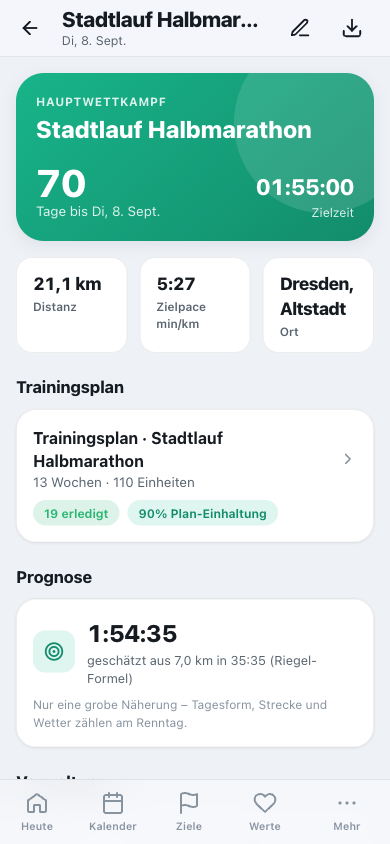

So legst du dein Ziel an:

1. Öffne **Ziele** und tippe oben auf **„+"** → wähle **Wettkampf**.
2. Trage **Name, Datum, Distanz** und **Zielzeit** ein und wähle die **Priorität**
   (A = Hauptwettkampf).
3. **Speichern** – du landest auf der Ziel-Seite mit Countdown und Zielpace.
4. Tippe auf **„Plan erstellen"**. Cat-O-Fit verteilt die Wochen automatisch in die Phasen
   **Grundlage → Aufbau → Spitze → Tapering** und leitet die Zielpaces aus deiner Zielzeit ab.
   Der **Long-Run-Aufbau passt sich der Renndistanz an** (5 km bekommt genug Grundlage, ein Marathon
   wird bei ~32 km gedeckelt). Trainierst du bereits **längere Läufe**, startet der Aufbau bei deinem
   **aktuellen Niveau** (ein Hinweis im Plan zeigt das an).

Du musst also nichts selbst ausrechnen – der fertige Plan steht in Sekunden und ist
jederzeit anpassbar.

 

---

## 1b. Trainingsprogramm ohne Wettkampf

Du willst einfach **fit, kräftig oder gesünder** werden – ganz ohne Wettkampf? Dann lege
statt eines Wettkampfs ein **Trainingsprogramm** an:

1. Öffne **Ziele** → **„+"** → wähle **Trainingsprogramm**.
2. Wähle einen **Schwerpunkt**:
   - **💪 Allgemeine Fitness** – ausgewogener Mix aus Ausdauer, Kraft und Beweglichkeit
     (an den WHO-Bewegungsempfehlungen orientiert).
   - **🏋️ Kraft & Muskelaufbau** – Ganzkörper-Kraft im Wechsel, ergänzt um Cardio und Mobilität.
   - **⚖️ Abnehmen & Gewicht** – viel Bewegung plus Kraft; wirkt zusammen mit der **Kalorienbilanz**.
   - **🧘 Beweglichkeit & Gesundheit** – sanfter Einstieg mit Mobility, leichtem Cardio und Kraft.
3. Lege **Trainingstage pro Woche** (3–5) und die **Dauer** (4, 8 oder 12 Wochen) fest.
4. **Speichern & Plan erstellen** – der wiederkehrende Wochenplan steht sofort.

Die Einheiten erscheinen **wie gewohnt überall**: im Kalender, unter „Heute", in der
Session-Ansicht (inklusive **Workout-Modus** mit Satz-Zähler) und in der Statistik. Über
**„Plan neu erstellen"** kannst du die Wochen jederzeit frisch erzeugen, über den Status
ein Programm auf **abgeschlossen** setzen.

 

---

## 2. Ein Training durchführen

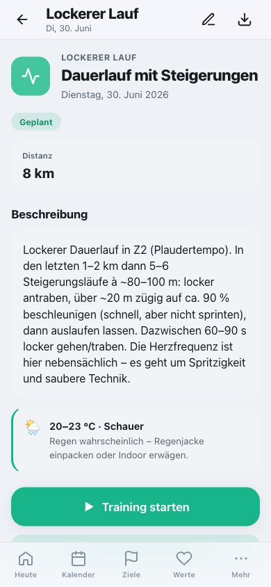

Jede Einheit hat eine eigene Seite mit dem **Soll**: Distanz, Zielpace und Herzfrequenz-Zone.

1. Tippe auf dem **Dashboard** oder im **Kalender** auf die Einheit.
2. Prüfe die Zielwerte und tippe **„Training starten"**.
3. Im **Workout-Modus** läuft die Uhr. Bei Intervallen führt dich Cat-O-Fit mit Ton durch
   Belastung und Pause; beim Krafttraining zählst du Sätze per großem Plus/Minus.
4. Am Ende **„Beenden"** → Distanz, Anstrengung (RPE) und Gefühl eintragen → fertig.

### Trinkpausen im Long Run

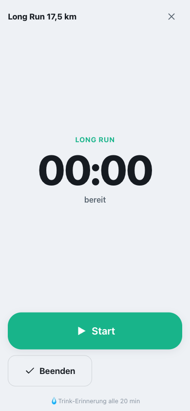

Bei langen Läufen erinnert dich Cat-O-Fit **automatisch ans Trinken** – mit eingeblendetem
Banner, Ton und Vibration (Long Run alle 20 Minuten, Wettkampf/Radtour alle 25 Minuten).
Tippe das Banner an, um es zu bestätigen. Du kannst das **Intervall pro Einheit** im Bearbeiten-Dialog
unter **„Trinkpause alle (min)"** selbst festlegen (leer = automatisch, 0 = aus).

**Abwechslungsreiche Intervalle.** Neben gleichmäßigen Intervallen (z. B. 6×800 m) streut der Plan
**Pyramiden** (Spitzenphase, 1–2–3–4–3–2–1 min) und **Fahrtspiele** (Aufbauphase, z. B. 8×1 min
schnell / 1 min locker) ein. Beim Fahrtspiel ist die „Pause" lockeres **Weiterlaufen** (Float), kein
Stopp – der Workout-Modus führt dich mit Ton durch die wechselnden Abschnitte.

Der Bildschirm bleibt während des Trainings an, und dein Fortschritt wird laufend
gespeichert – selbst wenn das Training unterbrochen wird, geht nichts verloren.

> 💡 **Tipp:** Lieber oft kleine Schlucke als selten viel.

 

---

## 3. Ein Training ohne Uhr nachtragen

Du bist ohne Handy gelaufen? Kein Problem:

1. Öffne die Einheit (über Dashboard, Kalender oder Plan).
2. Tippe **„Als erledigt erfassen"**.
3. Trage ein, was du weißt – Distanz, Zeit, Gefühl. **Alles ist optional.**

Cat-O-Fit verknüpft das automatisch mit der geplanten Einheit und zeigt dir den
**Soll-Ist-Vergleich**.

---

## 4. Eine Einheit verschieben

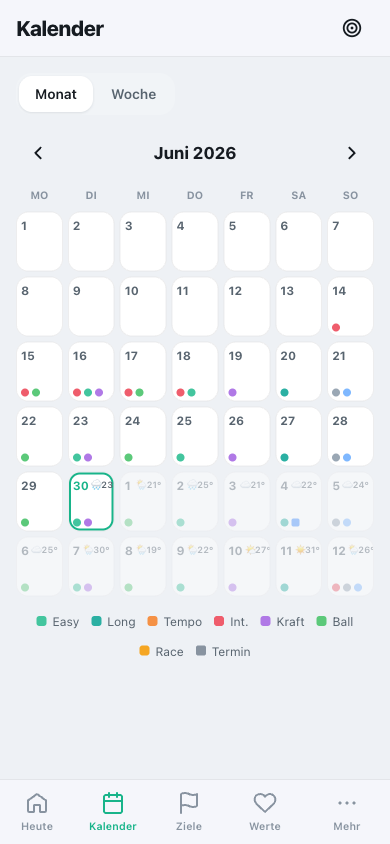

Das Leben kommt dazwischen – verschiebe Einheiten einfach:

1. Öffne den **Kalender** und wechsle oben auf **„Woche"**.
2. Halte eine Einheit am **Griff ⠿** gedrückt und zieh sie auf einen anderen Tag.
3. Alternativ: Einheit öffnen → **„Verschieben"** → neues Datum wählen.

Der Plan merkt sich die Verschiebung; in der Statistik bleibt deine Plan-Einhaltung
nachvollziehbar.

**Termine im Kalender.** Trägst du in **„Checkliste & Erinnerungen"** einen Termin mit Datum ein
(z. B. Arzttermin, Besorgung), erscheint er automatisch im Kalender: in der **Wochenansicht** als
eigene Zeile mit Uhrzeit und Kategorie, in der **Monatsansicht** als kleiner **eckiger** Punkt (die
runden Punkte sind Trainingseinheiten). Ein Tipp auf den Termin bringt dich zur Checkliste zum
Abhaken oder Bearbeiten.

**Sanfter Hinweis.** Wählst du im „Verschieben"-Dialog einen Tag, an dem **schon eine Einheit** liegt,
oder **direkt neben** eine fordernde Einheit (Tempo, Intervalle, Kraft, Long Run), macht dich Cat-O-Fit
darauf aufmerksam – so geht die Erholung nicht unter. Der Hinweis **blockiert nichts**: Du verschiebst
trotzdem, wenn du möchtest.

 

---

## Einheiten anpassen, ergänzen & aufholen

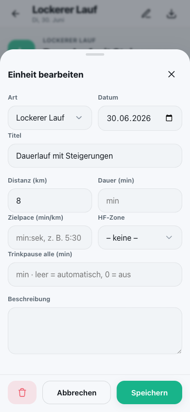

Dein Plan gehört dir – passe ihn jederzeit an:

1. Öffne eine Einheit und tippe oben aufs **Stift-Symbol**. Editierbar sind **Art** (z. B. Easy → Tempo),
   **Zielpace**, **HF-Zone**, **Distanz/Dauer**, die **Intervallstruktur** (Runden × Belastung/Pause,
   steuert direkt den Workout-Modus) und die Beschreibung.
2. Über das **„+"** im Trainingsplan legst du eine **ganz neue Einheit** an. Neben den Lauf- und
   Kraft-Typen gibt es auch **Testspiel** (⚑) und **Trainingslager** (🔥) – ideal für Fußballerinnen,
   die ein Spiel oder ein intensives Wochenende eintragen wollen. Diese gelten als **fordernd** und
   fließen in Belastungs- und Erholungshinweise ein.
3. Im Bearbeiten-Dialog kannst du eine Einheit auch **löschen**.

**Wochenbelastung im Blick.** Legst du eine Einheit selbst an und liegt in **derselben Woche** schon
eine **ähnlich intensive**, noch offene Einheit, fragt Cat-O-Fit, ob du diese aus dem Plan nehmen
möchtest – so wächst die Wochenbelastung nicht unbemerkt an. Das ist nur ein Vorschlag: **„Aus Plan
nehmen"** gleicht aus, **„Beide behalten"** lässt alles, wie es ist.

**Eine Woche neu berechnen.** Hat sich für eine bestimmte Woche etwas grundlegend geändert (z. B.
Saisonstart, ein Trainingslager oder eine längere Pause)? In der **Wochenübersicht** des Plans setzt
**„Diese Woche neu berechnen"** genau diese eine Woche frisch auf. **Bereits erledigte Trainings
bleiben erhalten**; verschobene oder manuell geänderte Einheiten dieser Woche werden ersetzt.

**Überfällig?** Vergangene, nicht absolvierte Einheiten werden automatisch als **„überfällig"**
gekennzeichnet (Kalender, Plan, Session). Auf dem Dashboard erinnert dich ein Hinweis ans
Verschieben, Nachtragen oder Abhaken – ganz ohne erhobenen Zeigefinger.

**Schlüsseleinheit nachholen.** Hast du eine **fordernde** Einheit (Tempo, Intervalle, Long Run, Kraft)
als **verpasst** markiert, schlägt das Dashboard einen **freien Tag** der nächsten Woche vor und holt sie
auf Wunsch dorthin nach – so geht ein wichtiger Reiz nicht ersatzlos verloren. Der Zieltag wird so
gewählt, dass keine zwei harten Einheiten direkt aufeinandertreffen.

 

---

## 5. Körperwerte pflegen

Unter **Werte** verfolgst du deine Entwicklung – ruhig und ohne Druck:

1. Tippe auf **„+"** und trage z. B. Gewicht, Ruhepuls oder Schlaf ein (nur was du möchtest).
2. Die Verläufe zeigen deinen **Trend** – mit **Y-Skala**, beim Gewicht mit **Ziellinie**.
3. **Werte ablesen:** Zieh den Finger über ein Diagramm (am Rechner: Maus darüber) – eine Führungslinie
   springt zum nächsten Datenpunkt und zeigt **Datum + Wert** in einer kleinen Bubble.

Die Darstellung ist bewusst **wertfrei** – es geht um die Richtung über Wochen, nicht um
tägliche Schwankungen. Einzelne Werte kannst du in den Einstellungen ausblenden.

 

---

## 6. Daten aus Apple Health holen

Deine Garmin-Uhr synchronisiert nach Apple Health – von dort holst du die Daten per Export:

1. iPhone → **Health-App** → oben aufs **Profilbild** → **„Alle Gesundheitsdaten exportieren"**.
2. Die entstehende **ZIP-Datei** in der App hochladen: **Mehr → Health-Import**.
3. Cat-O-Fit übernimmt **Lauf-Workouts** (→ durchgeführte Einheiten, automatisch zugeordnet)
   und **Körperwerte** (Gewicht, Ruhepuls, Schlaf, HRV, VO₂max).

**Einzelne Aktivität (GPX/TCX).** Auf derselben Seite kannst du auch eine **einzelne GPX- oder
TCX-Datei** hochladen – etwa aus **Garmin Connect**, einem **Strava-Export** oder einer Uhren-App. Sie
wird direkt im Browser ausgewertet (Datum, Dauer, Distanz, Ø-Herzfrequenz) und als absolvierter Lauf
gespeichert. Praktisch, wenn du nur einen einzelnen Lauf nachtragen willst.

> ⚠️ **Ehrlich gesagt:** Eine Live-Verbindung ist technisch nicht möglich – es ist ein
> **Import auf Knopfdruck**, so oft du magst. Doppelte Einträge werden automatisch erkannt.

---

## 7. Erinnerungen aufs iPhone bekommen

Der zuverlässigste Weg auf iPhone/iPad ist der **native Kalender**:

1. Öffne eine Einheit oder den Plan und tippe auf das **Export-Symbol**.
2. Wähle **„Kompletter Plan"**, **„Diese Einheit"** oder **„Nur Wettkampf"**.
3. Die **.ics-Datei** öffnet sich im iOS-Kalender – inklusive Erinnerung **1 Stunde vorher**
   und **am Vorabend**, samt Link zurück in die App.

> In-App-Hinweise greifen nur bei geöffneter App. Für verlässliche Erinnerungen ist der
> Kalender-Export der richtige Weg.

---

## 8. Deinen Fortschritt verstehen

Unter **Statistik** siehst du auf einen Blick, wo du stehst:

- **Ampel „Bin ich auf Plan?":** ganz oben – grün, gelb oder rot, mit Begründung. Sie fasst
  Plan-Einhaltung, Trainingslast und Ausfälle der letzten vier Wochen zu einem Status zusammen.
- **Plan-Einhaltung:** wie viele fällige Einheiten du im rollenden 4-Wochen-Fenster erledigt hast.
- **Wochenumfang & Trainingslast:** Lauf-Kilometer (7 vs. 28 Tage) mit beschrifteter Achse, plus eine
  **Gesamtbelastung** (Dauer × Intensität) über **alle Sportarten** – so zählen auch Kraft, Fußball,
  Rad oder ein Testspiel mit, nicht nur die Lauf-km.
- **Trainingsjahr:** eine **Heatmap** der letzten 12 Monate im GitHub-Stil – Wochen × Wochentage, je
  dunkler ein Tag, desto mehr Trainingszeit. Tippen/Hovern zeigt Datum und Minuten; ein Zähler nennt
  deine **aktiven Tage**.
- **Ausgefallene Einheiten:** nach Grund aufgeschlüsselt (Verletzt/Krank/Keine Zeit/Sonstiges).
  Verletzungs- und krankheitsbedingte Ausfälle zählen nicht gegen deine Einhaltung.
- **Einheiten-Verteilung:** das Verhältnis deiner Trainingsarten.
- **Werte & Ziele:** Gewicht, Wochenumfang, lockeres Tempo, Ruhepuls und VO₂max – je mit Trendpfeil
  (↑/↓/→) und der Kennzeichnung **halten** oder **verbessern**, Gewicht in Richtung Zielgewicht.
- **Wettkampfprognose:** eine grobe Schätzung deiner möglichen Zeit (Riegel-Formel).

Alles ist als **Orientierung** gedacht – keine Versprechen, sondern Anhaltspunkte.
Konsistenz zählt mehr als einzelne Top-Tage.

 

---

## Dein Coach & deine Erfolge

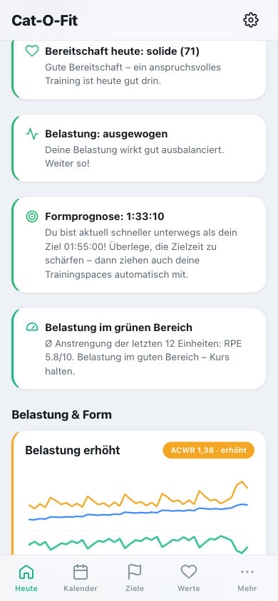

**Der Coach** auf dem Dashboard reagiert auf dein Verhalten:

- **Bereitschaft** aus HRV, Ruhepuls und Schlaf – wie erholt du heute bist.
- **Belastung** aus dem RPE deiner letzten Einheiten – zu hart, ausgewogen oder noch Luft nach oben.
- **Formprognose** – deine geschätzte Wettkampfzeit im Vergleich zur Zielzeit.
- **Aktuelle Form (VDOT)** – aus deinen jüngsten Lauf-Leistungen geschätzt, mit passenden Trainings-Paces.
  Details und Bedienung siehe **[Aktuelle Form & Zielpaces anpassen](#aktuelle-form--zielpaces-anpassen)**.
- **Tagesanpassung** – ist deine **Bereitschaft heute niedrig** und steht eine **fordernde Einheit** an
  (Tempo, Intervalle, Long Run, Kraft), schlägt der Coach „**Heute lockerer machen**" vor: ein Tap wandelt
  sie in eine lockere Variante (Easy, ~60 % Distanz). Die Schlüsseleinheit holst du erholt nach.
- **Nachholen, Entlasten & Steigern** – verpasste **Schlüsseleinheiten** holt der Coach auf einen freien
  Tag der nächsten Woche nach. Bei der Belastung passt er in **beide Richtungen** an: waren die letzten
  Einheiten **sehr fordernd**, bietet er eine **Entlastungswoche** an (~25 % weniger Umfang); waren sie
  **eher locker** und du hast Reserven, kannst du die kommende Woche **steigern** (~12 % mehr).
- **Wochenumfang ausgleichen** – sind Lauf-km der Woche liegen geblieben, schlägt der Coach vor, einen
  **Teil davon behutsam** (gedeckelt) auf die nächste lockere Einheit zu legen. Ein Tap übernimmt es –
  nie alles auf einmal, nie auf eine harte Einheit.
- **Bereit für mehr?** – aus dem Anstrengungs-Trend (RPE) deiner letzten Einheiten empfiehlt der Coach
  **behutsam zu steigern** (wenn es zuletzt locker war), den **Kurs zu halten** oder eine **lockere
  Phase** einzulegen (wenn es durchweg sehr hart war).

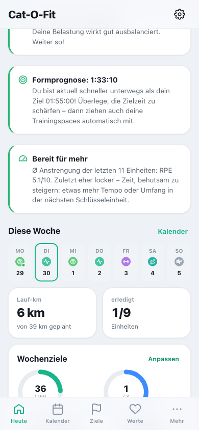

Das sind **Empfehlungen**, keine Vorschriften – Änderungen am Plan passieren nur, wenn du sie auslöst.

 

### Aktuelle Form & Zielpaces anpassen

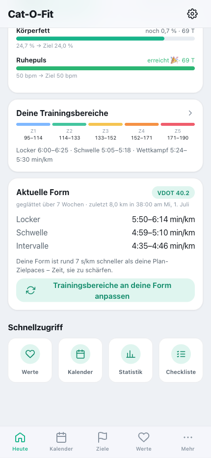

Zwei Karten auf „Heute" gehören zusammen:

- **Deine Trainingsbereiche** – die Zielpaces, mit denen dein Plan aktuell rechnet (z. B. Schwelle 5:05–5:18/km).
- **Aktuelle Form** – was deine jüngsten Läufe hergeben, als **VDOT** und passende Paces.

**So liest du die „Aktuelle Form":**

1. Der **VDOT-Chip** (z. B. „VDOT 40") ist deine geschätzte, **geglättete** Leistung.
2. „**geglättet über 7 Wochen · zuletzt 8,0 km in 38:00 am Mi, 1. Juli**" heißt: Die Form ist **kein
   einzelner Lauf**, sondern ein geglätteter Wert aus deinen letzten Wochen – je Woche zählt dein bester
   Lauf, jüngere Wochen zählen mehr, und **einzelne Ausreißer werden gekappt**. So springt die Form nicht
   bei einem einzelnen sehr schnellen oder langsamen Tag; „zuletzt …" nennt deinen jüngsten Qualitätslauf.
3. **Locker / Schwelle / Intervalle** sind die zu dieser Form passenden Paces.
4. Die Zeile darunter vergleicht Form und Plan: „Deine Form ist rund **7 s/km schneller** als deine
   Plan-Zielpaces – Zeit, sie zu schärfen." (Passt beides zusammen, steht dort „passen gut".)

**Anpassen (ein Tap):** „**Trainingsbereiche an deine Form anpassen**" übernimmt die Form-Paces **sofort**
in deine Trainingsbereiche **und** in alle offenen, künftigen Lauf-Einheiten deines Plans – ohne Umweg über
„Diese Woche neu berechnen". Danach zeigt die Karte „passen gut".

> **Mit den Demodaten zum Ausprobieren:** Noras geglättete Form liegt bei ~VDOT 40, ihr Plan zielt noch etwas
> langsamer (Schwelle 5:05–5:18/km). Öffne „Heute" → tippe auf „Trainingsbereiche an deine Form anpassen" →
> die Schwelle wird geschärft, und die kommenden Läufe im Plan zeigen die neuen Paces. Wichtig: Ein einzelner
> Ausreißer-Tag verschiebt die Form **nicht** – sie wird über **mehrere Wochen geglättet**.

 

### Erfolge & Momentum

Für durchgeführte Trainings und erreichte Ziele schaltest du **Abzeichen** frei – automatisch und mit
einer kleinen Feier. Dein **Momentum** ist die „Schwung-Flamme": Sie **wächst**, wenn du dranbleibst,
und **schrumpft sanft** bei Lücken – als Anstoß gedacht, nie als Strafe (passend zur Cat-O-Fit-
Philosophie „Motivation ohne Druck"). Das Momentum siehst du immer oben im Dashboard; alle Abzeichen
mit Fortschritt findest du unter **Mehr → Erfolge & Momentum**.

 

---

## Belastungssteuerung, feste Termine & zwei Ziele

Seit v3.7–v3.9 plant Cat-O-Fit **rollierend** und steuert die Belastung nach Profisport-Standard.

### Belastung & Form (Karte auf „Heute")

Aus **Dauer × Anstrengung (RPE)** jeder Einheit – über **alle** Sportarten (Laufen, Kraft, Fußball …):

- **ACWR (akut:chronisch)** – die Last der letzten 7 Tage im Verhältnis zu den letzten 28. Der grüne
  Sweet-Spot liegt bei **0,8–1,3**; deutlich darüber steigt das Überlastungsrisiko, darunter geht Fitness verloren.
- **Fitness / Ermüdung / Form** – langfristige Fitness (CTL) minus kurzfristige Ermüdung (ATL) ergibt die
  **Form (TSB)**: positiv = frisch, stark negativ = tief in der Ermüdung.
- **Monotonie & Strain** – zu gleichförmige Wochen erhöhen das Risiko; ein Wechsel aus harten und leichten
  Tagen senkt es.

### Feste Termine (Fußball & Spiele)

Trage wiederkehrende Termine **einmal** ein – der Plan legt sich darum herum:

- **Fußball-Trainingstage** (z. B. Mo & Mi) mit Dauer **und Intensität** (leicht · normal · intensiv).
  Fußball ist HIIT-artig und kostet viel Energie: Ab „normal" zählt ein Fußballtag als **fordernder Tag**
  (fließt voll in Belastung & Form ein), und nach einem intensiven Fußball schlägt der Coach vor, den
  **Folgetag lockerer** anzugehen. „Leicht" bleibt ein lockerer Tag.
- **Wiederkehrende Spiele** mit Startdatum (z. B. „ab 19.08. jeden Sonntag, 2 h"). An einem Spieltag entfällt
  die geplante Trainingseinheit; alles zählt in die Belastung mit.

### Rollierende Planung & automatischer Erholungstag

Statt eines starren Blocks passt sich die kommende Woche an das an, was du **tatsächlich** getan hast. Steigt
die Belastung zu schnell oder häufen sich harte Tage, schlägt der Coach einen **Erholungstag** vor. Liegen an
dem Tag **zwei Einheiten** (etwa aus zwei Zielen), wird der **ganze Tag** ruhig gestellt – nicht nur eine
Einheit; alternativ bietet der Coach an, eine der beiden auf einen freien Tag zu **verschieben** (entzerren).
Jede automatische Anpassung steht im **Log „Zuletzt automatisch angepasst"** und lässt sich **rückgängig** machen.

**Zyklusbewusst:** Trägst du im **Zyklus**-Bereich einen Periodenbeginn ein, entschärft Cat-O-Fit das Training
am **1. Periodentag** automatisch (Läufe → locker, Kraft → Mobility) – auch das steht im Anpassungs-Log und
ist rückgängig. So musst du an dem Tag nichts von Hand verschieben, selbst wenn die Periode früher kommt.

### Wochen-Check & Vorschau (What-if)

Der **Wochen-Check** im Plan zeigt Kollisionen und die Reihenfolge der Triage:
**feste Termine → Schlüssel-Läufe → Kraft → Umfang**. Bevor du eine Einheit hinzufügst oder verschiebst,
zeigt die **Vorschau** die Auswirkung auf die Wochenbelastung.

> **Hinweis:** Krafttraining ist seit v3.9.1 **nicht mehr** fest im Wettkampf-Laufplan verdrahtet (Dienstag
> ohne Kraft, Freitag ohne fixes Training). Kraft steuerst du bei Bedarf über ein **eigenes Programm/Ziel**.

### Ziel-Cockpit: zwei Ziele in einem Plan

Halbmarathon **und** Abnehmen? Das **Ziel-Cockpit** bündelt Leistungsziel und Gewicht: Der Schwerpunkt
wandert mit der Phase (im Aufbau darf das Kaloriendefizit größer sein, in der Wettkampfphase steht die
Leistung vorn), eine **Defizit-Empfehlung** koppelt an die Ernährung, und ein **Reiz-Check** warnt, wenn zu
wenig Trainingsreiz gesetzt wird oder das Defizit die harten Einheiten gefährdet.

 

---

## Übungs-Bibliothek

Unter **Mehr → Übungs-Bibliothek** findest du **29 Übungen** für **Kraft, Rumpf & Beweglichkeit** – als
Begleitung zu den Kraft- und Mobility-Einheiten deines Plans, u. a. **Rücken-/Hüft-Dehnungen** und
**Bauch-/Rücken-/Bein-Kraft**.

- Jede Übung hat eine **symbolhafte Illustration** (eine schematische Strichfigur, die die Grundbewegung
  zeigt – selbst gezeichnet, keine Fotos), eine **Schritt-für-Schritt-Anleitung**, die beanspruchten
  **Muskelgruppen**, das nötige **Equipment**, die **Schwierigkeit** und einen **Tipp**.
- Oben **suchen** (Name/Muskelgruppe), nach **Kategorie** (Kraft/Rumpf/Beweglichkeit) **und** zusätzlich
  nach **Körperregion** filtern (Rücken · Hüfte · Bauch · Beine · Oberkörper).
- Jede Übung zeigt einen **Nutzungszähler** („3×") – wie oft du sie gemacht hast. Im Detail zählst du per
  **„Gemacht (+1)"** hoch; außerdem zählt es automatisch, wenn du eine damit verknüpfte Einheit erledigst.
- **In der Trainingseinheit:** Kraft- und Mobility-/Regenerations-Einheiten schlagen dir passende Übungen
  vor – **nach deiner Nutzungshäufigkeit sortiert**. Mit **„+"** hängst du eine Übung an die Einheit; beim
  Erledigen zählt sie dann automatisch mit. Tippe eine Übung an, um die Details groß zu sehen. Die Übungen
  bleiben auch **während des Workouts** erreichbar (ein-/ausklappbares Panel unter der Uhr).

> Die Darstellungen sind bewusst symbolisch – sie zeigen die Grundbewegung und ersetzen keine
> individuelle Anleitung. Bei Schmerzen oder Unsicherheit lieber fachkundig anleiten lassen.

 

## Gesundheitsziele mit Fortschritt

Neben den **Wochenzielen** (aktive Minuten & Trainingstage) kannst du **dedizierte Zielwerte** für deine
Körperwerte festlegen: **Gewicht, Körperfett, Ruhepuls, HRV** oder **VO₂max** – jeweils mit optionaler
**Frist**.

1. **Einstellungen → Gesundheitsziele → „+ Ziel"**: Metrik wählen, Zielwert (und optional ein Zieldatum)
   eintragen. Dein **aktueller Wert** wird als **Startpunkt** gemerkt.
2. Auf **„Heute"** erscheint die Karte **Gesundheitsziele** mit einem **Fortschrittsbalken** je Ziel –
   vom Startwert zum Ziel, plus „noch X bis Ziel" und die verbleibenden Tage.
3. Der Fortschritt zählt mit jedem neuen Wert, den du unter **Werte** einträgst (oder per Apple-Health-
   Import). Ist das Ziel erreicht, feiert die Karte es 🎉.

 

---

## Ernährung & Listen lernen mit

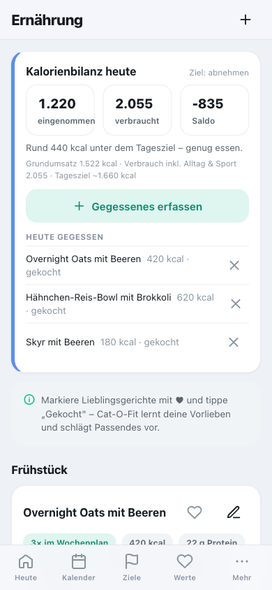

**Schnell starten:** Beim ersten Öffnen ist die Liste leer – tippe auf **„Rezept-Ideen laden"** und du
hast mit einem Schlag **~48 fertige Gerichte** (Frühstück, Mittag, Abend, Snack: vegetarisch, vegan,
low-carb, proteinreich, meal-prep …). Oder lege über **„Eigenes Gericht anlegen"** bzw. das **„+"** oben
dein eigenes an. Jedes Gericht hat Zutaten, kcal und Eiweiß; der **„schätzen"**-Knopf füllt Kalorien &
Eiweiß automatisch aus den Zutaten (siehe unten).

Markiere Gerichte mit **♥** und tippe nach dem Kochen auf **„Gekocht"**. Cat-O-Fit lernt, welche Tags
(z. B. *proteinreich*, *vegetarisch*) du bevorzugst, und empfiehlt Passendes unter **„Für dich"**.
Plane Gerichte mit **Portionen** für die Woche – daraus entsteht automatisch die gemeinsame
**Einkaufsliste** (siehe unten). Oft genutzte Checklisten-Punkte tauchen als **Schnell-Hinzufügen**-Chips
auf – so wird die Pflege mit der Zeit immer schneller.

Brauchst du noch mehr Abwechslung? Über **„… Rezept-Ideen hinzufügen"** am Ende der Liste holst du
jederzeit weitere proteinbetonte Vorschläge über alle Kategorien dazu.

**Kalorienbilanz heute.** Ganz oben zeigt eine Karte deinen **Verbrauch** (Grundumsatz nach
Mifflin-St-Jeor + Alltag + heutiges Training) gegen die **Einnahme**, inkl. Saldo und einem Tagesziel
in Richtung deines **Zielgewichts**. Die Einnahme kommt aus deinem **Ess-Tagebuch**: Tippst du bei
einem Rezept auf **„Gekocht"** oder erfasst mit **„Gegessenes erfassen"** eine Auswärts-Mahlzeit
(pauschale kcal nach Portionsgröße), entsteht ein datierter Eintrag. **„Heute gegessen"** unter der
Bilanz listet alle Einträge des Tages – einzeln löschbar. So bleiben Tagebuch und Rezeptliste getrennt.
Beim Anlegen eigener Gerichte schätzt der **„schätzen"**-Knopf Kalorien **und Eiweiß** aus den Zutaten.
Wenn aktiviert (Einstellungen → Ernährung → *„Nährwerte online ergänzen"*), holt er dafür echte Werte je
Zutat aus **Open Food Facts** (offene Datenbank); unplausible Treffer werden verworfen, sonst greift eine
lokale Schätzung. Nur der Zutatenname verlässt den Server, Ergebnisse werden lokal zwischengespeichert –
ist die Option aus, bleibt alles rein lokal. Alles ist als Orientierung gedacht. Für die Bilanz trägst du
im **Profil** Größe, Gewicht, Geburtsjahr und (optional) Geschlecht ein.

 

---

## Wetter im Plan

Hinterlege deinen **Standort** in den Einstellungen (→ „Standort & Wetter", Stadt suchen). Im
Kalender erscheinen dann für die kommenden ~16 Tage kleine **Wettersymbole mit Temperatur**.

Bei **Hitze, Regen, Sturm oder Gewitter** bekommst du in der jeweiligen Lauf-Einheit einen
passenden **Hinweis** – z. B. „früh oder spät laufen, viel trinken". So planst du wetterbewusst.

Die Daten kommen von **Open-Meteo** (ohne Anmeldung). Ohne Internet bleibt der zuletzt geladene
Stand erhalten – die App funktioniert normal weiter.

 

---

## Zykluskalender

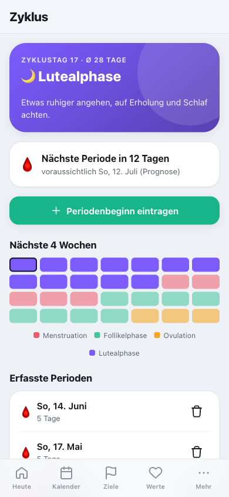

Eine zyklusbewusste, rücksichtsvolle Trainingsplanung – **opt-in** und jederzeit abschaltbar
(Einstellungen → Module).

1. Markiere deinen **Periodenbeginn**. Cat-O-Fit berechnet **Zykluslänge**, deine **aktuelle Phase**
   (Menstruation/Follikel/Ovulation/Luteal) und prognostiziert die **nächste Periode**.
2. Die Phasen erscheinen dezent im **Kalender**.
3. An deinen **Menstruationstagen** sind Einheiten **geschützt**: Du kannst sie **schadfrei**
   verschieben oder auslassen – sie zählen nicht als verpasst und schmälern weder Plan-Einhaltung
   noch Momentum.
4. Trainierst du trotzdem, gibt es das Abzeichen **„Harte Kämpferin" 🥊**.

> 🔒 **Datenschutz:** Diese sensiblen Daten bleiben – wie alles in Cat-O-Fit – lokal auf deinem eigenen Server oder NAS.

 

---

## Einkaufsliste & gemeinsames Lager (Team/Familie)

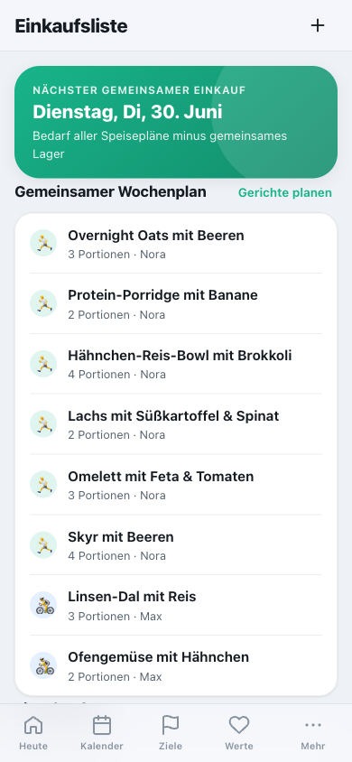

Die Einkaufsliste ist **gemeinsam** und entsteht **automatisch aus den Speiseplänen aller
Mitglieder** – niemand pflegt sie von Hand.

1. Jedes Mitglied plant in der **Ernährung** Gerichte mit **Portionen** für die Woche (Warenkorb-Symbol
   an jeder Mahlzeit).
2. Cat-O-Fit **zieht die geplanten Gerichte aller zusammen**, **aggregiert** die Zutaten mit echten
   Mengen (z. B. Haferflocken von zwei Personen zu einer Menge) und **zieht das gemeinsame Lager ab** –
   die Liste zeigt nach Kategorien genau, was ihr noch **braucht**. Fällig zum zentralen
   **Einkaufstag** (von Admins in der Team-/Familienverwaltung gesetzt, Standard Dienstag).
3. **„Alles eingekauft"** bucht die Mengen ins **gemeinsame Lager**. **„Gekocht"** (in der Ernährung)
   bucht sie wieder ab – so wisst ihr alle, was zu Hause ist und was wirklich gekauft werden muss.

Der Wochenplan zeigt pro Gericht das Mitglied (Avatar + Name). Zutaten ohne feste Menge (z. B.
„Spinat") erscheinen als **„nach Bedarf"**.

 

---

## Die Bereiche im Detail

### Heute (Dashboard)

Dein Startbildschirm: persönliche Begrüßung, **Countdown** zum nächsten Wettkampf, die
**heutige Einheit**, ein motivierender Tipp, der **Wochenüberblick** (Soll/Ist), deine
**Wochenziele** (aktive Minuten & Trainingstage als Fortschrittsringe, plus Differenz zum
Zielgewicht) und **Schnellzugriffe**. Von hier kommst du mit einem Tipp überallhin.

 

### Ziele

Deine **Trainingsprogramme** und **Zielwettkämpfe** an einem Ort. Wettkampf-Karten zeigen
Countdown, Distanz und Priorität (A/B/C); Programm-Karten den Schwerpunkt und die Trainingstage
pro Woche. Beide zeigen, ob schon ein Plan existiert. Über **„+"** legst du ein neues Ziel an und
wählst, ob es ein **Wettkampf** oder ein **Trainingsprogramm** werden soll.

 

### Trainingsplan

Der periodisierte Plan eines Events: ein **Phasen-Zeitstrahl**, Kennzahlen (geplante km,
Einheiten, Erledigtes) und die **Wochenübersicht** zum Aufklappen. Hier kannst du den Plan
auch neu generieren oder als Kalender exportieren.

 

### Session-Ansicht & Workout-Modus

Eine einzelne Einheit in drei Zuständen: **geplant** (Soll + „Training starten"),
**in Ausführung** (Vollbild-Workout mit großen Bedienelementen, Intervall-Steuerung,
Satz-Zähler und Trinkpausen-Erinnerung) und **absolviert** (Auswertung mit
Soll-Ist-Vergleich, Splits, Zeit-in-Zonen und RPE).

### Werte, Statistik & mehr

**Werte** zeigt deine Körperwert-Trends, **Statistik** deinen Fortschritt. Unter **Mehr**
findest du außerdem **Ernährung** (proteinbetonte Ideen), **Einkaufsliste**,
**Tages-Checkliste**, **Health-Import**, **Einstellungen** und diese **Hilfe**.

### Einstellungen

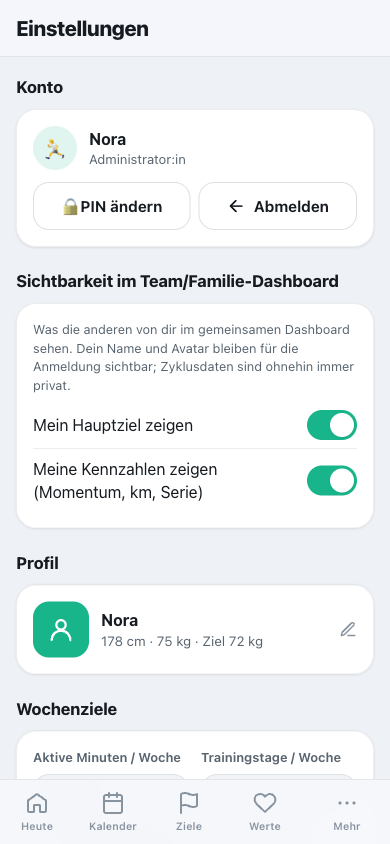

Hier passt du alles an: **Profil**, **Herzfrequenz-Zonen** (aus deiner Max-HF), **Pace-Bereiche**,
**Theme & Akzentfarbe**, welche **Module** und **Körperwerte** sichtbar sind, sowie
**Backup & Sicherung**. Deine Daten bleiben jederzeit in deiner Hand.

 

### Backup & Wiederherstellung

Unter **Einstellungen → Daten & Sicherung** sicherst du deine Daten – ganz ohne fremde Cloud.

- **Mein Backup (für alle):** „Backup exportieren" lädt eine JSON-Datei mit **deinen eigenen
  Daten** herunter – inklusive deiner **privaten Zyklusdaten**. „Backup importieren" spielt sie
  wieder ein. Stammt die Datei aus einem anderen Profil, fragt die App vorher nach.
- **Familien-Vollbackup (nur Admin):** Sichert die **gesamte Familie** in einer Datei – alle
  Mitglieder, Rollen, Einstellungen und sämtliche Daten **inkl. Urkunden/Reports**. Aus
  Datenschutzgründen **ohne private Zyklusdaten** – die sichert jedes Mitglied selbst über
  „Mein Backup".
- **Wiederherstellen (nur Admin):** „Vollbackup wiederherstellen" setzt die ganze Familie
  **autoritativ** auf den Stand der Datei zurück – auf dem Gerät **und** auf dem Server. Das ist
  der Notfall-Weg, wenn etwas schiefging. Private Zyklusdaten bleiben dabei **unangetastet**.
  Weil das alles überschreibt, fragt die App vorher deutlich nach.

> **Tipp:** Lege das Vollbackup regelmäßig an und bewahre es sicher auf (es enthält die Daten
> aller Mitglieder). Für den schnellen Eigenbedarf reicht „Mein Backup".

 

### Hilfe & Wissen (in der App)

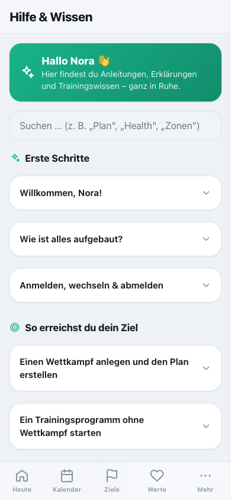

Dieselben Inhalte wie dieses Handbuch findest du **direkt in der App** unter
**Mehr → Hilfe & Wissen** – durchsuchbar und mit aufklappbaren Schritt-für-Schritt-Anleitungen.

 

---

## Trainingswissen

**Die Trainingsphasen (Periodisierung).** Ein guter Plan baut in Phasen auf:
*Grundlage* (lockerer Umfang), *Aufbau* (Schwelle, Tempohärte), *Spitze* (kurze schnelle
Reize & Wettkampftempo), *Tapering* (Umfang runter, frisch an den Start).

**Herzfrequenz-Zonen.** Fünf Zonen aus deiner Max-HF: Z1 Regeneration, Z2 Grundlage
(„unterhaltsam", hier wächst die Ausdauer), Z3 Tempo, Z4 Schwelle, Z5 VO₂max (nur kurz).

**Pace-Bereiche.** Jeder Einheitstyp hat einen Tempobereich in min/km, abgeleitet aus deiner
Zielzeit – ein Vorschlag, kein Muss. Tagesform zählt.

**RPE (1–10).** Dein subjektives Belastungsempfinden ergänzt Herzfrequenz und Pace –
besonders an Tagen, an denen sich Zahlen „anders anfühlen".

**Trainingslast & Erholung.** Steigt deine Belastung sehr schnell, plane bewusst Erholung
ein. Cat-O-Fit gibt Anhaltspunkte, keine Garantien.

**Einheiten-Typen.** Lauf-Einheiten (Regeneration, lockerer Lauf, Long Run, Tempo/Schwelle,
Intervalle, Wettkampf), Kraft & **Gerätetraining**, Mobility, **Gehen/Spazieren** und **Wandern**,
**Schwimmen**, **Rudern**, Rad & **Indoor-Cycling**, **Crosstrainer**, Ballsport (**Tennis,
Badminton, Squash, Tischtennis**, Fußball) sowie Cross-Training und Ruhetag. Alle außer dem Ruhetag
lassen sich im Workout-Modus mit Stoppuhr starten und zählen zur Gesamtbelastung.

---

## Tipps & FAQ

**Funktioniert die App offline?** Ja. Jede Änderung speichert sofort lokal; die
Synchronisierung läuft im Hintergrund, sobald wieder Verbindung besteht.

**Was, wenn ich iPhone und iPad gleichzeitig nutze?** Kein Problem. Der Server führt die Änderungen
zusammen – bearbeitest du auf beiden Geräten verschiedene Dinge, bleiben **beide** erhalten. Nichts
geht verloren, auch wenn die Uhren der Geräte leicht abweichen.

**Sind meine Daten sicher?** Sie liegen als Dateien auf deinem eigenen Server oder NAS, nicht in
einer fremden Cloud. Über die Einstellungen kannst du jederzeit ein Backup exportieren.

**Wie zuverlässig sind Erinnerungen?** Am verlässlichsten über den **Kalender-Export (.ics)** –
diese Erinnerungen funktionieren auch bei geschlossener App.

**Etwas sieht veraltet aus?** Lade die Seite neu – die App holt online automatisch die
neueste Version.

---

## Team & Familie (umgesetzt)

Cat-O-Fit ist längst **mehrbenutzerfähig**: Bis zu **32 Personen** – ob Laufgruppe, Sportmannschaft
oder Familie – nutzen die App auf demselben Server, jede mit eigenen Events, Plänen, Trainings und
Körperwerten. Wie Anmeldung, Rollen und gemeinsame Listen funktionieren, steht oben unter
[Team/Familie & Anmeldung](#teamfamilie--anmeldung). „Nora" in diesem Handbuch steht stellvertretend
für die jeweils angemeldete Person.

**Teams (seit v3.9.0).** Innerhalb der Familie kannst du als Admin **Teams** bilden (z. B. „Team Rot",
„Team Blau") und Mitglieder per Häkchen zuordnen. Ein Mitglied kann in **mehreren Teams** gleichzeitig sein,
manche in keinem – ein Teamwechsel ist jederzeit möglich. Im **Team/Familie-Dashboard** schaltest du oben
zwischen **Alle · je Team · Ohne Team** um; alle Kennzahlen (Wochen-Kilometer, Monats-km & Meilenstein,
„diese Woche aktiv", anstehende Wettkämpfe, Team-Erfolge) werden dann **sauber für das gewählte Team**
aggregiert. Teams anlegen/bearbeiten: Einstellungen → Team/Familie.

---

*Viel Freude und gute Läufe! 🏃‍♀️ — Bei Fragen hilft dir auch die Hilfe direkt in der App weiter.*
