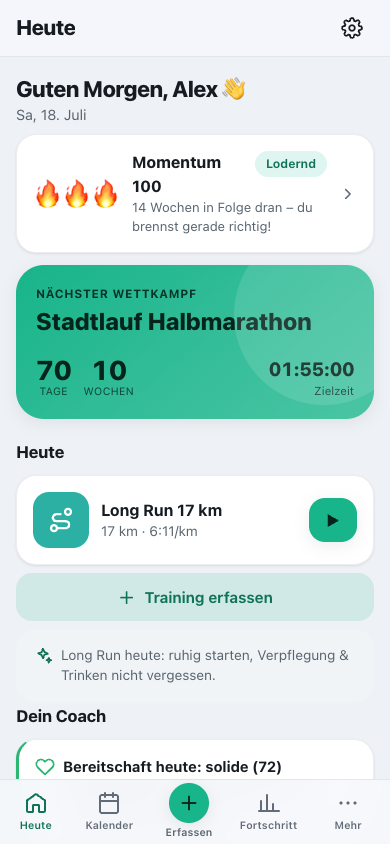
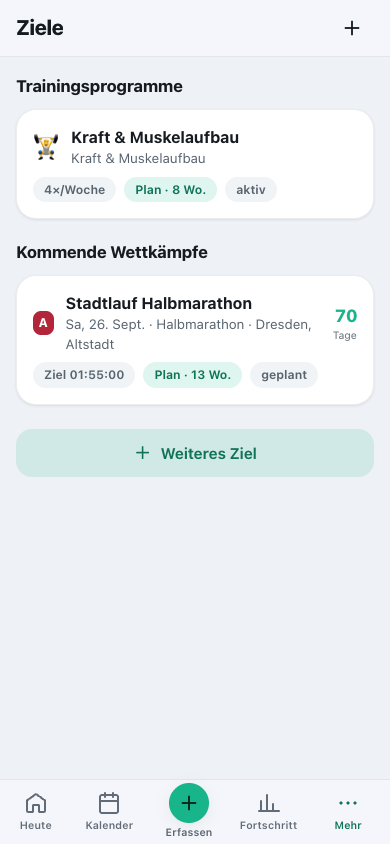
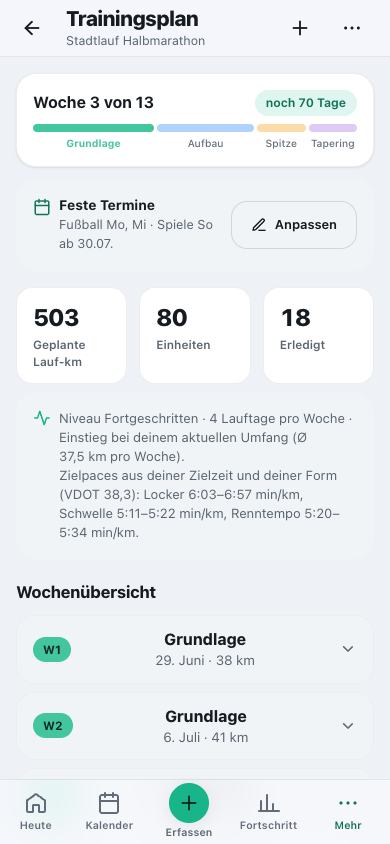
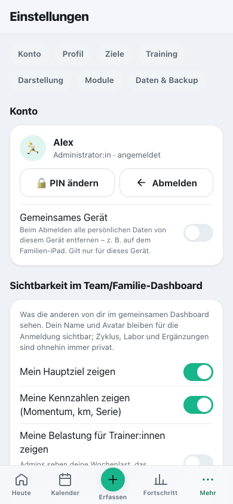
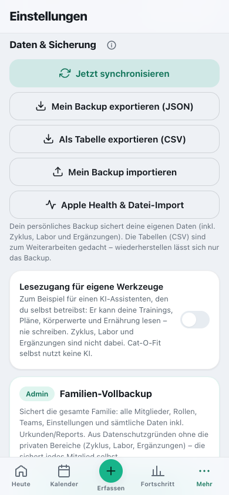
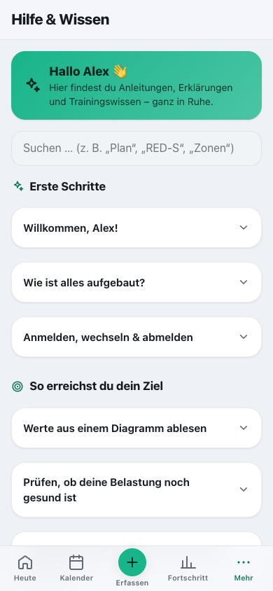

# Die Bereiche im Detail

[English](../../usage/areas.md) · **Deutsch**

Jede Ansicht der App kurz erklärt – von „Heute“ bis zu den Einstellungen.

> Teil der [Dokumentation](../README.md) · [Alle Seiten der Nutzung](../README.md#nutzen)

**Auf dieser Seite:**

- [Heute](#heute)
- [Ziele & Pläne](#ziele--pläne)
- [Trainingsplan](#trainingsplan)
- [Einheit & Workout-Modus](#einheit--workout-modus)
- [Fortschritt & Mehr](#fortschritt--mehr)
- [Einstellungen](#einstellungen)
- [Module](#module)
- [Daten & Sicherung](#daten--sicherung)
- [Hilfe & Wissen](#hilfe--wissen)

---

## Heute

Dein Startbildschirm für das, was **heute** zählt: persönliche Begrüßung, **Countdown** zum nächsten
Wettkampf, die **heutige Einheit** (der ▶ startet sie direkt), ein Tipp, **ein** Coach-Hinweis (weitere
aufklappbar), **Belastung & Form**, der **Wochenüberblick** (Soll/Ist) und deine **Wochen- und
Gesundheitsziele**. Aktuelle Form und Trainingsbereiche stehen unter **Fortschritt → Training** – auf
„Heute“ nur, wenn deine Zielpaces nicht mehr zu deiner Form passen. Nach „Leer starten“ zeigt „Heute“
statt eines Ruhetags die drei Schritte **Profil · Ziel · Mitglieder**. Am iPad quer und am Mac steht
alles in zwei Spalten.

 

---

## Ziele & Pläne

Deine **Trainingsprogramme** und **Wettkämpfe** an einem Ort (Mehr → „Ziele & Pläne“).
Wettkampf-Karten zeigen Countdown, Distanz und Priorität (A – Saisonhöhepunkt, B – wichtig,
C – Vorbereitung); Programm-Karten den Schwerpunkt und die Trainingstage pro Woche. Beide zeigen, ob
schon ein Plan existiert. Über **„+“** legst du ein neues Ziel an und wählst, ob es ein **Wettkampf**
oder ein **Trainingsprogramm** werden soll.

 

---

## Trainingsplan

Der Plan eines Wettkampfs oder Programms: ein **Phasen-Zeitstrahl**, Kennzahlen (geplante km,
Einheiten, Erledigtes), die Eckdaten (Niveau, Lauftage, Zielpaces) und die **Wochenübersicht** zum
Aufklappen. Oben fügt **„+“** eine Einheit hinzu; unter **„…“** findest du **Feste Termine**,
**In Kalender übernehmen (.ics)** und **Plan ab heute neu berechnen**.

 

---

## Einheit & Workout-Modus

Eine einzelne Einheit in drei Zuständen: **geplant** (Soll und unten die Leiste „Starten · Erledigt
erfassen“, die beim Scrollen sichtbar bleibt; Übungsvorschläge sind bei Läufen eingeklappt), **in
Ausführung** (Vollbild-Workout mit großen Bedienelementen, Intervall-Steuerung mit Zielpace und HF-Zone
je Phase, Satz-Zähler mit Pausen-Countdown und Trinkpausen-Erinnerung) und **absolviert** (Auswertung
mit Soll-Ist-Vergleich, Splits und Zeit in Zonen aus GPX/TCX-Dateien, Anstrengung).

---

## Fortschritt & Mehr

**Fortschritt** bündelt vier Reiter: **Training** (Statistik, Form & Trainingsbereiche), **Körper**
(Körperwert-Trends, Health-Import), **Erfolge** und **Berichte**. Unter **Mehr** findest du, nach
Themen gegliedert, **Ziele & Pläne**, die **Übungs-Bibliothek**, **Zyklus** und **Labor & Ergänzung**,
**Ernährung**, **Einkaufsliste** und **Checkliste**, **Team/Familie** (Admins zusätzlich „Team
verwalten“), **Einstellungen** und die **Hilfe**.

**Monatsbericht:** Vorgewählt ist der letzte abgeschlossene Monat. Wählst du den laufenden, weist der
Dialog darauf hin, und der Bericht nennt den **Stand** (z. B. „Stand Mo, 28. Sept.“) – Berichte werden
versiegelt und lassen sich nicht mehr ergänzen. Deshalb zeigt die App jeden Bericht und jede Urkunde
zuerst als **Vorschau**: „Ändern“ führt zurück, erst „Bericht speichern“ bzw. „Urkunde speichern“ legt
ihn ab.

---

## Einstellungen

Hier passt du alles an: **Konto** (PIN, Abmelden, „Gemeinsames Gerät“), **Profil**, **Gesundheit &
Eignung** (Abgrenzung und „Kalorienzahlen ausblenden“, siehe
[Gesundheit & Eignung](health.md#gesundheit--eignung)), **Wochen- und Gesundheitsziele**,
**Herzfrequenz-Zonen** (aus deiner Max-HF – oder als markierte Schätzung aus dem Alter; wahlweise über
die HF-Reserve mit Ruhepuls oder aus deiner **Schwellen-HF** aus Leistungsdiagnostik oder
30-Minuten-Feldtest), **Trainingsbereiche (Pace)**, **Darstellung** (Theme, Akzentfarbe und
**Sprache** – jede Person wählt ihre eigene), **Module**, sichtbare **Körperwerte**,
**Standort & Wetter**, **Ernährung** und **Daten & Sicherung**. Die Leiste ganz oben springt direkt
zu Konto, Profil, Zielen, Training, Darstellung, Modulen und Daten & Backup. Admins sehen außerdem
den Abschnitt **Verwaltung (Admin)** mit der Team-Verwaltung und der **Standardsprache** der Instanz
(für die Anmeldeseite und neue Personen). Ganz unten steht – nur für Admins – **„App
zurücksetzen“**.

 

---

## Module

Unter **Einstellungen → Module** blendest du Bereiche aus, die du nicht brauchst. Alle Module sind
anfangs **eingeschaltet**; die Schalter gelten **pro Person**. Ausgeschaltet verschwinden Menüpunkt und
Eintrag unter „＋ Erfassen“ – deine Daten bleiben erhalten und sind nach dem Einschalten wieder da.

| Modul | Was der Schalter ausblendet | Standard |
|---|---|---|
| Ernährung | Rezepte, Speiseplan, Ess-Tagebuch und Kalorienbilanz | an |
| Einkaufsliste | gemeinsame Einkaufsliste und Vorrat | an |
| Tages-Checkliste | Checkliste & Erinnerungen, auch ihre Termine im Kalender | an |
| Zykluskalender | Zyklus, Phasen im Kalender und die Frage am ersten Periodentag | an |
| Labor & Ergänzung | Laborwerte, Energieversorgung und Ergänzung, auch die Hinweise darauf in der Ernährung | an |

Erfolge & Momentum sowie die Übungs-Bibliothek sind kein Modul und immer da. Beim Verwalten eines
Mitglieds bleiben Zyklus und Labor ohnehin verborgen – sie sind privat.

---

## Daten & Sicherung

Unter **Einstellungen → Daten & Sicherung** sicherst du deine Daten – ganz ohne fremde Cloud. Es gibt
**drei Ebenen**:

1. **Der Server-Ordner `data/`** – die vollständige Sicherung aller Personen, auch der privaten
   Bereiche. Um ihn kümmert sich, wer den Server betreibt (siehe
   [Backup im Betrieb](../operations/backup.md)).
2. **Vollbackup (nur Admins):** sichert die **gesamte Familie** in einer Datei – alle Mitglieder,
   Rollen, Teams, Einstellungen und sämtliche Daten **inkl. Urkunden und Berichte**. Aus
   Datenschutzgründen **ohne die privaten Bereiche** (Zyklus, Labor, Ergänzungen) und ohne PINs.
   „Vollbackup wiederherstellen“ setzt die ganze Familie auf den Stand der Datei zurück – auf dem
   Gerät **und** auf dem Server (dafür braucht es die Verbindung zum Server). Private Bereiche und die
   PINs bleiben dabei **unangetastet**; auf einem ganz neuen Server setzt die Admin-Person die PINs der
   Mitglieder danach neu. Weil das alles überschreibt, fragt die App vorher deutlich nach.
3. **Mein Backup (für alle):** eine JSON-Datei mit **deinen eigenen Daten** – inklusive **Zyklus,
   Labor und Ergänzungen**. Auf iPhone und iPad öffnet sich dafür das **Teilen-Menü**: Wähle
   **„In Dateien sichern“** und prüfe, dass die Datei dort angekommen ist. „Mein Backup importieren“
   spielt sie wieder ein; stammt die Datei aus einem anderen Profil, fragt die App vorher nach.

> **Wichtig:** Das Vollbackup ersetzt die Sicherung des Server-Ordners nicht – nach einem Serververlust
> fehlten sonst die privaten Bereiche aller, die kein eigenes Backup haben. Bewahre Vollbackups sicher
> auf; sie enthalten die Daten aller Mitglieder.

**Als Tabelle exportieren (CSV):** Trainings, Körperwerte, Laborwerte oder das Ess-Tagebuch als Tabelle
für Excel, Numbers, deine Ärztin oder eine andere App – im Format, das Tabellenprogramme für die
Sprache der App erwarten: auf Englisch mit Komma und Dezimalpunkt, in Sprachen mit Dezimalkomma
(Deutsch, Französisch, …) mit Semikolon. Wiederherstellen lässt sich nur das Backup; die Tabellen
sind zum Weiterarbeiten.

**Lesezugang für eigene Werkzeuge** (standardmäßig aus): Betreibst du selbst einen KI-Assistenten oder
ein Auswertungsskript, bekommt es mit diesem Schlüssel **nur lesend** deine Trainings, Pläne,
Körperwerte und Ernährung – nie Zyklus, Labor oder Ergänzungen. Cat-O-Fit selbst nutzt keine KI.
Ausschalten macht den Schlüssel sofort ungültig; Aufruf und Parameter stehen in den
[Schnittstellen](../../API.md#for-external-programs).

**Jetzt synchronisieren** stößt den Abgleich mit dem Server von Hand an – normalerweise läuft er von
selbst im Hintergrund.

 

---

## Hilfe & Wissen

Unter **Mehr → Hilfe & Wissen** findest du Anleitungen, Trainingswissen und ein Glossar – durchsuchbar
(auch nach Fachbegriffen wie „RED-S“ oder „sRPE“) und mit aufklappbaren Schritt-für-Schritt-Anleitungen.
Das **ⓘ** neben Kennzahlen öffnet den passenden Artikel direkt.

 
