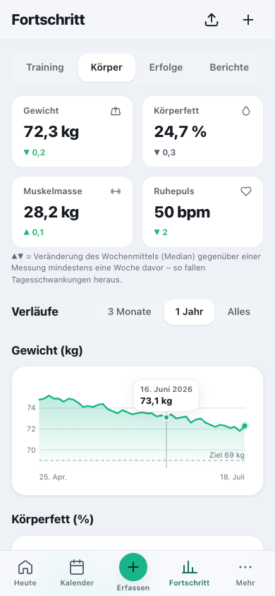

# Erste Schritte

[English](../../usage/getting-started.md) · **Deutsch**

Was Cat-O-Fit macht, wie du dich zurechtfindest und wie du Diagramme liest.

> Teil der [Dokumentation](../README.md) · [Alle Seiten der Nutzung](../README.md#nutzen)

**Auf dieser Seite:**

- [In 2 Minuten verstanden](#in-2-minuten-verstanden)
- [Die ersten fünf Minuten](#die-ersten-fünf-minuten)
- [Navigation & Bedienung](#navigation--bedienung)
- [Hilfe direkt in der App](#hilfe-direkt-in-der-app)
- [Werte aus einem Diagramm ablesen](#werte-aus-einem-diagramm-ablesen)

---

## In 2 Minuten verstanden

Cat-O-Fit plant und begleitet das Training deiner ganzen Familie – mit Wettkampf oder ganz
ohne. Der rote Faden ist immer gleich:

**Ziel → Plan → Kalender → Training → Auswertung → Fortschritt**

Du legst ein Ziel an – einen **Wettkampf** (z. B. den Dresden Halbmarathon) oder ein
**Trainingsprogramm** ohne Wettkampf –, bekommst dafür automatisch einen Plan, trainierst nach
Kalender und siehst, wie du dich entwickelst. Jede Änderung speichert die App sofort auf deinem
Gerät und gleicht sie mit eurem eigenen Server oder NAS ab; ohne Verbindung einfach später –
auch mitten im Lauf.

> 💡 **Tipp:** Lege die App über das Teilen-Symbol in Safari „Zum Home-Bildschirm“. Dann
> startet sie wie eine echte App im Vollbild.

---

## Die ersten fünf Minuten

1. **Ersteinrichtung:** Beim allerersten Öffnen legt ein Assistent die Admin-Person an – Name
   und eigene PIN (4 bis 8 Ziffern, nicht `0000`). Danach wählst du **„Mit Demodaten starten“**
   (eine Beispiel-Familie zum Ausprobieren) oder **„Leer starten“**.
2. **Anmelden:** Kachel antippen, PIN eingeben. Mehr dazu unter
   [Team & Familie](family.md#teamfamilie--anmeldung).
3. **Ziel anlegen:** Mehr → „Ziele & Pläne“ → „+“ → **Wettkampf** oder **Trainingsprogramm** –
   siehe [Training planen](training.md#wettkampf-anlegen--plan-erstellen).
4. **Trainieren:** Auf „Heute“ steht die Einheit des Tages; ▶ startet den Workout-Modus,
   „Erledigt erfassen“ trägt ein Training nach.
5. **Aufs iPhone holen:** Adresse in Safari öffnen → Teilen → „Zum Home-Bildschirm“.

---

## Navigation & Bedienung

**iPhone – die Leiste unten:** **Heute** · **Kalender** · **＋ Erfassen** · **Fortschritt** · **Mehr**.

- **＋ Erfassen** ist der feste Platz für alles, was du schnell einträgst: ein **Training**
  (auch ohne Plan), **Körperwerte**, eine **Mahlzeit**, einen **Laborwert**, den
  **Periodenbeginn** oder einen **Checklisten-Punkt** – je nachdem, welche Module aktiv sind.
  Gespeichert wird in die Seite, auf der du gerade bist; sie bleibt stehen.
- **Fortschritt** bündelt vier Reiter: **Training** (Statistik, Form & Trainingsbereiche),
  **Körper** (Körperwerte), **Erfolge** und **Berichte**.
- **Mehr** ist gegliedert – Training · Gesundheit · Ernährung & Haushalt · Team · System – und
  markiert, wo du gerade bist. Oben steht immer, **wer angemeldet ist**, mit **Abmelden**.

**iPad & Mac – die Seitenleiste:** oben **＋ Erfassen**, darunter Heute, Kalender, Fortschritt
und die Gruppen. Der **Fuß bleibt immer sichtbar**: die angemeldete Person sowie
**Einstellungen · Hilfe · Abmelden**. Formulare öffnen sich als Dialog in der Bildschirmmitte.
Ab Querformat zeigt „Heute“ zwei Spalten, und der Monatskalender nennt die Einheiten mit
Kurztitel („Long 14 km“) statt nur mit farbigen Punkten.

**Ein Mitglied verwalten:** Wer als Admin ein anderes Profil öffnet, sieht oben im Kopf das Band
**„Du verwaltest gerade Lea“** mit **„Zurück zu mir“** – dieselbe Angabe steht im Mehr-Menü, in
der Seitenleiste und in den Einstellungen. „Heute“ heißt dann **„Leas Übersicht“**.

**Speichern ohne Neuladen:** Nach dem Speichern bleibt die Seite, wo du warst, und die
Bestätigung („Gespeichert“) bleibt lesbar. Gelöschte Einträge (Checkliste, Ess-Tagebuch) und
das Verschieben per Ziehen im Kalender lassen sich direkt im Hinweis **rückgängig** machen.

**Barrierefreiheit:** Zoomen ist erlaubt; Schrift und Farben erreichen den WCAG-AA-Kontrast –
mit jeder Akzentfarbe, hell und dunkel. Am Mac führt **„Zum Inhalt springen“** (erster
Tab-Halt) direkt in den Inhalt, **Escape** schließt Dialoge, Pfeiltasten wählen in Umschaltern.
Screenreader hören zu jedem Diagramm eine Zusammenfassung (Zeitraum, niedrigster, höchster und
letzter Wert).

**Ohne Verbindung:** Die App startet sofort aus dem Gerätespeicher und gleicht im Hintergrund
ab. Antwortet der Server nicht (unterwegs, Server im Ruhezustand), arbeitest du offline weiter –
deine Änderungen gehen raus, sobald er wieder erreichbar ist. Ein Link aus einer
Kalender-Erinnerung führt nach der Anmeldung direkt zur Einheit.

---

## Hilfe direkt in der App

Unter **Mehr → Hilfe & Wissen** findest du Anleitungen und Trainingswissen, mit Suche – sie
kennt auch Fachbegriffe wie „RED-S“, „ACWR“ oder „sRPE“. Neben Kennzahlen wie **Belastung &
Form**, **Aktuelle Form**, **Energieversorgung** oder den **Herzfrequenz-Zonen** steht ein
kleines **ⓘ**: Es erklärt die Zahl in zwei, drei Sätzen, „In der Hilfe öffnen“ führt zum ganzen
Artikel. Am Ende der Hilfe steht ein **Glossar** mit allen Begriffen.

---

## Werte aus einem Diagramm ablesen

Jede Kurve in Cat-O-Fit gibt dir **konkrete Zahlen** – du musst nicht schätzen, was sie
gerade zeigt.

1. Fahre mit dem **Finger** über das Diagramm (am Rechner mit der Maus).
2. Eine Führungslinie springt zum nächstgelegenen Messpunkt, eine kleine Blase zeigt
   **Datum und Wert**.
3. Bei mehreren Kurven – etwa **Fitness, Ermüdung und Form** – siehst du alle Werte
   desselben Tages gleichzeitig, farblich zugeordnet.
4. Am Rechner geht es auch **per Tastatur**: mit den Pfeiltasten wandern, mit Escape schließen.

> 💡 Die **Y-Achse** zeigt runde Orientierungswerte mit haarfeinen Hilfslinien – der Bereich
> ist damit schon erkennbar, bevor du das Diagramm anfasst. Senkrechtes Scrollen auf dem
> iPhone bleibt frei; das Diagramm fängt deinen Finger nicht ein.

 
