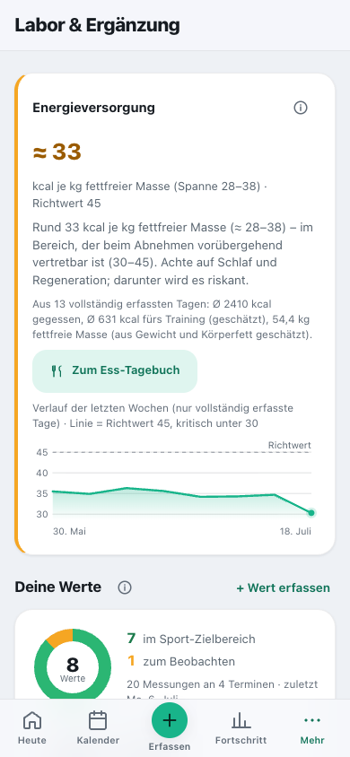
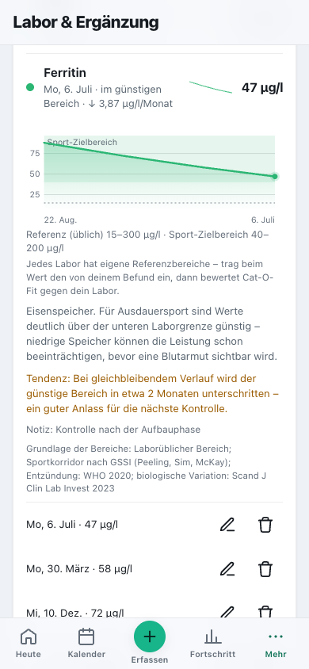

# Labor & Ergänzung

[English](../../usage/labs.md) · **Deutsch**

Laborwerte erfassen, sportbezogen einordnen und allgemeine Informationen zur Ergänzung.

> Teil der [Dokumentation](../README.md) · [Alle Seiten der Nutzung](../README.md#nutzen)

---

## Labor & Ergänzung

Wer viel trainiert, lässt oft regelmäßig Blut abnehmen – und legt den Befund
danach in eine Schublade. Hier kannst du die Werte erfassen, ihren **Verlauf** verfolgen und
sie **sportbezogen** einordnen lassen.

**Warum sportbezogen?** Laborbereiche gelten für die Allgemeinbevölkerung. Ein **Ferritin von
25 µg/l** ist laut Befund „normal“ – für Ausdauertraining ist der Eisenspeicher damit aber
knapp, und das kostet Leistung, lange bevor eine Blutarmut entsteht. Cat-O-Fit zeigt deshalb
**beide** Korridore: den Referenzbereich des Labors und den für Training günstigen.

1. **Einrichten:** Beim ersten Öffnen beantwortest du ein paar kurze Fragen zur Abgrenzung –
   sie gelten für die ganze App (siehe [Gesundheit & Eignung](health.md#gesundheit--eignung)). Die App
   ist für **gesunde Erwachsene** gedacht – wer in ärztlicher Behandlung ist, Medikamente
   nimmt, schwanger ist oder stillt oder eine Essstörung hat, nutzt das Modul nur zum
   **Dokumentieren**. Erfassen und Verlauf ansehen geht weiterhin, Empfehlungen gibt es dann
   bewusst nicht. Für **Kinder und Jugendliche** (aus dem Geburtsjahr) werden Werte nur
   dokumentiert und nicht gegen Erwachsenenbereiche bewertet – die passenden Bereiche stehen
   auf dem Befund.
2. **Wert erfassen:** Analyt wählen (19 sportrelevante von Ferritin über Vitamin D bis fT3;
   Magnesium als Vollblut- **und** Serumwert, B12 als Holo-TC **und** gesamt), Datum,
   Messwert und direkt daneben die **Einheit** – für fast jeden Wert die in Deutschland üblichen
   (CRP in mg/l oder mg/dl, Vitamin D in nmol/l oder ng/ml, Testosteron in nmol/l oder ng/ml
   …). Die App rechnet um und zeigt den Wert so, wie er auf dem Befund stand. Liegt ein Wert
   weit außerhalb des Üblichen, fragt sie „Stimmt die Einheit?“. Dazu der **Referenzbereich
   deines Labors** (siehe unten), optional die **Umstände der Blutentnahme** (harte Belastung in
   den 48 Stunden davor, nüchtern, Biotin, Zyklustag) und eine Notiz.
   **Ganzer Befund auf einmal:** „Befund mit mehreren Werten erfassen“ unter der Werteliste zeigt alle
   Werte untereinander – Datum und Umstände trägst du einmal ein, je Wert Messwert, Einheit und den
   Referenzbereich deines Labors. Leere Zeilen zählen nicht; unplausible Werte meldet die App vor dem
   Speichern gesammelt.
3. **Einordnung:** Antippen zeigt den Verlauf mit beiden Korridoren (Referenz gestrichelt,
   Sport-Zielbereich als Fläche), eine Erklärung, die **Quelle** der Bereiche und alle
   Messungen – dort lassen sich Werte **bearbeiten und löschen**. Einen **Trend** zeigt die App
   erst ab drei Messungen über mindestens zwei Monate und wenn die Änderung größer ist als die
   natürliche Schwankung des Werts; eine Projektion („wann verlässt der Wert den günstigen
   Bereich“) gibt es nur in die ungünstige Richtung und höchstens ein Jahr voraus.
   **Ferritin** ordnet sie mit dem CRP derselben Blutentnahme ein: Bei einer Entzündung ist ein
   hoher Wert nicht beurteilbar, ein niedriger bleibt auffällig. CK, Harnstoff und CRP nach
   harter Belastung bewertet sie nicht („in Ruhe kontrollieren“); Hämoglobin, Testosteron und
   Östradiol brauchen das Geschlecht im Profil (oder den Bereich deines Labors). **Alte Werte**
   (Vitamin D nach vier Monaten oder aus einer anderen Jahreszeit, die meisten anderen nach
   einem Jahr) bleiben im Verlauf, tragen aber keine Vorschläge mehr.
4. **Ergänzung:** Allgemeine Informationen mit **Begründung**, üblicher Menge (an den
   Höchstmengen des BfR und den Obergrenzen der EFSA ausgerichtet, mit Quellenangabe),
   Zeitpunkt und Wechselwirkungen. Immer zuerst der Weg über die Ernährung – ein Präparat
   füllt eine Lücke, es ersetzt keinen Teller. **Eisen wird nie ohne Laborwert
   vorgeschlagen**: Auf Verdacht eingenommen ist es bei vollen Speichern schädlich. Ein **zu
   hoher** Wert führt nie zu „ergänzen“, sondern zum Rat, die Einnahme zu prüfen. Magnesium
   gibt es nur mit Befund, Eiweiß nur, wenn dein Ess-Tagebuch unter 1,2 g je kg liegt, Kreatin
   nur bei regelmäßigem Krafttraining. Bei Leistungspräparaten steht der Hinweis, für
   Wettkämpfe mit Dopingkontrollen nur chargengeprüfte Produkte zu nehmen (Kölner Liste).
5. **Plan & Abhaken:** Was du regelmäßig nimmst, trägst du unter „Dein Plan“ ein und hakst es
   ab – inklusive Einnahmetreue (Balken mit 100 % als voller Höhe; Tage vor dem Planbeginn
   bleiben leer). Mittel, die du nur **bei Bedarf** nimmst (z. B. Koffein vor Wettkämpfen),
   zählen dort nicht mit.

> ⚡ **Energieversorgung:** Ganz oben schätzt Cat-O-Fit aus Ess-Tagebuch, Trainingsverbrauch
> und fettfreier Masse, ob du **genug isst für das, was du trainierst** – gerundet und als
> **Spanne** (alle Eingangswerte sind Schätzungen) **und als Kurve über die letzten Wochen**,
> mit dem Richtwert als Linie. Gerechnet wird nur mit Tagen, die du in der Ernährung als
> **„Tag vollständig“** bestätigt hast; bis dahin zeigt die App, wie viele Tage bestätigt sind,
> statt einen Mangel zu behaupten. Die kritische Schwelle liegt bei Frauen bei 30, bei Männern
> bei 25 kcal je kg fettfreier Masse; mit Abnehmziel gilt 30–45 als vorübergehend vertretbar.
> Fehlt ein Körperfettwert der letzten vier Monate, sagt die Karte das. Zu wenig Energie ist im
> Ausdauersport das häufigere Problem als ein fehlendes Präparat – und eine häufige Ursache für
> Leistungsabfall, Verletzungen und Zyklusstörungen.

 

**Was du auf einen Blick siehst:** Ein Ring zeigt, wie viele deiner Werte im Sport-Zielbereich
liegen und wie viele du beobachten solltest. Jede Zeile trägt einen **Mini-Verlauf**, sodass
du Trends erkennst, ohne etwas zu öffnen. Beim Antippen erscheint die volle Kurve mit
**Referenz- und Sport-Zielbereich** sowie der Änderung pro Monat. Nimmst du etwas regelmäßig
ein, zeigt ein Balkendiagramm deine **Einnahmetreue** der letzten drei Wochen.

Im Beispiel oben liegt das **Ferritin bei 47 µg/l** – noch im Sport-Zielbereich (40–200), aber
die Kurve fällt seit Monaten um knapp 4 µg/l pro Monat. Die Tendenz rechnet das weiter: In etwa
zwei Monaten wäre der günstige Bereich unterschritten – ein guter Anlass für die nächste
Kontrolle. Genau solche Verläufe sieht man in einem einzelnen Befund nicht.

### Woher bekomme ich die Werte? (Deutschland)

Vier bis fünf Wege führen zu einem Laborbefund – sie unterscheiden sich vor allem darin,
**wer zahlt** und wie sportnah die Auswahl der Werte ist.

| Weg | Was drin ist | Kosten |
|---|---|---|
| **Sportmedizinische Untersuchung** ⭐ | Der eigentlich passende Weg: Ärztin oder Arzt mit Zusatzbezeichnung **Sportmedizin**, oft an sportmedizinischen Instituten, Unikliniken oder in größeren Praxen. Meist Blutbild, Eisenstatus, Leber- und Nierenwerte – häufig zusammen mit einer Leistungsdiagnostik. | ca. **100–300 €** |
| **Haus- oder Facharztpraxis** | Auf Kassenkosten nur bei **medizinischer Indikation** (Beschwerden, konkreter Verdacht). „Ferritin, weil ich viel laufe“ ist keine – das läuft als Selbstzahlerleistung (IGeL). | Kasse bei Indikation, sonst ca. **20–60 €** |
| **Check-up 35** | Gesetzliche Vorsorge: einmalig zwischen 18 und 34, danach alle drei Jahre. Cholesterin, Blutzucker, Urinstatus – **weder Ferritin noch Vitamin D**. | Kassenleistung |
| **Einsende-/Selbstzahlerlabor** | Testkit für zu Hause (Blut aus der Fingerbeere) oder venöse Blutentnahme als Selbstzahler bei einem klassischen Labor. | ca. **30–150 €** |
| **Blutspende** | Hämoglobin bei jeder Spende; manche Spendedienste bestimmen bei regelmäßigen Spenden zusätzlich das **Ferritin**. | kostenlos |

> 💰 **Wenig bekannt:** Viele gesetzliche Krankenkassen **bezuschussen den Sportcheck** als
> freiwillige Satzungsleistung – je nach Kasse etwa 60–200 €, meist alle zwei Jahre. Ein Anruf
> bei deiner Kasse lohnt sich, bevor du selbst zahlst.

> 🔬 **Für Verläufe wichtig:** Möglichst beim **selben Labor und Verfahren** bleiben. Blut aus
> der Fingerbeere ist empfindlicher in der Vorbereitung als eine venöse Blutentnahme – kleine
> Sprünge zwischen zwei Anbietern sind oft Messunterschiede und keine echte Veränderung.
> Regelmäßiges Blutspenden senkt übrigens die Eisenspeicher spürbar; wer Ausdauersport treibt,
> sollte dann besonders aufs Ferritin achten.

### Warum du den Referenzbereich deines Labors einträgst

In Deutschland gibt es **keine bundesweit einheitlichen Referenzbereiche**. Jedes Labor legt
eigene fest – abhängig von Messmethode, Gerät und Vergleichsgruppe. Bei Ferritin, fT3 oder
Vitamin B12 unterscheiden sie sich spürbar. Deshalb steht der Bereich immer **auf deinem
Befund** neben dem Wert: Er gehört dazu.

Beim Erfassen stehen in den Feldern **„Referenzbereich deines Labors“** darum nur grau angedeutet
ein üblicher Bereich – in der Einheit, die du gewählt hast. Tipp den Bereich von deinem Befund ab:
Cat-O-Fit bewertet den Wert dann gegen *dein* Labor, und der sportliche Zielkorridor bleibt als
zweite Ebene daneben bestehen. Gespeichert wird nur, was du selbst einträgst; leer gelassen gilt
der übliche Bereich. Bis v3.19.0 wurde die Vorbelegung mitgespeichert (bei umgestellter Einheit
sogar falsch umgerechnet) – solche älteren Werte erkennt die App und bewertet sie wieder gegen den
üblichen Bereich.

**Was dagegen sehr wohl geregelt ist:** Die Qualitätssicherung der Labore (Richtlinie der
Bundesärztekammer, **RiliBÄK**, mit verpflichtenden Ringversuchen), häufig ergänzt durch eine
Akkreditierung nach **DIN EN ISO 15189**. Für die Übermittlung an Praxen gibt es mit **LDT**
einen deutschen Standard, international **HL7 FHIR**; über die **elektronische Patientenakte
(ePA)** kommen Befunde zunehmend digital bei dir an.

**Nicht geregelt sind sportspezifische Zielwerte.** Was Cat-O-Fit als Sport-Zielkorridor zeigt
(etwa Ferritin über 40 statt über 15), stammt aus sportmedizinischer Fachliteratur und
internationalen Positionspapieren – nicht aus einer deutschen Norm. Die Quelle je Wert zeigt die
Detailansicht unter „Grundlage der Bereiche“; die Liste steht unter
[Methodik & Quellen](../knowledge/methods-and-sources.md#laborwerte).

> 🔒 **Privat wie der Zyklus:** Laborwerte und Ergänzungen sieht in der App **nur du** – auch
> Admins nicht –, und der Server gibt sie nur nach deiner PIN-Anmeldung heraus. Sie bleiben aus dem
> Familien-Vollbackup heraus; in deinem persönlichen Backup sind sie dabei. Wer den Server betreibt,
> kann die gespeicherten Dateien lesen.

> ⚕️ Cat-O-Fit dient der **Dokumentation und allgemeinen Information für gesunde Erwachsene** –
> **kein Medizinprodukt**, keine Diagnose und keine Therapie. Bei Beschwerden oder auffälligen
> Werten gehört die Beurteilung in ärztliche Hände – bei kritischen Werten sagt die App das
> ausdrücklich und hält sich mit Empfehlungen zurück.

 
