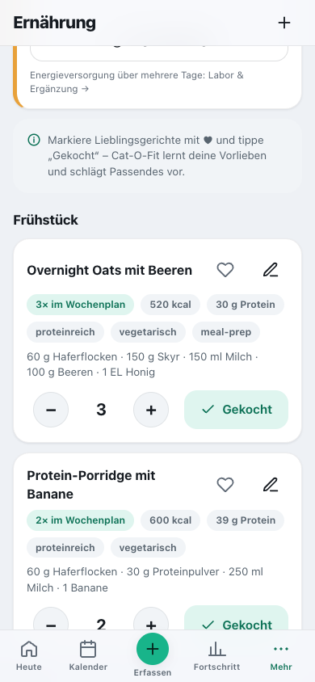
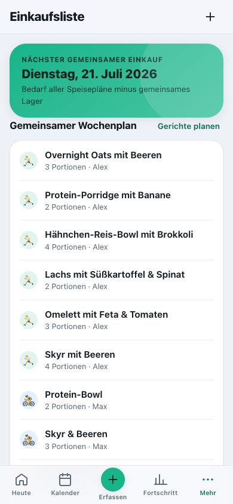

# Ernährung & Einkauf

[English](../../usage/nutrition.md) · **Deutsch**

Rezepte, Kalorienbilanz, Ess-Tagebuch, Einkaufsliste und gemeinsames Lager.

> Teil der [Dokumentation](../README.md) · [Alle Seiten der Nutzung](../README.md#nutzen)

**Auf dieser Seite:**

- [Ernährung & Listen lernen mit](#ernährung--listen-lernen-mit)
- [Einkaufsliste & gemeinsames Lager (Team/Familie)](#einkaufsliste--gemeinsames-lager-teamfamilie)

---

## Ernährung & Listen lernen mit

**Schnell starten:** Beim ersten Öffnen ist die Liste leer – tippe auf **„Rezept-Ideen laden“** und du
hast mit einem Schlag **~48 fertige Gerichte** (Frühstück, Mittag, Abend, Snack: vegetarisch, vegan,
low-carb, proteinreich, meal-prep …). Oder lege über **„Eigenes Gericht anlegen“** bzw. das **„+“** oben
dein eigenes an. Jedes Gericht hat Zutaten, kcal und Eiweiß; der **„schätzen“**-Knopf füllt Kalorien &
Eiweiß automatisch aus den Zutaten (siehe unten).

Markiere Gerichte mit **♥** und tippe nach dem Kochen auf **„Gekocht“**. Cat-O-Fit lernt, welche Tags
(z. B. *proteinreich*, *vegetarisch*) du bevorzugst, und empfiehlt Passendes unter **„Für dich“**.
Plane Gerichte mit **Portionen** für die Woche – daraus entsteht automatisch die gemeinsame
**Einkaufsliste** (siehe unten). Oft genutzte Checklisten-Punkte tauchen als **Schnell-Hinzufügen**-Chips
auf – so wird die Pflege mit der Zeit immer schneller.

Hast du Rezept-Ideen gelöscht oder fehlen welche aus dem Katalog? **„… Rezept-Ideen hinzufügen“** am
Ende der Liste ergänzt genau die, die dir noch fehlen (der Katalog umfasst 48 Rezepte).

**Kalorienbilanz heute.** Ganz oben zeigt eine Karte deinen **Verbrauch** (Grundumsatz nach
Mifflin-St-Jeor + Alltag + heutiges Training) gegen die **Einnahme**, inkl. Saldo und einem Tagesziel
in Richtung deines **Zielgewichts**. Die Einnahme kommt aus deinem **Ess-Tagebuch**: Tippst du bei
einem Rezept auf **„Gekocht“** oder erfasst mit **„Gegessenes erfassen“** (auch über **＋ Erfassen →
Mahlzeit**) etwas, entsteht ein datierter Eintrag. Dort gibst du entweder **Lebensmittel mit Menge**
ein („200 g Skyr, 1 Banane“ – die App schätzt kcal und Eiweiß aus ihrer Nährwerttabelle), trägst mit
einem Tipp etwas **zuletzt Gegessenes** erneut ein, tippst unter **„Barcode“** den Strichcode einer
Packung ein (wo der Browser es kann, auch per Kamera) und gibst die Menge in Gramm an – die Nährwerte
kommen über deinen Server von **Open Food Facts**, nur der Strichcode geht hinaus – oder wählst für
auswärts eine **Portionsgröße** (pauschale kcal). **„Heute gegessen“** unter der Bilanz listet alle Einträge des Tages – einzeln
löschbar, mit **„Rückgängig“** im Hinweis. So bleiben Tagebuch und Rezeptliste getrennt.
Hast du alles erfasst, tippe darunter auf **„Tag vollständig“** – nur bestätigte Tage zählen für die
Energieversorgung im Labor-Modul. Das Tagesziel rechnet mit dem **Wochenmittel** deiner Waage statt mit
einer Einzelmessung; bis 0,5 kg um das Zielgewicht heißt „halten“, und wer ein Abnehmziel unterschreitet,
bekommt „halten“ – nie automatisch „zunehmen“. Beim Abnehmen bleibt das Ziel über Grundumsatz und
Trainingsbedarf; ein Zielgewicht unter BMI 18,5 bekommt kein Defizit (beim Speichern weist die App darauf
hin). Die Rezept-Ideen sind aus ihren Zutaten gerechnet – dieselbe Schätzung wie der „schätzen“-Knopf.
Beim Anlegen eigener Gerichte schätzt der **„schätzen“**-Knopf Kalorien **und Eiweiß** aus den Zutaten.
Wenn aktiviert (Einstellungen → Ernährung → *„Nährwerte online ergänzen“*; für neue Profile
standardmäßig aus), holt er dafür echte Werte je Zutat aus **Open Food Facts** (offene Datenbank);
unplausible Treffer werden verworfen, sonst greift eine lokale Schätzung. Dein Server schickt dabei nur
den Zutatennamen dorthin und speichert die Ergebnisse zwischen – ist die Option aus, bleibt alles rein
lokal. Alles ist als Orientierung gedacht. Für die Bilanz trägst du
im **Profil** Größe, Gewicht, Geburtsjahr und (optional) Geschlecht ein.

 

---

## Einkaufsliste & gemeinsames Lager (Team/Familie)

Die Einkaufsliste ist **gemeinsam** und entsteht **automatisch aus den Speiseplänen aller
Mitglieder** – niemand pflegt sie von Hand.

1. Jedes Mitglied plant in der **Ernährung** Gerichte mit **Portionen** für die Woche (Warenkorb-Symbol
   an jeder Mahlzeit).
2. Cat-O-Fit **zieht die geplanten Gerichte aller zusammen**, **aggregiert** die Zutaten mit echten
   Mengen (z. B. Haferflocken von zwei Personen zu einer Menge) und **zieht das gemeinsame Lager ab** –
   die Liste zeigt nach Kategorien genau, was ihr noch **braucht**. Fällig zum zentralen
   **Einkaufstag** (von Admins in der Team-/Familienverwaltung gesetzt, Standard Dienstag).
3. **„Alles eingekauft“** bucht die Mengen ins **gemeinsame Lager**. **„Gekocht“** (in der Ernährung)
   bucht sie wieder ab – so wisst ihr alle, was zu Hause ist und was wirklich gekauft werden muss.

Der Wochenplan zeigt pro Gericht das Mitglied (Avatar + Name). Zutaten ohne feste Menge (z. B.
„Spinat“) erscheinen als **„nach Bedarf“**.

 
