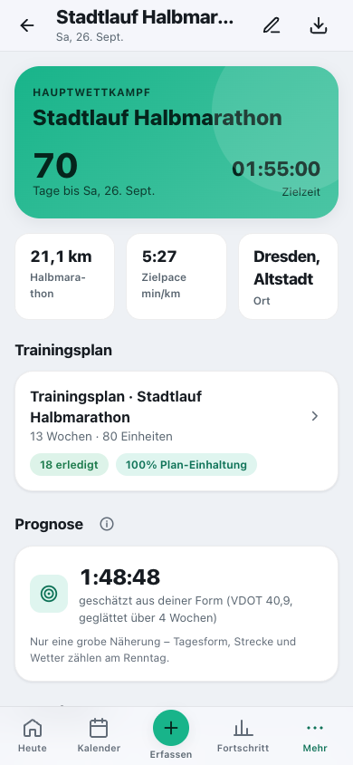
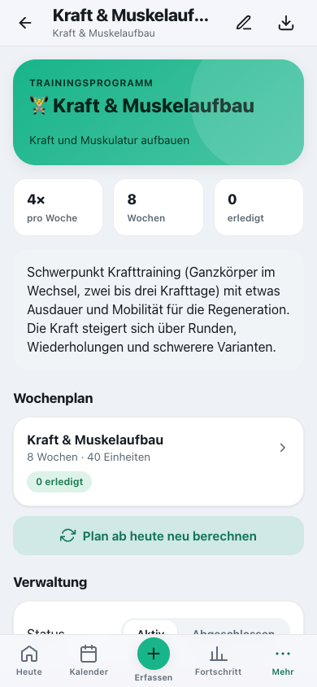
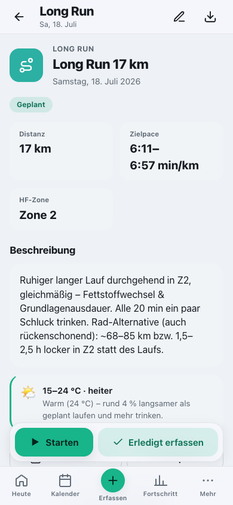
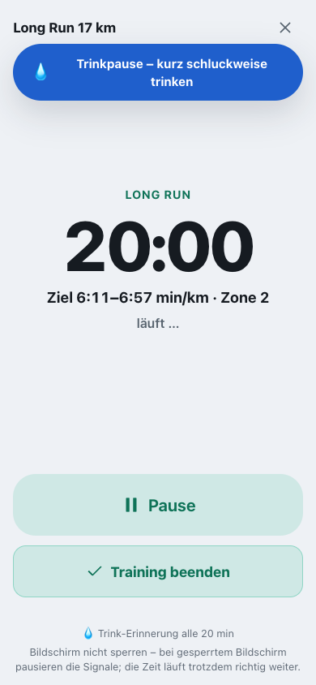
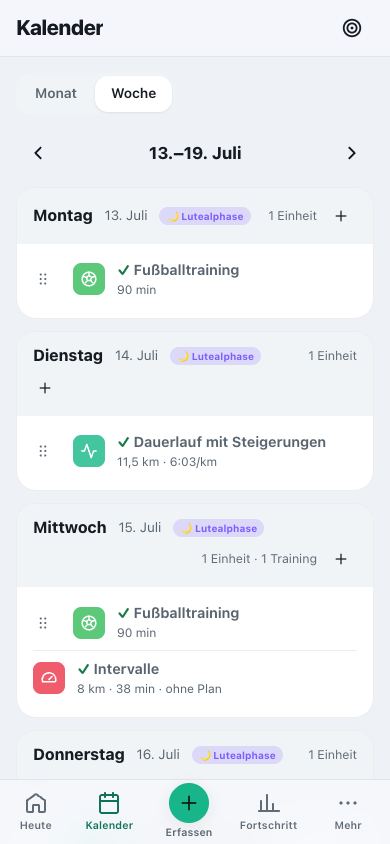
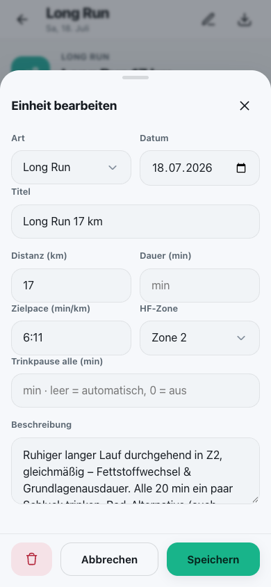
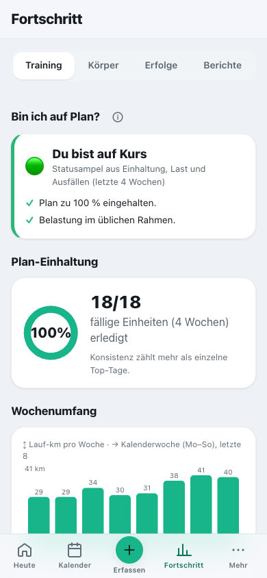
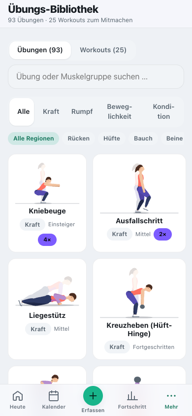
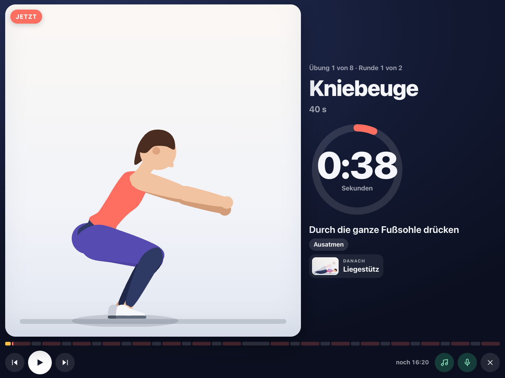
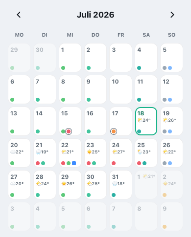

# Training planen und durchführen

[English](../../usage/training.md) · **Deutsch**

Wettkämpfe und Programme, Plan, Kalender, Workout-Modus, Erinnerungen, Übungen und Wetter.

> Teil der [Dokumentation](../README.md) · [Alle Seiten der Nutzung](../README.md#nutzen)

**Auf dieser Seite:**

- [Wettkampf anlegen & Plan erstellen](#wettkampf-anlegen--plan-erstellen)
- [Trainingsprogramm ohne Wettkampf](#trainingsprogramm-ohne-wettkampf)
- [Ein Training durchführen](#ein-training-durchführen)
- [Ein Training ohne Uhr nachtragen](#ein-training-ohne-uhr-nachtragen)
- [Aktivitäten aus Dateien übernehmen](#aktivitäten-aus-dateien-übernehmen)
- [Krafttraining-Verlauf aus anderen Apps übernehmen](#krafttraining-verlauf-aus-anderen-apps-übernehmen)
- [Eine Einheit verschieben](#eine-einheit-verschieben)
- [Einheiten anpassen, ergänzen & aufholen](#einheiten-anpassen-ergänzen--aufholen)
- [Erinnerungen aufs iPhone bekommen](#erinnerungen-aufs-iphone-bekommen)
- [Deinen Fortschritt verstehen](#deinen-fortschritt-verstehen)
- [Übungs-Bibliothek](#übungs-bibliothek)
- [Durchgehend mitmachen – mit Musik und Ansagen](#durchgehend-mitmachen--mit-musik-und-ansagen)
- [Wetter im Plan](#wetter-im-plan)

---

## Wettkampf anlegen & Plan erstellen

So legst du dein Ziel an:

1. Öffne **Mehr → Ziele & Pläne** und tippe oben auf **„+“** → wähle **Wettkampf**.
2. Trage **Name, Datum, Distanz** und **Zielzeit** ein (`h:mm:ss`, z. B. `1:55:00`; Punkt oder
   Komma gehen auch) und wähle die **Priorität**: **A** – Saisonhöhepunkt, auf den der Plan zuläuft;
   **B** – wichtiger Wettkampf; **C** – Vorbereitungs- oder Spaßrennen. Das Datum ist bewusst nicht
   vorbelegt; fehlt etwas, markiert die App das Feld.
3. **Speichern** – du landest auf der Ziel-Seite mit Countdown und Zielpace.
4. Tippe auf **„Plan erstellen“**. Eine kurze Einrichtung fragt:
   - **Niveau** – *Einsteiger*, *Fortgeschritten* oder *Leistung*. Die App schlägt eines aus deinen
     letzten vier Wochen vor (Wochenumfang, längster Lauf); du kannst es ändern.
   - **Lauftage pro Woche** – 3 bis 6. Mehr Tage tragen mehr Umfang; die zwei Schlüsseleinheiten
     (Dienstag, Samstag) liegen nie direkt nebeneinander.
   - **Feste Termine** – etwa Vereinstraining oder Spiele. Standardmäßig gibt es **keine**; du kannst
     sie eintragen oder aus einem anderen laufenden Plan übernehmen (dann erscheinen sie nicht doppelt).
   - Dazu siehst du die **Zielpaces**: Sie kommen aus deiner **Zielzeit**. Liegt die Zielzeit deutlich
     über deiner aktuellen Form, sagt die App das – trainiert wird dann nach der Form, das Renntempo
     bleibt dein Ziel. Ohne Zielzeit und ohne harte Läufe gibt es noch keine Pace-Vorgaben.
   - Ist die Zeit bis zum Rennen für dein Niveau **knapp** (z. B. Marathon als Einsteiger unter 18
     Wochen), weist die App darauf hin und nennt Alternativen: späteres Rennen, kürzere Distanz oder
     „gesund ankommen“ ohne Zielzeit. Für ein Rennen heute oder in der Vergangenheit entsteht kein Plan.
5. **„Plan erstellen“** – Cat-O-Fit verteilt die Wochen in die Phasen
   **Grundlage → Aufbau → Spitze → Tapering**:
   - Der **Wochenumfang** startet bei deinem aktuellen Stand (auch darunter, wenn du wenig läufst) und
     steigt je Woche höchstens um 8–12 % – jede **4. Woche ist leichter**, die letzten zwei Wochen sind
     **Tapering** (etwa 70 % und 50 % der Spitze).
   - Der **Long Run** ist gedeckelt: als Anteil am Wochenumfang, auf höchstens ~2:30 h (Einsteiger)
     bzw. ~3 h, und in den Wochen vor dem Rennen deutlich kürzer.
   - Die **Renneinheit** steht an deinem Wettkampftag – egal ob Samstag oder Ostermontag. Der Tag davor
     ist ein kurzer Shakeout, zwei Tage vorher ist frei.
   - **Einsteiger:innen** über 5 oder 10 km ohne Laufbasis starten mit **Lauf-Geh-Wechseln**
     (z. B. 6× 2 min laufen / 1 min gehen), die sich Woche für Woche verlängern.
   - **Triathlon und Hyrox** (Beta) haben eigene Wochen mit Ruhetag, Tapering und Wettkampfformat –
     Triathlon mit Schwimmen, Rad und Koppellauf, Hyrox mit Lauf-Intervallen, Kraft und Stationen bis
     zur Wettkampfsimulation.

Du musst also nichts selbst ausrechnen – der fertige Plan steht in Sekunden und ist
jederzeit anpassbar.

**Plan ab heute neu berechnen.** Über **„…“** oben im Plan rechnet die App einen laufenden Plan mit
der aktuellen Planlogik neu – mit Niveau und Lauftagen, **ab heute**. Vergangene Einheiten bleiben
unverändert: erledigte, verpasste (samt Grund) und verschobene. Pläne aus früheren Versionen zeigen
dafür eine Karte „Neue Planlogik verfügbar“; geändert wird nur, wenn du es auslöst. Auch „Diese Woche
neu berechnen“ und das Speichern fester Termine rühren nichts vor heute an.

 

---

## Trainingsprogramm ohne Wettkampf

Du willst einfach **fit, kräftig oder gesünder** werden – ganz ohne Wettkampf? Dann lege
statt eines Wettkampfs ein **Trainingsprogramm** an:

1. Öffne **Mehr → Ziele & Pläne** → **„+“** → wähle **Trainingsprogramm**.
2. Wähle einen **Schwerpunkt**:
   - **💪 Allgemeine Fitness** – Ausdauer, Kraft und Beweglichkeit nach den WHO-Empfehlungen: Die
     Ausdauer wächst von rund 120 auf 150–180 Minuten pro Woche (zügiges Gehen zählt mit), dazu
     Kraft an zwei Tagen.
   - **🏋️ Kraft & Muskelaufbau** – zwei bis drei Krafttage (Ganzkörper im Wechsel), ergänzt um
     Ausdauer und Mobilität.
   - **⚖️ Abnehmen & Gewicht** – viel Bewegung (von rund 150 auf 225–240 Minuten pro Woche) plus
     Kraft an zwei Tagen; wirkt zusammen mit der **Kalorienbilanz**.
   - **🧘 Beweglichkeit & Gesundheit** – sanfter Einstieg: Beweglichkeit, sanfte Kraft und Bewegung,
     die auf 150 Minuten pro Woche wächst.
3. Lege **Trainingstage pro Woche** (3–5) und die **Dauer** (4, 8 oder 12 Wochen) fest. An manchen
   Tagen stehen zwei Einheiten – etwa Ausdauer und danach Kraft.
4. Der Name ist mit dem Schwerpunkt vorbelegt – ändere ihn, wenn du magst. **Speichern & Plan
   erstellen** – der Wochenplan steht sofort.

Das Programm **steigert sich**: Die Ausdauer wird Woche für Woche etwas länger (jede 4. Woche ist
leichter), die Kraft geht von der **Eingewöhnung** (2 Runden, Technik) über den **Aufbau** (3 Runden,
mehr Wiederholungen oder Gewicht) bis zum **Festigen** (schwerere Varianten). Jede Einheit zeigt Dauer
und Anleitung.

Die Einheiten erscheinen **wie gewohnt überall**: im Kalender, unter „Heute“, in der Ansicht der
Einheit (inklusive **Workout-Modus** mit Satz-Zähler) und in der Statistik. Über **„Plan ab heute neu
berechnen“** erzeugst du die kommenden Wochen frisch – Vergangenes und
Erledigtes bleibt stehen. Über den Status setzt du ein Programm auf **abgeschlossen**.

 

---

## Ein Training durchführen

Jede Einheit hat eine eigene Seite mit dem **Soll**: Distanz, Zielpace und Herzfrequenz-Zone.

1. Tippe auf **„Heute“** oder im **Kalender** auf die Einheit (der ▶ auf „Heute“ startet sie direkt).
2. Prüfe die Zielwerte und tippe unten auf **„Starten“**.
3. Im **Workout-Modus** läuft die Uhr. Bei Intervallen führt dich Cat-O-Fit mit Ton durch
   **Einlaufen, Belastung, Pause und Auslaufen**; unter der großen Zeit stehen **Zielpace und
   HF-Zone** der Phase. Strecken-Intervalle (z. B. 8× 400 m) rechnet die App über deine Zielpace in
   Zeit um. Beim Krafttraining zählst du Sätze per großem Plus/Minus; die **Satzpause** läuft als
   großer Countdown (erneut tippen startet sie neu). Zu jeder verknüpften Übung trägst du
   **Wiederholungen und Gewicht je Satz** ein; darüber steht, was du **letztes Mal** geschafft hast,
   und ein Hinweis zur Steigerung: Schaffst du in allen Sätzen 12 Wiederholungen, ist beim nächsten
   Mal etwas mehr Gewicht dran (sonst erst die Wiederholungen steigern). Die Sätze stehen danach in
   der Auswertung der Einheit – mit dem bewegten Gesamtgewicht. Halteübungen wie Unterarmstütz oder
   Wandsitz zählen nach Zeit und haben deshalb keine Satz-Erfassung.
4. Am Ende **„Beenden“** → Distanz, Anstrengung (RPE) und Gefühl eintragen → fertig. Zum
   **Verwerfen** ohne Speichern fragt die App noch einmal nach.

> 📱 **Auf dem iPhone:** Sperrst du den Bildschirm, pausieren die Signale – die Zeit läuft aber
> richtig weiter, und beim Entsperren springt die Anzeige in die aktuelle Phase. Töne gibt es nur mit
> ausgeschaltetem Stummschalter; vibrieren kann Safari nicht. Am besten die automatische Sperre für das
> Training ausschalten.

### Trinkpausen im Long Run

Bei langen Läufen erinnert dich Cat-O-Fit **automatisch ans Trinken** – mit eingeblendetem
Banner und Ton – wo das Gerät es kann, auch mit Vibration (Long Run alle 20 Minuten, Wettkampf/Radtour alle 25 Minuten).
Tippe das Banner an, um es zu bestätigen. Du kannst das **Intervall pro Einheit** im Bearbeiten-Dialog
unter **„Trinkpause alle (min)“** selbst festlegen (leer = automatisch, 0 = aus).

**Abwechslungsreiche Intervalle.** Neben gleichmäßigen Intervallen (z. B. 6×800 m) streut der Plan
**Pyramiden** (Spitzenphase, 1–2–3–4–3–2–1 min) und **Fahrtspiele** (Aufbauphase, z. B. 8×1 min
schnell / 1 min locker) ein. Beim Fahrtspiel ist die „Pause“ lockeres **Weiterlaufen** (Float), kein
Stopp – der Workout-Modus führt dich mit Ton durch die wechselnden Abschnitte.

Der Bildschirm bleibt während des Trainings an, und dein Fortschritt wird laufend
gespeichert – selbst wenn das Training unterbrochen wird, geht nichts verloren.

> 💡 **Tipp:** Lieber oft kleine Schlucke als selten viel.

 

---

## Ein Training ohne Uhr nachtragen

Du bist ohne Handy gelaufen? Kein Problem:

1. Öffne die Einheit (über „Heute“, Kalender oder Plan).
2. Tippe unten in der Leiste auf **„Erledigt erfassen“** (sie bleibt beim Scrollen sichtbar;
   daneben startet **„Starten“** den Workout-Modus – den startet auch der ▶ auf „Heute“ direkt).
3. Trage ein, was du weißt – Distanz, Dauer in **Minuten und Sekunden**, Anstrengung, Gefühl.
   **Alles ist optional.** Die Anstrengungs-Skala (RPE) nennt ihre Stufen: 1 sehr leicht ·
   3 locker · 5 mittel · 7 hart · 10 maximal.

Cat-O-Fit verknüpft das automatisch mit der geplanten Einheit und zeigt dir den
**Soll-Ist-Vergleich**. Er ist ehrlich in beide Richtungen: Einen **lockeren Lauf deutlich zu schnell**
zu laufen, gilt nicht als „erreicht“ – lockere Läufe wirken, wenn sie locker bleiben. Bei **Intervallen
und Tempoblöcken** bewertet die App das Tempo nicht über den Schnitt der ganzen Einheit (Ein-/Auslaufen
und Trabpausen würden ihn verfälschen); beim **Wettkampf** zählt, ob du dein Renntempo gehalten hast.

**Training ohne Plan erfassen.** Spontane Radtour, Lauf am Ruhetag oder Training ganz ohne Ziel: Tippe
auf **＋ Erfassen → Training**, auf „Heute“ auf **„Training erfassen“** oder im **Kalender** (Wochenansicht)
auf das **„+“** im Tageskopf.
Wähle Sportart, Datum, Dauer, Distanz, Herzfrequenz und Anstrengung. Liegt an dem Tag eine passende
geplante Einheit (gleiche Sportart), bietet die App an, das Training ihr zuzuordnen – sonst entsteht ein
**freies Training**. Freie Trainings erscheinen im Kalender (Monat: Punkt mit Ring, Woche: eigene Zeile),
auf „Heute“ und in der Statistik unter **„Trainings ohne Plan“**; dort lassen sie sich öffnen,
bearbeiten und löschen.

---

## Aktivitäten aus Dateien übernehmen

Unter **Fortschritt → Körper** → Symbol „Health-Import“ (oben rechts) bzw. **Einstellungen → Daten & Sicherung** → „Apple Health & Datei-Import“ übernimmst du im Abschnitt **„Aktivitäten aus Dateien“** Aufzeichnungen deiner Uhr –
alles wird **auf deinem Gerät** gelesen:

- **Einzelne Dateien:** GPX, TCX oder **FIT** (das Format von Garmin, COROS, Polar, Suunto, Wahoo …).
  Die App zeigt die erkannte Aktivität zur Bestätigung – mit Sportart, Bewegungszeit, Distanz,
  Herzfrequenz, Höhenmetern und Strecke.
- **Ganze Exporte:** mehrere Dateien auf einmal oder ein ZIP – etwa der Garmin-Datenexport (die
  Aktivitäten liegen dort in `DI_CONNECT/DI-Connect-Uploaded-Files`, auch als ZIP im ZIP) oder das
  Strava-Archiv (Ordner `activities` mit `.fit.gz`/`.gpx`). Du siehst vorher, wie viele Aktivitäten
  welcher Sportart erkannt wurden und wie viele schon vorhanden sind.

Doppelte Aktivitäten (selber Tag, Strecke ± 400 m, Dauer ± 90 s) werden übersprungen. Passt eine
Aktivität zu einer **geplanten Einheit** desselben Tages und derselben Sportart, gilt diese als erledigt.
Ohne Sportart in der Datei schätzt die App sie am Tempo (ab 18 km/h Rad).

**Strecke ohne Kartendienst:** Die Auswertung einer Einheit zeigt die Strecke als Linie mit
**Höhenprofil** und **Höhenmetern** – gezeichnet von der App selbst, ohne Kartenkacheln eines fremden
Dienstes. Gespeichert wird eine vereinfachte Linie (höchstens 150 Punkte); beim Massenimport nur für
die letzten 90 Tage, damit der Gerätespeicher nicht vollläuft.

**Wie hart war's?** Dateien und Uhren kennen dein Empfinden nicht. Fehlt die Anstrengung, schätzt die
App sie aus deiner Herzfrequenz, und „Heute“ fragt bei frisch importierten Trainings kurz nach – ein
Tipp auf „leicht“, „mittel“, „hart“ oder „sehr hart“ genügt (siehe
[Coach & Belastung](coach-and-load.md#prüfen-ob-deine-belastung-gesund-ist)).

---

## Krafttraining-Verlauf aus anderen Apps übernehmen

Hast du dein Krafttraining bisher in **Strong**, **Hevy** oder **FitNotes** festgehalten, nimmst du den
Verlauf mit. Auf derselben Import-Seite steht gleich nach „Aktivitäten aus Dateien“ der Abschnitt
**„Krafttraining aus anderen Apps“**:

1. Exportiere in der anderen App deine Workouts als **CSV-Datei**.
2. Tipp in Cat-O-Fit auf **„CSV-Datei wählen“** und such die Datei aus. Sie wird **auf deinem Gerät**
   gelesen. Bevor etwas gespeichert wird, siehst du eine Übersicht: wie viele Workouts aus welcher App,
   welchen Zeitraum sie abdecken und „… von … Übungen der Bibliothek zugeordnet, die übrigen mit eigenem
   Namen“.
3. Tipp auf **„… übernehmen“** (davor steht, wie viele Workouts neu sind).

Was die App mit der Datei macht:

- **Welche App sie geschrieben hat:** Das erkennt die App an den Spaltenüberschriften; als Trennzeichen
  sind Komma, Semikolon und Tabulator gleichermaßen in Ordnung. Jede andere Datei weist sie ab mit „Diese
  Datei ist kein CSV-Export aus Strong, Hevy oder FitNotes.“
- **Workouts:** Bei Strong und Hevy werden die Zeilen je Workout zusammengefasst (Beginn und Name, wie in
  der App). FitNotes kennt weder eine Startzeit noch einen Namen, deshalb wird alles, was du an einem
  **Tag** gemacht hast, zu einem Workout. Die Dauer bringen Strong und Hevy mit, wo die Datei sie
  enthält; FitNotes hat keine.
- **Kilogramm oder Pfund:** Hevy und FitNotes nennen die Einheit in den Spaltenüberschriften, Strong in
  einer Spalte „Weight Unit“. Fehlt sie in einer Strong-Datei, fragt die Übersicht **„Gewichte in der
  Datei“** – **kg** oder **lb** (kg ist vorgewählt; beim Umschalten rechnet die Übersicht neu). Pfund
  werden in Schritten von 0,25 kg in Kilogramm umgerechnet.
- **Körpergewicht und übersprungene Zeilen:** Ein Gewicht von 0 ist die Schreibweise dieser Apps für
  einen Satz mit dem eigenen Körpergewicht (Klimmzüge, Liegestütze); hier wird daraus ein Satz ohne
  Gewicht. Zeilen ohne Wiederholungen – Cardio, Haltezeiten wie beim Plank – werden übersprungen; die
  Übersicht nennt die Zahl („… Zeilen ohne Wiederholungen übersprungen“). Ein Satz zählt mit 1 bis 100
  Wiederholungen.
- **Übungsnamen:** Eine Übung wird der [Bibliothek](#übungs-bibliothek) nur bei einem **exakten**
  Treffer zugeordnet – Name oder Alias einer unserer Übungen, in deiner App-Sprache, auf Englisch oder
  auf Deutsch, ohne die Geräteangabe in Klammern und gleich in Einzahl oder Mehrzahl. „Squat (Barbell)“
  wird zu unserer „Kniebeuge“. Alles andere behält seinen **eigenen Namen** im Training: „Bench Press
  (Barbell)“ bleibt, wie es ist, und ein klassisches „Deadlift (Barbell)“ ist bewusst **nicht** unser
  Rumänisches Kreuzheben – ein falscher Treffer würde den Steigerungshinweis in die Irre führen.
- **Titel und Anstrengung:** Jedes Workout wird an seinem Tag zu einem **freien Krafttraining** (ohne
  Bezug zu einer geplanten Einheit) mit dem Titel aus der Datei. Hat die Datei keinen – bei FitNotes
  immer –, nennt die App es **„Kraft (Strong)“**, „Kraft (Hevy)“ bzw. „Kraft (FitNotes)“. Enthält die
  Datei einen RPE je Satz (Strong, Hevy), wird der auf eine ganze Zahl gerundete **Durchschnitt** der
  Sätze zur Anstrengung des Trainings.
- **Zweimal importieren ist unbedenklich:** Was schon da ist, erkennt die App und überspringt es („…
  schon vorhanden – werden übersprungen“); du kannst also auch einen neueren Export einlesen, der die
  alten Workouts noch enthält. Als schon übernommen gilt ein Workout, wenn an dem Tag ein Training aus
  derselben App existiert – und, wo die App Workout-Namen kennt, mit demselben Namen. Trainings, die du
  selbst erfasst hast, bleiben unberührt.

---

## Eine Einheit verschieben

Das Leben kommt dazwischen – verschiebe Einheiten einfach:

1. Öffne den **Kalender** und wechsle oben auf **„Woche“**.
2. Zieh eine Einheit am **Griff ⠿** auf einen anderen Tag – am Bildschirmrand scrollt die Woche mit.
   Liegt dort schon eine Einheit oder daneben eine fordernde, fragt die App vorher nach; danach
   bietet der Hinweis **„Rückgängig“** an.
3. Alternativ: den Griff antippen oder die Einheit öffnen → **„Verschieben“**. Die Schnellwahl
   **„Morgen“**, **„Übermorgen“** oder **„Nächster freier Tag“** spart den Datumsdialog.

Der Plan merkt sich die Verschiebung; in der Statistik bleibt deine Plan-Einhaltung
nachvollziehbar.

**Termine im Kalender.** Trägst du in der **Checkliste** einen Termin mit Datum ein
(z. B. Arzttermin, Besorgung), erscheint er automatisch im Kalender: in der **Wochenansicht** als
eigene Zeile mit Uhrzeit und Kategorie, in der **Monatsansicht** als kleiner **eckiger** Punkt (die
runden Punkte sind Trainingseinheiten). Ein Tipp auf den Termin bringt dich zur Checkliste zum
Abhaken oder Bearbeiten.

**Sanfter Hinweis.** Wählst du im „Verschieben“-Dialog einen Tag, an dem **schon eine Einheit** liegt,
oder **direkt neben** eine fordernde Einheit (Tempo, Intervalle, Kraft, Long Run), macht dich Cat-O-Fit
darauf aufmerksam – so geht die Erholung nicht unter. Der Hinweis **blockiert nichts**: Du verschiebst
trotzdem, wenn du möchtest.

 

---

## Einheiten anpassen, ergänzen & aufholen

Dein Plan gehört dir – passe ihn jederzeit an:

1. Öffne eine Einheit und tippe oben aufs **Stift-Symbol**. Editierbar sind **Art** (z. B. Easy → Tempo),
   **Zielpace**, **HF-Zone**, **Distanz/Dauer**, die **Intervallstruktur** (Runden × Belastung/Pause,
   steuert direkt den Workout-Modus) und die Beschreibung.
2. Über das **„+“** im Trainingsplan legst du eine **ganz neue Einheit** an. Neben den Lauf- und
   Kraft-Typen gibt es auch **Testspiel** (⚑) und **Trainingslager** (🔥) – ideal, um ein Spiel oder
   ein intensives Wochenende einzutragen. Diese gelten als **fordernd** und
   fließen in Belastungs- und Erholungshinweise ein.
3. Im Bearbeiten-Dialog kannst du eine Einheit auch **löschen**.

**Wochenbelastung im Blick.** Legst du eine Einheit selbst an und liegt in **derselben Woche** schon
eine **ähnlich intensive**, noch offene Einheit, fragt Cat-O-Fit, ob du diese aus dem Plan nehmen
möchtest – so wächst die Wochenbelastung nicht unbemerkt an. Das ist nur ein Vorschlag: **„Aus Plan
nehmen“** gleicht aus, **„Beide behalten“** lässt alles, wie es ist.

**Eine Woche neu berechnen.** Hat sich für eine bestimmte Woche etwas grundlegend geändert (z. B.
Saisonstart, ein Trainingslager oder eine längere Pause)? In der **Wochenübersicht** des Plans setzt
**„Diese Woche neu berechnen“** genau diese eine Woche frisch auf. **Bereits erledigte Trainings
bleiben erhalten**; verschobene oder manuell geänderte Einheiten dieser Woche werden ersetzt.

**Überfällig?** Vergangene, nicht absolvierte Einheiten werden automatisch als **„überfällig“**
gekennzeichnet (Kalender, Plan, Einheit). Auf „Heute“ erinnert dich ein Hinweis ans
Verschieben, Nachtragen oder Abhaken – ganz ohne erhobenen Zeigefinger.

**Schlüsseleinheit nachholen.** Hast du eine **fordernde** Einheit (Tempo, Intervalle, Long Run, Kraft)
als **verpasst** markiert, schlägt „Heute“ einen **freien Tag** der nächsten Woche vor und holt sie
auf Wunsch dorthin nach – so geht ein wichtiger Reiz nicht ersatzlos verloren. Der Zieltag wird so
gewählt, dass keine zwei harten Einheiten direkt aufeinandertreffen.

 

---

## Erinnerungen aufs iPhone bekommen

Der zuverlässigste Weg auf iPhone/iPad ist der **native Kalender**:

1. In der Einheit oben auf das Download-Symbol **„In Kalender übernehmen (.ics)“** tippen – im Plan
   unter **„…“ → „In Kalender übernehmen (.ics)“**.
2. Wähle **„Kompletter Plan“**, **„Diese Einheit“** oder **„Nur Wettkampf“**.
3. Die **.ics-Datei** öffnet sich im iOS-Kalender – inklusive Erinnerung **1 Stunde vorher**
   und **am Vorabend**, samt Link zurück in die App.

> In-App-Hinweise greifen nur bei geöffneter App. Für verlässliche Erinnerungen ist der
> Kalender-Export der richtige Weg.

### Kalender abonnieren

Statt einzelne Dateien zu öffnen, kann dein Kalender einen ganzen Plan **abonnieren** – alle Einheiten
und den Wettkampf – und holt sich Änderungen dann selbst. Abonniert wird immer ein Plan, nicht der
Kalender der App:

1. **Mehr → Ziele & Pläne** → Wettkampf oder Programm öffnen → oben auf das Download-Symbol
   **„Export“** – oder im Plan **„…“ → „In Kalender übernehmen (.ics)“**.
2. Im Fenster „In Kalender exportieren“ auf **„Abo-Link kopieren“** tippen. Den Knopf gibt es nur mit
   Verbindung zum Server und nach deiner PIN-Anmeldung.
3. Den Link in deinem Kalender als Abonnement einfügen:

| Kalender | So geht's |
|---|---|
| iPhone/iPad | Kalender-App → „Kalender“ → „Hinzufügen“ → „Kalenderabonnement hinzufügen“ |
| Mac | Kalender → Ablage → „Neues Kalenderabonnement“ |
| Google | im Browser am Computer neben „Weitere Kalender“ auf **+** → „Per URL“ (in der Google-App geht das nicht) |
| Outlook | „Kalender hinzufügen“ → „Vom Web abonnieren“ |

> **Nur im Heimnetz erreichbar?** iCloud, Google und Outlook holen Abos über das Internet ab – einen
> Server, den sie nicht erreichen, können sie nicht abonnieren. Leg das Abo dann direkt aufs Gerät: am
> iPhone über iOS-Einstellungen → Apps → Kalender → Kalender-Accounts → Account hinzufügen → Andere →
> „Kalenderabo hinzufügen“, am Mac mit „Ort: Auf meinem Mac“. Ist eine Anmeldung vorgeschaltet (Basic
> Auth), trägst du am iPhone dort Benutzername und Passwort ein; Google und Outlook können das nicht.

Der Link zeigt auf den Server, von dem du ihn kopierst, und enthält deinen **persönlichen
Kalender-Schlüssel** – jede Person holt sich ihren eigenen. Wer ihn kennt, kann die Termine lesen; teile
ihn also nur mit Menschen, die deinen Plan sehen dürfen. Kalender fragen Abos in ihrem eigenen Takt ab,
bei Outlook kann eine Änderung laut Microsoft über 24 Stunden brauchen. Links aus Versionen vor 3.20.0
(ohne Schlüssel) gelten noch bis 30.11.2026; danach das Abo einmal neu einrichten.

---

## Deinen Fortschritt verstehen

Unter **Fortschritt → Training** siehst du auf einen Blick, wo du stehst:

- **Ampel „Bin ich auf Plan?“:** ganz oben – grün, gelb oder rot, mit Begründung. Sie fasst
  Plan-Einhaltung und Trainingslast der letzten vier Wochen zu einem Status zusammen. In deinen ersten
  vier Wochen bewertet sie die Belastung noch nicht („Datenbasis wächst“), und Ausfälle wegen Krankheit
  oder Verletzung färben sie nie.
- **Plan-Einhaltung:** wie viele fällige Einheiten du im rollenden 4-Wochen-Fenster erledigt hast. Fällig
  ist eine Einheit, wenn ihr Tag vorbei ist – die heutige zählt erst, wenn du sie erledigt hast. Ausfälle
  wegen Krankheit oder Verletzung und geschützte Zyklustage zählen nicht. Dieselbe Rechnung steht auf der
  Wettkampf- und Programmseite, bei den Erfolgen und im Monatsbericht.
- **Wochenumfang & Trainingslast:** **Lauf-Kilometer** pro Woche und für 7 bzw. 28 Tage – nur Laufen;
  Rad, Gehen, Wandern und Schwimmen zählen hier nicht. Dazu die **Belastungspunkte** (Minuten ×
  Anstrengung) über **alle Sportarten** – so zählen auch Kraft, Fußball, Rad oder ein Testspiel mit.
- **Trainingsjahr:** eine **Heatmap** der letzten 12 Monate im GitHub-Stil – Wochen × Wochentage, je
  dunkler ein Tag, desto mehr Trainingszeit. Tippen/Hovern zeigt Datum und Minuten; ein Zähler nennt
  deine **aktiven Tage**.
- **Ausgefallene Einheiten:** nach Grund aufgeschlüsselt (Verletzt/Krank/Keine Zeit/Sonstiges).
  Verletzungs- und krankheitsbedingte Ausfälle zählen nicht gegen deine Einhaltung.
- **Einheiten-Verteilung:** das Verhältnis deiner Trainingsarten.
- **Werte & Ziele:** Gewicht, Wochenumfang, lockeres Tempo, Ruhepuls und VO₂max – je mit Trendpfeil
  (↑/↓/→) und der Kennzeichnung **halten** oder **verbessern**, Gewicht in Richtung Zielgewicht. Das
  **lockere Tempo** zählt nur Läufe, deren Herzfrequenz in der Grundlagenzone (Z2) lag – schneller ist nur
  dann besser, wenn der Lauf auch locker war. Ohne HF-Zonen siehst du den Wert, aber kein Urteil.
- **Wettkampfprognose:** eine Schätzung deiner möglichen Zeit aus deiner aktuellen,
  über mehrere Wochen geglätteten Form – ein einzelner guter (oder schlechter) Lauf
  verschiebt sie also nicht.

Alles ist als **Orientierung** gedacht – keine Versprechen, sondern Anhaltspunkte.
Konsistenz zählt mehr als einzelne Top-Tage.

 

---

## Übungs-Bibliothek

Unter **Mehr → Übungs-Bibliothek** findest du **93 Übungen** für **Kraft, Rumpf, Beweglichkeit,
Kondition und Prävention** – als Begleitung zu den Kraft- und Mobility-Einheiten deines Plans: von
Kniebeuge, Liegestütz und Kreuzheben über Hyrox-Übungen wie Wall Ball, Kettlebell-Swing und Farmers Walk
bis zu Dehnungen für Rücken und Hüfte und den wichtigsten **Präventionsübungen für Laufen und Fußball**
(Nordic Hamstring Curl, Copenhagen-Seitstütz, Clamshell, Monster Walk, Wadenheben mit gebeugtem Knie,
Lauf-ABC, Fußgelenksprünge und das **Fußball-Aufwärmen nach FIFA 11+**).

- **Jede Übung ist animiert.** Eine gezeichnete Vorturnerin zeigt die Bewegung im **Takt der
  Ausführung** – etwa langsam absenken, kurz halten, zügig hochdrücken. Die arbeitenden Muskeln leuchten
  in der Farbe der Kategorie, oben stehen die aktuelle Phase („Absenken“, „Halten“ …) und bei
  einseitigen Übungen die Seite.
- **Mitmachen:** Im Detail stellst du Wiederholungen (bei Halteübungen Sekunden) und Sätze ein und
  tippst auf **„Mitmachen“**. Die Animation zählt mit („Satz 1 von 3 · Wdh. 4 von 12“), zeigt einen
  kurzen **Technik-Hinweis** und wann du **ein- und ausatmest**, hält die Pause zwischen den Sätzen und
  zeigt dir, wann du die **Seite wechselst**. **„Langsam“** verlangsamt den Takt zum Lernen, **„Ton“**
  gibt ihn hörbar vor – so musst du nicht ständig aufs Display schauen; das klappt auch, wenn iPhone
  oder iPad auf lautlos stehen. Der Bildschirm bleibt dabei an; am Ende zählt die Übung automatisch als
  gemacht.
- Dazu gibt es eine **Schritt-für-Schritt-Anleitung**, die beanspruchten **Muskelgruppen**, das nötige
  **Equipment**, die **Schwierigkeit**, einen **Tipp**, wie du sie **steigerst**, und wann du
  **vorsichtig** sein solltest.
- Ist auf deinem Gerät **„Bewegung reduzieren“** eingeschaltet, siehst du ein Standbild aus Start- und
  Zielpose; Antippen spielt die Animation ab.
- Oben **suchen** (Name, Muskelgruppe oder gängige Bezeichnung wie „Lunges“), nach **Kategorie**
  (Kraft/Rumpf/Beweglichkeit/Kondition) **und** zusätzlich nach **Körperregion** filtern
  (Rücken · Hüfte · Bauch · Beine · Oberkörper).
- **Fußballtermine** schlagen das Aufwärmen nach FIFA 11+ und die Präventionsübungen vor.
- Jede Übung zeigt einen **Nutzungszähler** („3ד) – wie oft du sie gemacht hast. Im Detail zählst du per
  **„Gemacht (+1)“** hoch; außerdem zählt es automatisch, wenn du mitgemacht oder eine damit verknüpfte
  Einheit erledigt hast.
- **In der Trainingseinheit:** Nennt die Beschreibung einer Einheit Übungen („Kniebeugen 12× ·
  Liegestütz 8–12× · Plank 30–45 s“), stehen genau diese oben – markiert mit **„im Plan“** und in der
  Reihenfolge der Beschreibung. Darunter folgen passende Vorschläge, **nach deiner Nutzungshäufigkeit
  sortiert**. Mit **„+“** hängst du eine Übung an die Einheit; beim Erledigen zählt sie dann automatisch
  mit. Tippe eine Übung an, um sie animiert zu sehen und mitzumachen. Die Übungen bleiben auch **während
  des Workouts** erreichbar (ein-/ausklappbares Panel unter der Uhr).

> Die Animationen sind bewusst schematisch – sie zeigen Ablauf und Takt der Grundbewegung und ersetzen
> keine individuelle Anleitung. Bei Schmerzen oder Unsicherheit lieber fachkundig anleiten lassen.

 

---

## Durchgehend mitmachen – mit Musik und Ansagen

Statt Übung für Übung anzutippen, spielst du eine ganze Einheit **am Stück** ab – wie ein Video zum
Mitmachen, gedacht fürs iPad oder Handy ein, zwei Meter entfernt auf dem Boden:

- **Aus dem Plan:** In jeder Kraft- und Mobility-Einheit steht über den Übungen **„Durchgehend
  mitmachen · ≈ … min“**. Die App übernimmt, was die Beschreibung vorgibt – „Kniebeugen 12× ·
  Plank 30–45 s · 3 Runden · 60–90 s Pause“ – und hängt per „+“ ergänzte Übungen hinten an.
- **Fertige Workouts:** Die Übungs-Bibliothek hat neben den Übungen einen eigenen Katalog
  **Workouts** – mit Suche, Filter (Kraft, Rumpf, Beweglichkeit, Kondition, Laufen & Fußball), Dauer,
  Schwierigkeit und den nötigen Geräten. Darunter Ganzkörper ohne Geräte, Oberkörper, Kurzhanteln,
  Kettlebell, Hyrox-Kraft, Po & Beine, Bauch, Tabata, Cardio ohne Springen, Mobility am Morgen,
  Hüfte frei, Schultern & Nacken, Abendroutine, Dehnen nach dem Laufen, Lauf-ABC, Füße & Waden und
  Fußball-Prävention – jeweils mit fester Arbeits- und Pausenzeit.

Vor dem Start siehst du alle Übungen mit Menge und Dauer und stellst **Runden** und **Pause** ein. Dann
**„Los geht’s“** – danach musst du nichts mehr antippen:

- Die Vorturnerin macht jede Übung **im Takt** vor; groß daneben stehen Name, Wiederholung bzw.
  Restzeit, ein kurzer Technik-Hinweis und die Atmung, darunter **„Danach“** mit der nächsten Übung.
- In der **Pause** siehst du schon, was kommt (mit Probe-Wiederholung bzw. dem Weg in die Position);
  bei einseitigen Übungen gibt es einen eigenen **Seitenwechsel**, zwischen den Runden eine längere Pause.
- **Musik:** ein Beat, der zur Übung passt – kräftig bei Kraft, ruhiger bei Rumpf, flächig bei
  Beweglichkeit, treibend bei Kondition –, in der Pause leiser, kurz vor dem Einsatz baut er auf. Das
  Tempo richtet sich nach der Bewegung: **jede Bewegung – runter, halten, hoch – fällt auf den Beat**.
  Die Musik entsteht im Gerät, ohne Dateien oder Streamingdienst.
- **„Eigene Musik“** lässt z. B. Spotify weiterlaufen; Ansagen und Zähltöne kommen dazu. Dafür darf das
  Gerät nicht auf lautlos stehen.
- **Ansagen** kommen in den Pausen: die nächste Übung samt Menge, der Seitenwechsel, die nächste Runde.
  Sie sind in jeder Sprache der App eingesprochen und laufen über denselben Weg wie die Musik – auch
  auf lautlos und ohne dass die Musik abreißt. **In der Übung führen Töne:** drei Töne zählen jeden Einsatz herunter,
  die letzten drei Wiederholungen bzw. Sekunden ticken, ein Doppelton sagt „noch 10 Sekunden“, ein tiefer
  Ton beendet die Übung.
- Antippen blendet die Bedienleiste ein: **Pause**, **zurück**, **weiter**, Musik und Ansagen an/aus,
  beenden. Die Leiste darunter zeigt alle Abschnitte – Antippen springt dorthin. Der Bildschirm bleibt an.
- Am Ende zählen alle Übungen als gemacht. Kam die Session aus einer Plan-Einheit, erfasst
  **„Als erledigt erfassen“** die Einheit gleich mit der tatsächlichen Dauer.

> Tipp: Das iPad quer hinstellen – dann steht die Vorturnerin groß links und alles Wichtige rechts.

---

## Wetter im Plan

Hinterlege deinen **Standort** in den Einstellungen (→ „Standort & Wetter“, Stadt suchen). Bei
mehrdeutigen Namen (Neustadt, Frankfurt, Halle) wählst du aus bis zu fünf Treffern mit Region und
Land. Im Kalender erscheinen dann für die kommenden ~16 Tage kleine **Wettersymbole mit Temperatur**.

Bei **Hitze, Regen, Sturm oder Gewitter** bekommst du in der jeweiligen Lauf-Einheit einen
passenden **Hinweis** – z. B. „früh oder spät laufen, viel trinken“. Ab 24 °C nennt er eine konkrete
**Pace-Korrektur**: rund 0,4 % langsamer je Grad über 15 °C (bei 30 °C also etwa 6 %, höchstens 8 %).
So planst du wetterbewusst. Umgekehrt wertet die Formschätzung **hügelige Läufe** nicht mehr als
schwach: Jeder Höhenmeter bergauf zählt wie 6 m in der Ebene, sobald es mehr als 5 m je km sind.

Die Daten kommen von **Open-Meteo** (ohne Anmeldung; dein Gerät fragt dort mit Ort bzw. Koordinaten an).
Ohne Internet bleibt der zuletzt geladene
Stand erhalten – die App funktioniert normal weiter.

 
