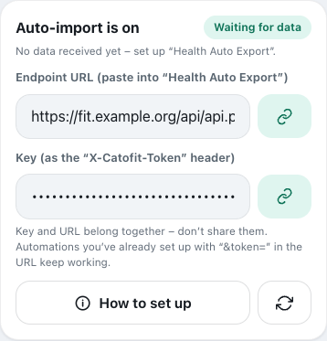
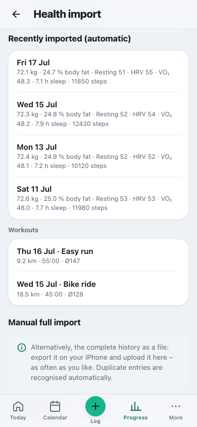

# Importing from Apple Health

**English** · [Deutsch](../de/usage/apple-health.md)

Cat-O-Fit takes **weight, body fat, lean mass, resting heart rate, HRV, VO₂max, sleep, steps, active
energy and workouts** from Apple Health – that is where Apple Watch, Garmin, Withings & Co. write to.
There are three ways:

| Way | Cost | What arrives | Effort |
|---|---|---|---|
| [Automatic with “Health Auto Export”](#automatic-with-health-auto-export) | The app is free, but the automatic transfer it needs (REST API) only comes with **Premium** – according to the App Store (as of September 2026) about €8 a year or €30 once; the Basic tier is not enough | all the values above **and workouts**, daily | set up once |
| [Free with a shortcut](#free-with-a-shortcut) | free (Apple's “Shortcuts” app) | the daily values the shortcut reads (no workouts) | set up once |
| [Full import by hand](#full-import-by-hand) | free | workouts of all sports that can be matched, body values and – if you like – the cycle from the complete export | a few minutes per import |

You can also upload recordings from your watch (Garmin, COROS, Polar, Suunto, Wahoo …) as **GPX, TCX or
FIT files** – one at a time or as a whole export in a ZIP (see
[Training](training.md#import-activities-from-files)). On **Android**, a bridge app takes the values
from Health Connect – see [Android: Health Connect](#android-health-connect).

<p align="center"></p>

---

## Getting the endpoint and key

Both automatic ways send to your personal **endpoint**:

1. In Cat-O-Fit: **Progress → Body → “Health import” icon** (or Settings → Data & backup → Apple
   Health & file import) → **“Switch on auto-import”**. This creates your personal **key** (token).
2. **Copy the endpoint URL** (button next to the field). It looks like this:
   ```
   https://<your-server-address>/cat-o-fit/api/api.php?action=health-ingest&user=<your-id>
   ```
3. **Copy the key** (second field). It belongs in the header `X-Catofit-Token` – that way it appears
   in no access log of the server or a proxy. **Do not share** the URL and the key.

> Older setups with the key directly in the URL (`…&token=<secret>`) keep working. If you want to
> switch over: enter the URL without `&token=…` and add the header.

---

## Automatic with “Health Auto Export”

Requirements: an iPhone with Apple Health, the app **Health Auto Export – JSON+CSV** with **Premium**
and Health access, and you are signed in to Cat-O-Fit as the person concerned.

1. In Health Auto Export, at the bottom: **“Automations” → “+”**, type **“REST API”**.
2. **URL**: the endpoint URL you copied. **Method** `POST`, **Format** `JSON` (export version 2).
3. **Headers → add:** key `X-Catofit-Token`, value = your copied key.
4. Choose the **Health Metrics**: Weight/Body Mass, Body Fat %, Lean Body Mass, Resting Heart Rate,
   Heart Rate Variability, VO₂ Max, Sleep Analysis, Step Count, Active Energy. Switch on **Workouts**.
5. **Aggregation** `Daily`, **Schedule** `Daily`, **Period** `Since last sync` (sends only what is new).
6. **Save → “Run now”** to test.

**Only if** your instance also sits behind an upstream sign-in (a reverse proxy with Basic Auth): under
**Headers**, also add `Authorization` with the value `Basic <base64>` (`<base64>` = `user:password`
Base64-encoded, e.g. `printf 'user:password' | base64`). The container's built-in Basic Auth lets the
health endpoint through anyway – there you can skip this.

**Loading the 10-year history (backfill):** The running import sends only what is new. For the past,
send one additional automation once, with Period “Custom”, **one month** at a time; dense values (pulse,
sleep, HRV) are enough for the last one to two years. For long periods switch on **“Batch requests”**
so the packets stay small.

---

## Free with a shortcut

Apple's **“Shortcuts”** app can read health values and send them to your endpoint. For this,
Cat-O-Fit accepts a **slim daily format** – a simple dictionary that is easy to click together in
Shortcuts.

> ⚠️ This guide describes the actions of the Shortcuts app; please test your shortcut once by hand.
> Health data is protected while the iPhone is locked – an automation only reads it reliably when the
> iPhone is unlocked. So pick a trigger at which you have it in your hand anyway (e.g. “Alarm” → “Is
> Stopped” or “App” → “Is Opened”).

**Creating the shortcut** (Shortcuts → “+”):

1. **“Find Health Samples”** – type **Weight**, sorted by **Start Date**, **Latest First**, limit
   **1**. Repeat for **Resting Heart Rate** and **Heart Rate Variability** (limit 1 each).
2. Optionally **Steps**: “Find Health Samples” – type **Steps**, Start Date **is today**; then
   **“Calculate Statistics” → Sum**.
3. **“Format Date”** – current date, format **Custom** `yyyy-MM-dd`.
4. **“Get Contents of URL”** – URL = your endpoint URL, method **POST**, header `X-Catofit-Token` =
   your key, request body **JSON** with the fields `date` (the formatted date), `weight`, `restingHr`,
   `hrv` and optionally `steps` – each with the result of the search before it as the value.
5. **Run it by hand** once: the response says `"health":{"days":1}` if it arrived.

**Automatically every day:** Shortcuts → **Automation** → “+” → e.g. **“Alarm” → “Is Stopped”** →
**“Run Immediately”** → choose your shortcut.

**The format** (also for your own scripts):

```json
{ "date": "2026-09-29", "weight": 72.4, "restingHr": 52, "hrv": 48, "sleepHours": 7.3, "steps": 8421 }
```

| Field | Meaning | valid range |
|---|---|---|
| `date` | day (required), `YYYY-MM-DD` or an ISO timestamp | – |
| `weight` | weight in kg (with `"weightUnit": "lb"` in pounds) | 20–400 |
| `bodyFat` | body fat in % (0.185 becomes 18.5%) | 1–80 |
| `leanMass` | lean mass in kg | 10–200 |
| `restingHr` | resting heart rate | 25–150 |
| `hrv` | HRV in ms; measurement type SDNN (Apple), with `"hrvMethod": "rmssd"` RMSSD | 1–400 |
| `vo2max` | VO₂max | 10–100 |
| `sleepHours` | sleep in hours | up to 24 |
| `steps` | steps | up to 200,000 |
| `activeEnergyKcal` | active energy in kcal | up to 20,000 |

Numbers may also arrive as text with a decimal comma (“72,4”) – that is how the Shortcuts app outputs
them in German and several other languages. Values outside the range are discarded by the server and
reported in `warnings`; unknown fields are listed in `ignoredMetrics`. Several days at once:
`{ "days": [ { "date": … }, { "date": … } ] }`.

---

## Full import by hand

1. iPhone → **Health app** → tap your **profile picture** at the top → **“Export All Health Data”**.
2. Upload the resulting **ZIP file** in Cat-O-Fit under **Health import** (or the `export.xml` it
   contains).
3. What is imported: the **workouts** of all sports Cat-O-Fit knows (running, cycling, swimming,
   walking, hiking, strength, rowing …; matching planned sessions are marked done) and the **body
   values**. If the export contains cycle data, the app first asks whether to import the **period
   starts** – they stay private. The app recognises duplicate entries.

Weight and lean mass in pounds are converted to kg, workout energy in kJ to kcal. Sleep from several
sources (e.g. watch and sleep app) is not added up – for each night the longest single source counts.
Every value lands on the calendar day on which it was measured (even shortly after midnight). For this
the server needs PHP with **XMLReader**; for ZIP files also **ZipArchive** (otherwise upload the
`export.xml` on its own).

---

## Android: Health Connect

On Android, **Health Connect** collects the values from your watch and apps. Websites cannot read from
it – so a small **bridge app** on the device sends the data to the same address as above, such as the
open-source “HC Webhook”:

1. In Cat-O-Fit, under **Health import**, “Switch on auto-import” and copy the **endpoint URL** and
   **key** (see [Getting the endpoint and key](#getting-the-endpoint-and-key)).
2. In the bridge app, enter the URL as the webhook address and send the key along as the header
   **`X-Catofit-Token`**. If the app cannot set headers, append it to the address:
   `…&token=<key>`.
3. Allow these data types: weight, body fat, lean mass, resting heart rate, HRV, sleep, steps, active
   calories, workouts and **heart rate** (Cat-O-Fit uses it to calculate the average HR of workouts).
   The cycle only if you want to import it – it lands in the private area.

Daily values belong to the calendar day in your server's time zone. The HRV from Health Connect is
**RMSSD** and is evaluated separately from Apple values (SDNN). The bridge often resends the last 48
hours – Cat-O-Fit recognises duplicate days and workouts. This way has been tested with the example
data from the bridge app's documentation; if anything differs, the response shows under `warnings` what
could not be matched.

---

## Checking

After “Run now” or the first shortcut run, the endpoint answers with a summary, e.g.:

```json
{"ok":true,"received":{"metrics":8,"workouts":1},"health":{"days":1},"sessions":{"imported":1},"ignoredMetrics":[],"warnings":[]}
```

- `health.days` or `sessions.imported` > 0 → it arrived.
- **`ignoredMetrics`** lists names that are not (yet) matched.
- In Cat-O-Fit, **Health import → “Recently imported”** shows the imported daily values and workouts;
  the values also appear under **Progress → Body** and in the **Calendar**.

<p align="center"></p>

---

## What goes where

| Apple Health | Cat-O-Fit |
|---|---|
| Weight / Body Mass | Body values → Weight |
| Body Fat % | Body fat |
| Lean Body Mass | Lean mass (feeds into energy availability in the labs module) |
| Resting Heart Rate | Resting heart rate |
| Heart Rate Variability | HRV (measurement type SDNN) |
| VO₂ Max | VO₂max |
| Sleep Analysis | Sleep (h) |
| Step Count | Steps |
| Active Energy | Active energy (kcal) |
| Workouts | Training, de-duplicated by HealthKit UUID – with the measured active energy, which then replaces the estimate in the training burn |
| Menstrual Flow | Cycle (period start and duration, private) – with the automatic export, if it is sent along; with the full import after asking |

Existing **manual** entries are not overwritten: daily values are merged field by field (your mood,
energy and notes stay), and a manually logged session “wins” against an identical imported one.
“Today” suggests matching automatically imported sessions to the right planned session.

**Lean mass instead of “Muscle mass”:** Up to v3.19.0, Apple's “Lean Body Mass” landed in the “Muscle
mass” field – at 72 kg and 25% body fat that is about 54 kg, next to the roughly 28 kg of muscle mass
from a body-analysis scale. Since v3.20.0 there is a separate “Lean mass” field; the app shows older
Apple values there automatically.

**HRV measurement type:** Apple stores heart rate variability as **SDNN**, many watches and rings show
**RMSSD**. The numbers are not comparable – Cat-O-Fit remembers the measurement type for each value and
compares trend, goals and readiness only within one measurement type.

---

## Security & environments

- The endpoint is protected by your **personal key**. If your instance also sits behind a sign-in, both
  apply.
- **Several instances?** Key and data are separate per person **and** per instance; the URL shown in
  the app always belongs to the instance you are currently using.
- **Generating a new key** (Health import → Apple Health → ⟳, “Generate a new token”) invalidates the
  old one – then replace the header value (or, in old setups, the URL).

## Troubleshooting

- **401 “Invalid token”** (`code: invalid_token`) – the key does not match (after generating a new one,
  replace the header value).
- **403 “No health token has been set up for this user yet”** (`code: no_health_token`) – in Cat-O-Fit, first
  tap “Switch on auto-import” under **Health import**.
- **Nothing arrives at all** – did you copy the URL exactly? Is the server reachable when you are out
  and about? If a 401 comes from an upstream sign-in (not from Cat-O-Fit), the `Authorization` header
  is missing.
- **The shortcut returns empty values** – check once by hand in the shortcut whether “Find Health
  Samples” finds anything (is the permission for the Shortcuts app granted in Health?).
- **HealthFit** delivers workouts as FIT/GPX – for Cat-O-Fit one of the ways above is enough; HealthFit
  is optional for detailed activity files.
