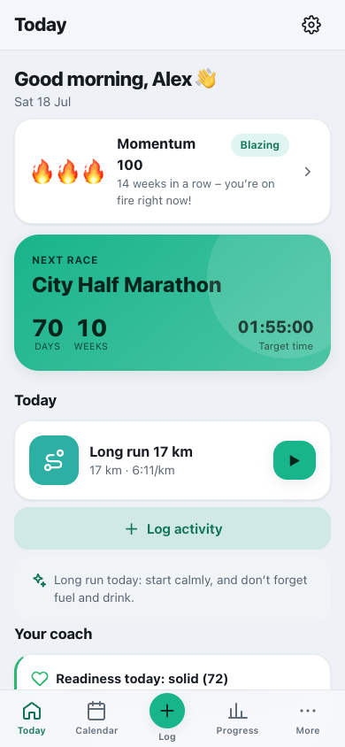
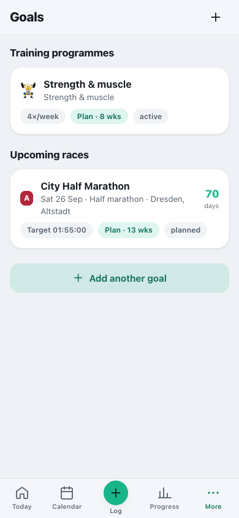
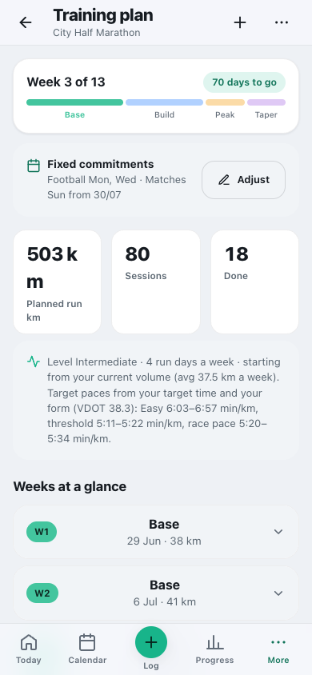
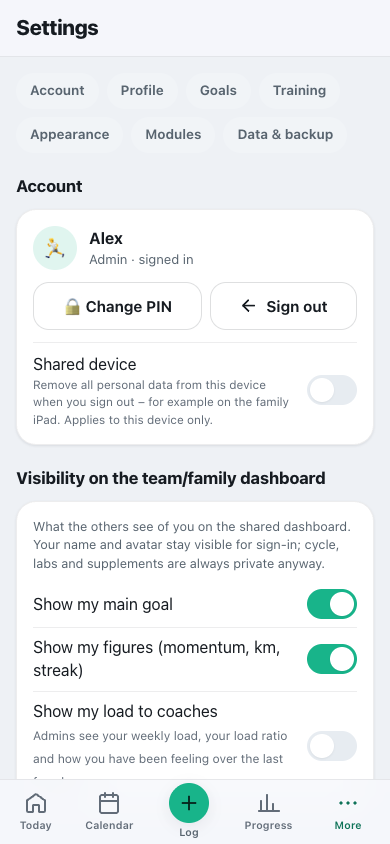
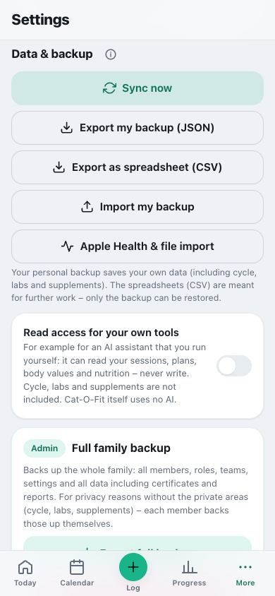
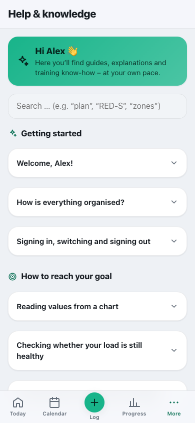

# The areas in detail

**English** · [Deutsch](../de/usage/areas.md)

Every view of the app explained briefly – from “Today” to Settings.

> Part of the [documentation](../README.md) · [All usage pages](../README.md#use)

**On this page:**

- [Today](#today)
- [Goals & plans](#goals--plans)
- [Training plan](#training-plan)
- [Session & workout mode](#session--workout-mode)
- [Progress & More](#progress--more)
- [Settings](#settings)
- [Modules](#modules)
- [Data & backup](#data--backup)
- [Help & knowledge](#help--knowledge)

---

## Today

Your home screen for what counts **today**: a personal greeting, the **countdown** to the next race,
**today's session** (the ▶ starts it directly), a tip, **one** coach hint (more can be expanded),
**Load & form**, the **weekly overview** (planned vs. actual) and your **weekly and health goals**.
Current form and training zones are under **Progress → Training** – on “Today” only when your target
paces no longer match your form. After “Start empty”, “Today” shows the three steps **Complete your
profile · Set up a goal or programme · Add members** instead of a rest day. On an iPad in landscape and
on a Mac, everything is in two columns.

 

---

## Goals & plans

Your **training programmes** and **races** in one place (More → “Goals & plans”). Race cards show the
countdown, distance and priority (A – season highlight, B – important, C – build-up); programme cards
show the focus and the training days per week. Both show whether a plan already exists. With **“+”**
you create a new goal and choose whether it should be a **race** or a **training programme**.

 

---

## Training plan

The plan of a race or programme: a **phase timeline**, key figures (planned km, sessions, completed),
the basics (level, running days, target paces) and the **weekly overview** to expand. At the top,
**“+”** adds a session; under **“…”** you find **Fixed commitments**, **Add to calendar (.ics)** and
**Recalculate plan from today**.

 

---

## Session & workout mode

A single session in three states: **planned** (the target and, at the bottom, the bar “Start · Log as
done”, which stays visible as you scroll; exercise suggestions are collapsed for runs), **in progress**
(full-screen workout with large controls, interval control with target pace and HR zone for each phase,
set counter with rest countdown and drink-break reminder) and **completed** (evaluation with
plan-vs-actual comparison, splits and time in zones from GPX/TCX files, effort).

---

## Progress & More

**Progress** bundles four tabs: **Training** (statistics, form & training zones), **Body** (body-value
trends, health import), **Badges** and **Reports**. Under **More**, organised by topic, you find
**Goals & plans**, the **Exercise library**, **Cycle** and **Labs & supplements**, **Nutrition**,
**Shopping list** and **Checklist**, **Team/family** (admins additionally “Manage team”),
**Settings** and the **Help**.

**Monthly report:** The last completed month is preselected. If you choose the current one, the dialog
points that out, and the report states its **as-of date** (e.g. “As of Mon, 28 Sept”) – reports are
sealed and cannot be added to afterwards. That is why the app shows every report and every certificate
as a **preview** first: “Edit” takes you back, and only “Save report” or “Save certificate” files it
away.

---

## Settings

This is where you adjust everything: **Account** (PIN, sign out, “Shared device”), **Profile**,
**Health & suitability** (the scope check and “Hide calorie figures”, see
[Health & suitability](health.md#health--suitability)), **Weekly goals** and **Health goals**,
**Heart rate zones** (from your max HR – or as a marked estimate from your age; optionally via HR
reserve with your resting heart rate, or from your **threshold HR** from performance testing or a
30-minute field test), **Training zones (pace)**, **Appearance** (theme, accent colour,
**language** and **units** – each person chooses their own), **Modules**, **Visible body values**, **Location &
weather**, **Nutrition** and **Data & backup**. The bar at the very top jumps straight to Account,
Profile, Goals, Training, Appearance, Modules and Data & backup. Admins also see the section
**Administration (admin)** with the team management and the instance's **Default language** (for the
sign-in screen and new people). At the very bottom – for admins only – is **“Reset app”**.

 

---

## Modules

Under **Settings → Modules** you hide areas you do not need. All modules are **switched on** to begin
with; the switches apply **per person**. Switched off, the menu item and the entry under “＋ Log”
disappear – your data is kept and is back once you switch the module on again.

| Module | What the switch hides | Default |
|---|---|---|
| Nutrition | Recipes, meal plan, food diary and calorie balance | on |
| Shopping list | shared shopping list and pantry | on |
| Daily checklist | Checklist & reminders, including their dates in the calendar | on |
| Cycle calendar | Cycle, phases in the calendar and the question on the first day of a period | on |
| Labs & supplements | Lab values, energy availability and supplements, including the notes about them in Nutrition | on |

Badges & momentum and the exercise library are not modules and are always there. When you manage a
member, cycle and labs stay hidden anyway – they are private.

---

## Data & backup

Under **Settings → Data & backup** you back up your data – with no third-party cloud. There are
**three levels**:

1. **The server folder `data/`** – the complete backup of all people, including the private areas.
   Whoever runs the server takes care of it (see [Backup in operation](../operations/backup.md)).
2. **Full backup (admins only):** saves the **whole family** in one file – all members, roles, teams,
   settings and all data **including certificates and reports**. For privacy reasons **without the
   private areas** (cycle, labs, supplements) and without PINs. “Restore full backup” resets the
   whole family to the state of the file – on the device **and** on the server (this needs the
   connection to the server). Private areas and PINs are **left untouched** in the process; on a
   brand-new server the admin sets the members' PINs again afterwards. Because this overwrites
   everything, the app asks clearly beforehand.
3. **My backup (for everyone):** a JSON file with **your own data** – including **cycle, labs and
   supplements**. On iPhone and iPad the **Share menu** opens for this: choose **“Save to Files”** and
   check that the file has arrived there. “Import my backup” brings it back in; if the file comes from
   another profile, the app asks first.

> **Important:** The full backup does not replace backing up the server folder – otherwise, after
> losing the server, the private areas of everyone without their own backup would be missing. Keep full
> backups safe; they contain the data of all members.

**Export as a spreadsheet (CSV):** Sessions, body values, lab values or the food diary as a table for
Excel, Numbers, your doctor or another app – in the format spreadsheet programs expect for the app's
language: in English comma-separated with a decimal point, in languages with a decimal comma
(German, French, …) semicolon-separated. Only the backup can be restored; the tables are for further
work.

**Read access for your own tools** (off by default): If you run an AI assistant or an analysis script
of your own, this key gives it **read-only** access to your sessions, plans, body values and nutrition
– never to cycle, labs or supplements. Cat-O-Fit itself does not use AI. Switching it off makes the key
invalid immediately; the call and its parameters are in the
[interfaces](../API.md#for-external-programs).

**Sync now** starts the sync with the server by hand – normally it runs on its own in the background.

 

---

## Help & knowledge

Under **More → Help & knowledge** you find guides, training knowledge and a glossary – searchable (also
for technical terms such as “RED-S” or “sRPE”) and with expandable step-by-step instructions. The
**ⓘ** next to figures opens the matching article directly.

 
