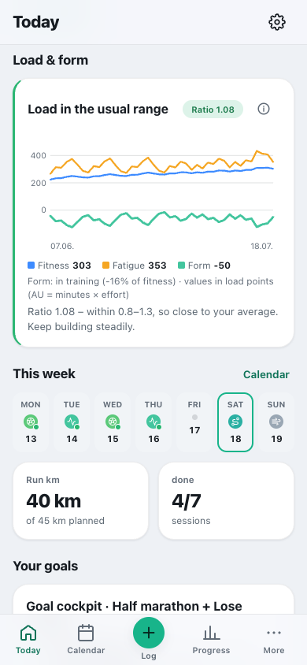
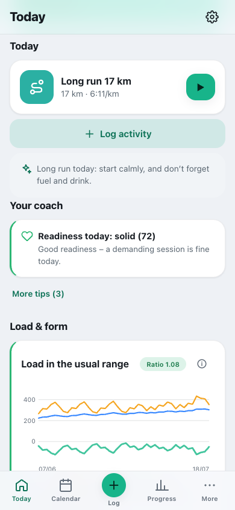
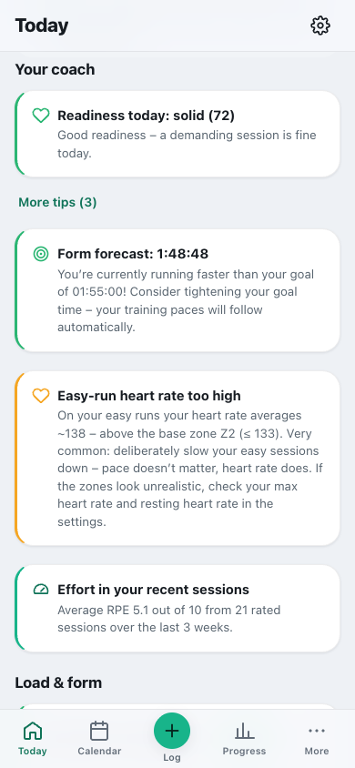
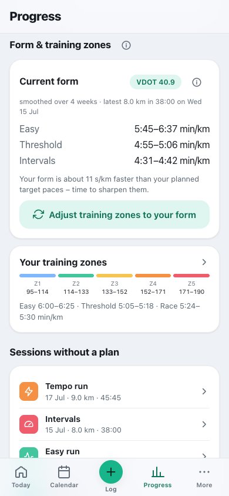
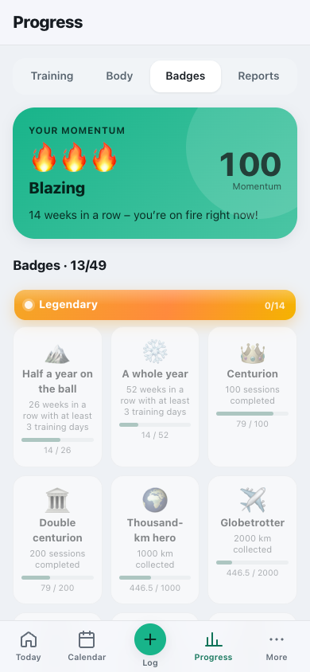

# Coach & load

**English** · [Deutsch](../de/usage/coach-and-load.md)

The daily recommendation, load & form, fixed commitments, rolling planning and two goals in one plan.

> Part of the [documentation](../README.md) · [All usage pages](../README.md#use)

**On this page:**

- [Checking whether your load is healthy](#checking-whether-your-load-is-healthy)
- [Your coach & your badges](#your-coach--your-badges)
- [Load management, fixed commitments & two goals](#load-management-fixed-commitments--two-goals)

---

## Checking whether your load is healthy

The **“Load & form”** card on “Today” answers three questions – in plain language instead of a wall of
numbers. The ⓘ in the card opens the explanation.

1. **Are you building up too fast?** The **load ratio** compares your last 7 days with the average of
   the three weeks before (technical term: ACWR). 1.0 means “as usual”, 1.3 means “30% more”. Between
   **0.8 and 1.3** you are close to your average. The limits are a **guide** drawn from observational
   data in team sport – not an injury barometer and not a promise of protection.
2. **Are you recovered?** Fitness minus fatigue gives your **form**, ranked relative to your fitness:
   **fresh** (more than 10% above), **balanced**, **in training** (up to 30% below) or **clearly
   tired** – the card’s headline then says so too. In the first three months or so the fitness curve is
   still settling in – until then the card does not rate your form.
3. **Are you training too uniformly?** The card only speaks up if your training days look very alike
   **and** the week is clearly above your usual level. Very light activity (walking, mobility) does not
   count here – daily movement is welcome.

> 💡 **All sports count** – strength, football, cycling and swimming just like running.
> The values are **load points (AU)**: minutes × effort (RPE 1–10). Without a recorded duration, the
> planned duration of the session counts, and only then a flat 30 minutes. If the effort is missing,
> the app estimates it from your **average heart rate** relative to your max HR (for intervals, tempo and
> races never below the typical value for the session), otherwise that typical value applies. For
> imported workouts, “Today” briefly asks: **“How hard was it?”** – one tap is enough. A session’s
> analysis shows what was used in the calculation.

> ⚖️ In the first four weeks the card honestly says **“Your data is still building up”** instead of
> inventing a rating from a few days.

 

---

## Your coach & your badges

**The coach** gives you **exactly one recommendation** on “Today” – in a fixed order, so two cards never
contradict each other:

1. **Warning signs first:** a gentle **comeback** after illness or injury · a **recovery day** for the
   next hard session in the coming two days, if you have done clearly more than planned or had several
   hard days in a row that were not in the plan (if easy days fall in between anyway, the plan stays as
   it is) · **easier today**, if your readiness (HRV, resting heart rate, sleep) is low and a demanding
   session is coming up · **easier after football**, if you played hard yesterday or today · **lighter
   week**, if your sessions have been very hard for about three weeks (~25% less volume; tempo and
   interval sessions stay, just with about a third fewer repetitions).
2. **Then your plan:** **spread out** two sessions on one day · **make up** a missed **key session** ·
   **gently balance** running km that were left over (capped, never added to a hard session).
3. **Last, progression:** “**More in the tank**” (~12% more in the coming week) only if nothing speaks
   against it – no warning, load in the usual range, enough data and not in the 14 days after a
   lay-off.

“**Why this recommendation?**” below the card shows what else would have fitted and why it takes a back
seat.

- **Training according to plan is not a warning sign.** If you follow the plan, the coach does not suggest
  dropping the very key session. It reacts to **deviations**: more load than planned, extra or harder-run
  sessions, poor recovery values.
- **After illness or injury** the advice is to ease back in gently: no making up, no extra volume, no
  step-up for 14 days. These absences never count against you.
- **The coach never touches fixed commitments** – a lighter week and a step-up only affect your running
  sessions.

Below that come **pieces of information** without a verdict of their own: your **readiness**, the **form
forecast** compared with your target time, the heart rate on your easy runs and the **effort of your
recent sessions** (average RPE). The **current form (VDOT)** with matching training paces is explained
in **[Current form & adjusting target paces](#current-form--adjusting-target-paces)**.

These are **recommendations**, not rules – the plan only changes when you trigger it.

 

### Current form & adjusting target paces

Under **Progress → Training**, two cards belong together (on “Today” the form card only appears when
there is something to adjust):

- **Your training zones** – the target paces your plan currently calculates with (e.g. threshold
  5:05–5:18/km).
- **Current form** – what your most recent runs add up to, as a **VDOT** with matching paces.

**How to read “Current form”:**

1. The **VDOT chip** (e.g. “VDOT 40.9”) is your estimated, **smoothed** performance.
2. “**smoothed over 4 weeks · latest 8.0 km in 38:00 on Wed 15 Jul**” means: the form is **not a single
   run** but a smoothed value from your last weeks – each week your best **hard** run counts (race,
   tempo, intervals, or a run with an effort of 7 or more or a heart rate from zone 4 upwards), more
   recent weeks count more, and **individual outliers are capped**. Easy runs clearly underestimate your
   form and only count as a lower bound. If you only run easy, it says “estimated from easy training
   runs – likely on the low side”, and the app does not advise slower paces.
3. **Easy / Threshold / Intervals** are the paces that match this form. The long run and easy runs share
   one range; the **race paces** (half marathon, marathon) come from the equivalent time for the
   respective distance.
4. The line below compares form and plan: “Your form is about **11 s/km faster** than your planned
   target paces – time to sharpen them.” (If both match, it says they “suit your current form well”.)

**Adjusting (one tap):** “**Adjust training zones to your form**” applies the form paces **immediately**
to your training zones **and** to all open, future running sessions in your plan – without the detour via
“Recalculate this week”. Each session gets the zone for its type (long run → long run, threshold →
threshold). If you have a **target time**, race pace stays your goal; without a target time it follows
the form. Afterwards the card says your planned target paces “suit your current form well”.

**Forecast for long races.** For the marathon and half marathon, the form equivalence only says a lot
if your volume is right too. If your weekly volume (marathon: under ~50 km, half marathon: under ~30 km)
or your longest run (under ~25 or ~15 km respectively) is still below that, the forecast carries the
note “only achievable with enough preparation”, and the coach then does not advise sharpening the target
time.

> **To try it with the demo data:** The smoothed form is around VDOT 40, the plan still aims a bit
> slower. Under Progress → Training tap “Adjust training zones to your form” → the threshold is
> sharpened, and the upcoming runs in the plan show the new paces. Important: a single outlier day does
> **not** shift the form – it is **smoothed over several weeks**.

 

### Badges & momentum

You unlock **badges** for completed training and goals reached – automatically and with a little
celebration. Your **momentum** is the “flame of drive”: it **grows** when you keep going and **shrinks
gently** when there are gaps – meant as a nudge, never as a punishment (in keeping with Cat-O-Fit’s
philosophy of “motivation without pressure”). You see your momentum at the top of “Today” as soon as you
have logged your first workout; all badges with their progress are under **Progress → Badges**.

- **Streaks count in weeks:** A calendar week with at least **three training days** continues your streak –
  rest days are part of it. The current week does not break the streak while it is still running.
- **More is not always more:** Momentum rises with up to **five training days per week**; a sixth or
  seventh day brings no extra momentum.
- **Ill or injured?** Log the absence with a reason – momentum then **pauses** instead of dropping, and a
  week with an absence does not break your streak.

 

---

## Load management, fixed commitments & two goals

Cat-O-Fit plans on a **rolling** basis and manages load with methods from sports science – the formulas and
sources are in [Methods & sources](../knowledge/methods-and-sources.md).

### Load & form (card on “Today”)

From **duration × effort (RPE)** of each session – across **all** sports (running, strength, football …):

- **Load ratio (ACWR)** – the load of the last 7 days relative to the average of the 21 days before
  (“decoupled”: the acute days are not part of their own reference value). **0.8–1.3** means: close to your
  average. A guide drawn from observational data – the research supports no promise of protection.
- **Fitness / fatigue / form** – long-term fitness (CTL) minus short-term fatigue (ATL) gives the
  **form (TSB)**, ranked relative to fitness: fresh, balanced, in training, clearly tired. Only rated
  from about three months of data.
- **Monotony & strain** – a notice appears only when uniform training days coincide with a week above your
  average; very light activity does not count here.

### Fixed commitments (football & matches)

New plans have **no** fixed commitments – when you create a plan, the app asks about them (none, take them
over from another plan, or enter them). Plans from older versions keep their football training on Monday
and Wednesday. Enter recurring commitments **once** – the plan arranges itself around them; if the same
commitment is in two plans, it still appears only once per day:

- **Football training days** (e.g. Mon & Wed) with duration **and intensity** (light · normal · intense).
  Football is HIIT-like and costs a lot of energy: from “normal” upwards a football day counts as a
  **demanding day** (it feeds fully into load & form). If you played hard and a hard session is coming up
  afterwards, the coach suggests taking it **easier**. “Light” stays an easy day.
- **Recurring matches** with a start date (e.g. “from 19 Aug, every Sunday, 2 h”). On a match day the
  planned training session drops out; everything counts towards your load.
- **No hard day next to a hard commitment:** The plan never puts a quality session or long run directly
  next to a demanding fixed commitment (not even on the Monday after a Sunday match). It moves to a quiet
  day; if there is none, the quality session becomes “**Easy with strides**” – that week the commitment
  provides the intensity.

### Rolling planning & automatic recovery day

Instead of a rigid block, the coming week adapts to what you have **actually** done. If your load is clearly
above what was planned, or hard days pile up that were not in the plan, the coach suggests a **recovery
day**. If **two sessions** fall on that day (say from two goals), the **whole day** is turned down – not
just one session; alternatively the coach offers to **move** one of the two to a free day (spreading out
the day). Every automatic adjustment appears in the **“Recent automatic adjustments” log** and can be
**undone** as long as the session is still open – a session that has meanwhile been completed stays
completed, and a later move stays in place.

**Cycle-aware:** If you enter a period start for today or tomorrow in **Cycle** and a demanding session is
planned that day, Cat-O-Fit briefly asks how you are: “**As planned**” or “**Take it easier**”. Only at
your request is the training eased on day 1 (runs → easy, strength → mobility) – logged and undoable. Many
people train as normal that day; both are fine.

### Week check & preview (what-if)

The **week check** in the plan shows clashes and the order of triage: **fixed commitments → key runs →
strength → volume**. It also spots hard days back to back across the week boundary (match on Sunday →
training on Monday). Before you add or move a session, the **preview** shows the effect on the weekly
load – what is rated is the **change**: “hardly any effect”, “a bit harder” (more than ~8% or one more
hard session) or “much harder” (more than ~25% or two hard days back to back – even if you only move
within the week and the total load stays the same).

> **Note:** Running plans contain mobility but no fixed strength days. If you want strength, you plan it
> through a **training programme of its own** (strength focus); triathlon and Hyrox plans include strength.

### Goal cockpit: two goals in one plan

Half marathon **and** weight loss? The **goal cockpit** brings performance goal and weight together: the
emphasis moves with the phase – in the **base phase** the deficit is largest (around 450 kcal), in the
**build phase** smaller (around 300 kcal), in the **peak phase** small and during the **taper** zero, when
you top up. The **deficit recommendation** is the same as in Nutrition and has lower limits: never below
your basal metabolic rate and never so low that less than 30 kcal per kg of fat-free mass is left after
training (without a body-fat value, a deficit of 15% at most). A **stimulus check** warns if too little
training stimulus is set. As long as the scope check (see [Health & suitability](health.md#health--suitability))
is unanswered, the cockpit suggests no deficit.

 
