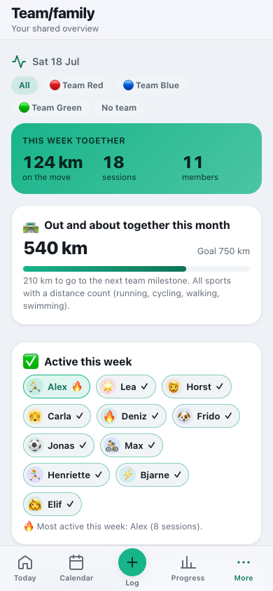
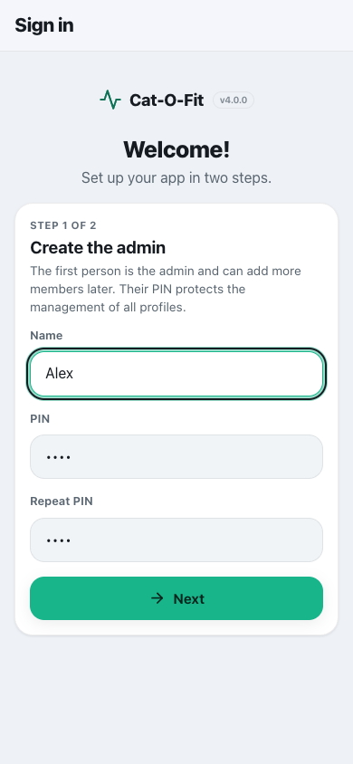
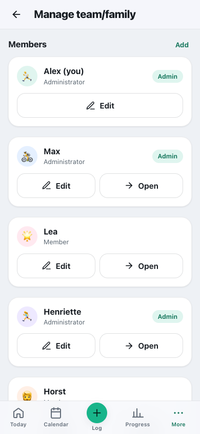

# Team & family

**English** · [Deutsch](../de/usage/family.md)

Signing in, PIN, roles, teams and the shared dashboard.

> Part of the [documentation](../README.md) · [All usage pages](../README.md#use)

**On this page:**

- [Team/family & signing in](#teamfamily--signing-in)
- [Changing or resetting your PIN](#changing-or-resetting-your-pin)
- [Roles, management and co-managing](#roles-management-and-co-managing)
- [Private stays private](#private-stays-private)
- [Teams](#teams)

---

## Team/family & signing in

Cat-O-Fit is for your **whole team or family** (up to 32 people) – whether it is a running group, a
sports team or a family. Each person has their own goals, plans, training and body values.

**First-time setup (first start):** The very first time you start the app, a short assistant takes you
through two steps: first you create the **admin person** (a name and your own PIN with 4 to 8 digits –
not `0000`, because it protects the management of all profiles) and then choose whether to load
**demo data** (a sample race, training history and a complete sample family with several members and
teams to try things out) or to **start empty**. As an admin you can add more members at any time
afterwards.

**Signing in:** As long as nobody is signed in, Cat-O-Fit shows only the **sign-in** with the profile
tiles – no menus at all. Tap your profile and enter your **PIN**; the menus then appear and you land
on “Today”. The server checks the PIN; after five wrong attempts there is a short pause. There is **no
auto-login**: if you close the app (or the tab), you sign in again the next time you start it.
**Reloading keeps you signed in** – so on shared devices always tap **“Sign out”**.

**Without a connection to the server** you can sign in on a device where you have already signed in
online once. The very first sign-in on a new device needs the server. Cycle, labs and supplements are
only synced once the server has confirmed your sign-in – until then your changes stay safely on the
device. If this confirmation is missing (for example after an update or after 30 days without use),
the app asks for your PIN once; “Later” postpones this until the next time you open it.

**Shared device (e.g. a family iPad):** Under **Settings → Account**, switch on **“Shared device”**.
Signing out then removes all personal data from this device's browser storage (changes not yet sent
stay until they have reached the server).

**Switching profile = signing out:** To switch, simply **sign out** – you land straight back at the
sign-in. You find **Sign out** on the iPhone in the **More** menu (at the top, by your name), on iPad
and Mac **at the bottom of the sidebar**, and under **Settings → Account**.

**Team/family dashboard:** The menu item **“Team/family”** is your shared overview: a **weekly
summary** (kilometres together on the move, sessions, members), the monthly km with a milestone, “who
was active this week” including the most active person, everyone's upcoming races, **team
achievements** (training badges only) and a **tile per member** with their main goal and figures.

  
  

---

## Changing or resetting your PIN

**Change your own PIN:** Settings → Account → “Change PIN”: the current PIN, then the new one twice
(4 to 8 digits, not `0000`). The app needs a connection to the server for this. New members start with
the PIN `0000` – until they set their own, “Today” reminds them.

**Forgot your PIN:** An admin opens the member (More → “Manage team” → “Open”) and taps **“Set PIN
for …”** under Settings → Account. If the **only admin** has forgotten their PIN, the only help is
working on the server itself – see
[Troubleshooting: forgotten PIN](../operations/troubleshooting.md#forgotten-pin).

The PIN is stored on the server only as a check value (hash) and works the same over the local
address (`http://…`) or over HTTPS.

---

## Roles, management and co-managing

**Roles:** There are **admins** and **members**. Management is under **More → “Manage team”** (in the
sidebar on iPad) and visible **to admins only**. There you **add, edit or remove** members (name, icon,
colour, role), form teams, set the **shared shopping day** and choose the dashboard figures. The last
admin is protected from removal. Adding members, changing roles and removing them only work with a
connection to the server.

**Reset app:** at the very bottom of Settings (admins only). After you type the confirmation word,
**all** members and data are deleted and the first-time setup starts again.

**Co-managing a member:** In “Manage team”, an admin taps **“Open”** on a member and then sees their
calendar, goals and sessions – ideal for planning for children or for the team, for example. The top
of the screen then reads **“You are managing …”** with **“Back to me”**; “Today” is called, for
example, “Lea’s overview”.

---

## Private stays private

**Cycle, lab values and supplements** are visible only to the person themselves – **never** to admins
when managing, and they then influence no figures either. The server, too, only hands them out after
the person's own PIN sign-in. Whoever runs the server can, however, read the stored files (they are
unencrypted) – more under [Privacy in operation](../operations/privacy.md).

Under **Settings → Account → “Visibility on the team/family dashboard”** you decide for yourself
whether your **main goal** and your **figures** (momentum, weekly km across all sports, weekly streak)
are visible to the others. If you hide them, a **🔒 private** appears there instead of your goal; your
name and avatar stay visible for signing in. The team achievements count **training badges** only –
the team dashboard never shows other people's health and cycle data.

**Coach view:** With the switch **“Show my load to coaches”** (off by default) you give admins your
**load points of the last 7 days**, the **load ratio** compared with your own average and your most
recent **wellbeing** (energy and mood of the last three days). They see this on the team/family
dashboard under **“Team load”** – for example to spot, before a match, who already has a lot in their
legs. A guide, not a diagnosis; cycle, labs and supplements stay out of it here too.

---

## Teams

Within the family, as an admin you form **teams** (e.g. “Team Red”, “Team Blue”) and assign members by
ticking them – under More → “Manage team” → “Create team”. A member can be in **several teams** at the
same time, some in none; changing teams is possible at any time. On the **team/family dashboard** you
switch at the top between **All · each team · No team**; all figures (weekly kilometres, monthly km &
milestone, “active this week”, upcoming races, team achievements) then apply to the chosen team. If a
member is removed, they disappear from all teams.
