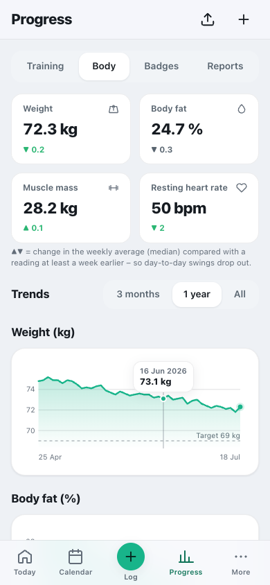
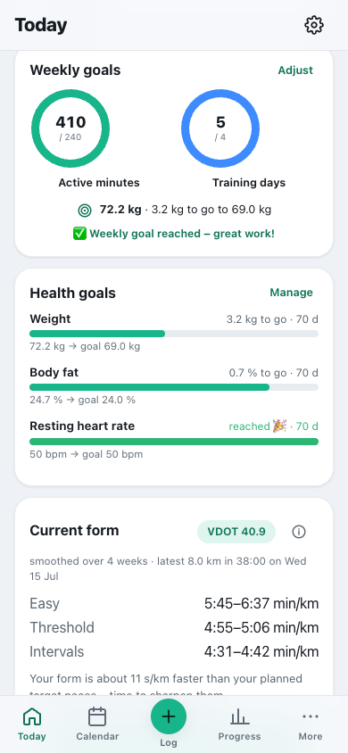
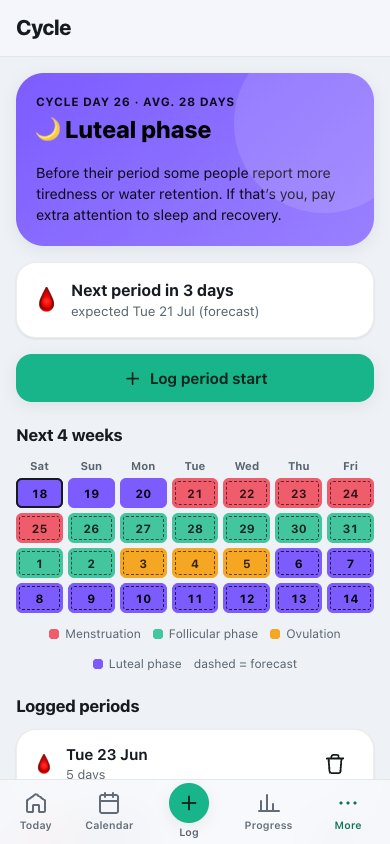

# Health

**English** · [Deutsch](../de/usage/health.md)

Body stats, Apple Health, health goals, health & suitability and the cycle calendar.

> Part of the [documentation](../README.md) · [All usage pages](../README.md#use)

**On this page:**

- [Keeping your body stats up to date](#keeping-your-body-stats-up-to-date)
- [Getting data from Apple Health](#getting-data-from-apple-health)
- [Health goals with progress](#health-goals-with-progress)
- [Health & suitability](#health--suitability)
- [Cycle calendar](#cycle-calendar)

---

## Keeping your body stats up to date

Under **Progress → Body** you follow your development – calmly and without pressure:

1. Tap **＋ Log → Body stats** (or **“+”** at the top) and enter e.g. weight, resting heart rate or sleep
   (only what you want).
2. The charts show your **trend** – with a **y-scale**, and for weight with a **target line**. The points
   are placed **by date**: two weeks and eight months no longer get the same width. At the top you choose
   the time range (**3 months · 1 year · All**); long series appear as weekly averages, and for ranges over
   a year the year is shown on the axis.
3. **Reading values:** Drag your finger across a chart (on a computer: hover with the mouse) – a guide line
   jumps to the nearest data point and shows **date + value** in a small bubble. On bars, a tap on the bar
   shows its value.

The presentation is deliberately **neutral** – it is about the direction over weeks, not daily
fluctuations. The tiles at the top show your latest reading and the **change in the weekly average**
(median) since a reading at least a week earlier. A change only turns green if it fits your goal – for
weight, a falling value with a weight-loss goal and a rising one with a weight-gain goal; without a goal it
stays neutral. You can hide individual values in the settings.

**Muscle mass or lean mass?** “Muscle mass” is the value from a body-analysis scale (about 28 kg at
72 kg). **Lean mass** (Lean Body Mass, e.g. from Apple Health) comprises everything except fat and is
considerably higher (around 54 kg at 25% body fat); it feeds into energy availability. **HRV** carries its
measurement type: Apple stores SDNN, many watches and rings show RMSSD – trends, goals and readiness only
compare values of the same type. When logging, you choose it next to the value.

 

---

## Getting data from Apple Health

Watches and scales (Apple Watch, Garmin, Withings …) write to Apple Health. From there the values reach
Cat-O-Fit in three ways – the setup is covered in detail under [Apple Health](apple-health.md). On
**Android**, a bridge app sends the values from Health Connect to the same address (see
[Android: Health Connect](apple-health.md#android-health-connect)).

| Route | Cost | What arrives |
|---|---|---|
| **Automatically** with the “Health Auto Export” app | The app is free; the automatic transfer you need is Premium only (according to the App Store, as of September 2026: about €8 a year or €30 one-off) | daily weight, resting heart rate, HRV, VO₂max, sleep, steps, active energy and workouts |
| **Automatically via a shortcut** (Apple’s “Shortcuts” app) | free | the daily values the shortcut reads (e.g. weight, resting heart rate, HRV, sleep) |
| **By hand: full import** | free | workouts of all sports that can be matched, body stats and, if you like, the cycle from the complete export, as often as you like |

**Full import by hand:**

1. iPhone → **Health app** → **profile picture** at the top → **“Export All Health Data”**.
2. Upload the resulting **ZIP file** in the app: **Progress → Body → “Health import” icon** at the top
   (or **Settings → Data & backup → Apple Health & file import**).
3. Cat-O-Fit takes over the **workouts** (running, cycling, swimming, walking, hiking, strength, rowing … →
   completed sessions, matched automatically) and **body stats** (weight, resting heart rate, sleep, HRV,
   VO₂max). If the export contains cycle data, the app asks whether it should take over the **period
   starts** – they stay private. The app recognises duplicate entries.

**Activities from files (GPX, TCX, FIT, ZIP).** On the same page you can also upload recordings from your
watch – one at a time or as a whole export (more under
[Importing activities from files](training.md#import-activities-from-files)). They are analysed right
in the browser: **sport** (from the file; if it is missing, the app asks), **date in your time zone** (even
for the New Year’s Day run at 00:30), **moving time** without pauses, distance, average and max heart rate,
**kilometre splits** and – with your HR zones from the settings – the **time in each zone**. Before saving
you see a summary: if a planned session of the same day and the same sport fits, the activity is matched to
it, otherwise it is saved as a free workout.

**Matching automatically imported workouts.** If workouts arrive via “Health Auto Export” without a link to
the plan, “Today” offers to match them to the fitting planned session of the same day (**Match**,
**Match all** or **Don’t match**). Once matched, the session counts as done – without double load.

> Splits, time in HR zones, elevation gain and route exist for GPX, TCX and FIT files. The Apple Health
> export (automatic as well as manual) provides no individual points for that.

---

## Health goals with progress

Besides the **weekly goals** (active minutes & training days), you can set **dedicated target values** for
your body stats: **weight, body fat, resting heart rate, HRV** or **VO₂max** – each with an optional
**deadline**.

1. **Settings → Health goals → “+ Goal”**: choose a metric, enter the target value (and optionally a
   target date). Your **current value** is remembered as the **starting point**.
2. On **“Today”** the **Health goals** card appears with a **progress bar** for each goal – from the start
   value to the goal, plus “X to go” and the days remaining.
3. Progress counts with every new value you enter under **body stats** (or via the Apple Health import).
   When the goal is reached, the card celebrates 🎉. For weight the **weekly average** counts, not the last
   single reading – “reached” means the same thing everywhere in the app.
4. **Plausibility:** A target weight below BMI 18.5 or a body-fat goal below about 12% (women) or 5% (men)
   is only saved after a clear warning. For children and teenagers, and in pregnancy, breastfeeding or with
   an eating disorder, there are no weight and body-fat goals; existing ones stay saved and are suspended.

 

---

## Health & suitability

Cat-O-Fit serves **documentation and general information for healthy adults** – it is **not a medical
device**. Under **Settings → Health & suitability** you answer a short **scope check** once; it applies to
the whole app (Nutrition, goals, programmes, Labs). The questions are deliberately not pre-filled – until
you answer, the app suggests no weight-loss deficit.

| Answer | What changes |
|---|---|
| Illness or regular medication | Labs & supplements for documentation only, no recommendations |
| Pregnancy/breastfeeding or (past) eating disorder | in addition no weight-loss or deficit goals, no weight-loss programme, no weight and body-fat goals |
| Under 18 (from the **year of birth** in the profile) | **Child and youth profile:** no calorie and weight goals, no target weight, no weight-loss programme, no performance supplements, lab values only documented, calorie figures hidden |

**Hide calorie figures:** The switch below hides kcal figures in Nutrition, on “Today” and in energy
availability – for anyone who doesn’t feel good about numbers around eating. You can still log everything.

**For parent admins:** If you manage a child’s profile, the banner at the top says “Child and youth
profile”. For children what matters is eating enough and eating a varied diet – especially on training
days.

**Missed period:** If your last period start is clearly longer ago than usual, the app asks on “Today” and
in Cycle (“Yes, it hasn’t come”, “I’m pregnant or breastfeeding”, “Hormonal contraception”, “No, I just
didn’t log it”). It shows a medical note only for “Yes, it hasn’t come” – or after 90 days without an
answer. Long cycles are counted as real cycles instead of quietly carrying on with 28 days.

---

## Cycle calendar

Cycle-aware, considerate training planning. The module is switched on to begin with; if you don’t need it,
switch it off under **Settings → Modules** (the menu item and the entry under “＋ Log” then disappear).

1. Mark your **period start** (**＋ Log → Period** or on the cycle page) – or have it taken over from Apple
   Health or Health Connect (see above; imported entries carry their origin). Cat-O-Fit works out the
   **cycle length** and your **current phase** (menstruation/follicular/ovulation/luteal) and predicts the
   **next period**.
2. The phases appear subtly in the **calendar**. The tips for each phase are deliberately **neutral**: how
   you feel across the cycle is very individual, and the evidence on performance differences between phases
   is weak – go by how you feel.
3. On your **menstruation days**, sessions are **protected**: you can move or skip them **without penalty** –
   they do not count as missed and reduce neither plan adherence nor momentum.
4. If you enter a period start for today or tomorrow, Cat-O-Fit asks whether you would like to take it
   **easier** that day – only then is the training adjusted.
5. **Hormonal contraception** (pill, hormonal coil, implant …): With the switch at the bottom of the page,
   Cat-O-Fit no longer shows phases, only your bleeding days, and does not ask about a missed bleed – under
   hormonal contraception cycle phases are not meaningful.
6. **With no new entry for about three months** the forecast pauses: no phases, no “next period”, no
   protected days. Add your last period start and it carries on.
7. The **“Cycle in view” 🌙** badge is awarded for three logged period starts.

> 🔒 **Privacy:** Only the person themself sees cycle data – admins managing the profile don’t either, and
> the server only releases it after their PIN sign-in. It lives on your own server (see
> [Private stays private](family.md#private-stays-private)).

 
