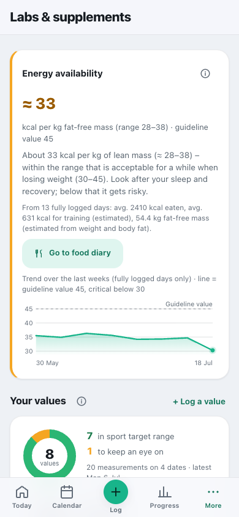
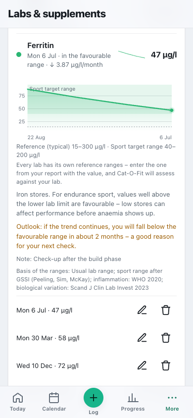

# Labs & supplements

**English** · [Deutsch](../de/usage/labs.md)

Record lab values, read them in a sports context, and general information on supplements.

> Part of the [documentation](../README.md) · [All usage pages](../README.md#use)

---

## Labs & supplements

People who train a lot often have blood taken regularly – and then put the report in a drawer. Here you can
record the values, follow their **trend** and have them put into a **sports context**.

**Why a sports context?** Laboratory ranges apply to the general population. A **ferritin of
25 µg/l** is “normal” according to the report – but for endurance training the iron store is then
marginal, and that costs performance long before anaemia develops. Cat-O-Fit therefore shows
**both** corridors: your lab’s reference range and the one that is favourable for training.

1. **Set up:** The first time you open it, you answer a few short questions about the scope – they apply
   to the whole app (see [Health & suitability](health.md#health--suitability)). The app is meant for
   **healthy adults** – anyone under medical treatment, taking medication, pregnant or breastfeeding, or
   with an eating disorder uses the module only for **documentation**. Logging and viewing the trend still
   work; recommendations are deliberately not given. For **children and teenagers** (from the year of
   birth) values are only documented and not rated against adult ranges – the matching ranges are on the
   report.
2. **Log a value:** choose the lab value (19 sport-relevant lab values, from ferritin and vitamin D to fT3;
   magnesium as a whole-blood **and** a serum value, B12 as holo-TC **and** total), date, result and, right
   next to it, the **unit** – for almost every value the ones customary in Germany (CRP in mg/l or mg/dl,
   vitamin D in nmol/l or ng/ml, testosterone in nmol/l or ng/ml …). The app converts and shows the value
   as it was on the report. If a value is far outside the usual range, it asks “Is the unit right?”. Then
   comes **your lab’s reference range** (see below), optionally the **circumstances of the blood draw**
   (hard exercise in the 48 hours before, fasting, biotin, cycle day) and a note.
   **Whole report at once:** “Log a lab report with several values” below the list of values shows all
   values one under the other – you enter date and circumstances once, and per value the result, unit and
   your lab’s reference range. Empty rows do not count; the app reports implausible values together before
   saving.
3. **Assessment:** Tapping a value shows the trend with both corridors (reference dashed, sport target
   range as an area), an explanation, the **source** of the ranges and all measurements – there you can
   **edit and delete** values. The app shows a **trend** only from three measurements over at least two
   months and when the change is larger than the value’s natural variation; a projection (“when does the
   value leave the favourable range”) exists only in the unfavourable direction and at most one year ahead.
   It interprets **ferritin** together with the CRP from the same blood draw: with inflammation a high value
   cannot be assessed, a low one remains noteworthy. It does not rate CK, urea and CRP after hard exercise
   (“recheck at rest”); haemoglobin, testosterone and oestradiol need the sex in your profile (or your
   lab’s range). **Old values** (vitamin D after four months or from a different season, most others after
   a year) stay in the trend but no longer carry suggestions.
4. **Supplements:** General information with the **reasoning**, the usual amount (in line with the maximum
   levels of Germany’s BfR and the upper limits of the EFSA, with a source), timing and interactions. The
   route via food always comes first – a supplement fills a gap, it does not replace a plate. **Iron is
   never suggested without a lab value**: taken on suspicion it is harmful when stores are full. A value
   that is **too high** never leads to “supplement” but to the advice to check your intake. Magnesium is
   only offered with a lab result, protein only if your food diary is below 1.2 g per kg, creatine only with
   regular strength training. For performance products there is a note to use only batch-tested products
   for competitions with doping controls (the German Cologne List).
5. **Plan & ticking off:** What you take regularly goes under “Your plan”, and you tick it off – including
   adherence (bars with 100% as full height; days before the plan began stay empty). Products you take only
   **as needed** (e.g. caffeine before competitions) do not count there.

> ⚡ **Energy availability:** At the very top, Cat-O-Fit estimates from your food diary, training
> expenditure and fat-free mass whether you **eat enough for what you train** – rounded and as a
> **range** (all inputs are estimates) **and as a curve over the last weeks**, with the guideline value as
> a line. The calculation only uses days that you have confirmed in Nutrition with **“Mark day
> complete”**; until then the app shows how many days are confirmed instead of claiming a shortfall. The
> critical threshold is 30 kcal per kg of fat-free mass for women and 25 for men; with a weight-loss goal,
> 30–45 is acceptable temporarily. If there is no body-fat value from the last four months, the card says
> so. Too little energy is the more common problem in endurance sport than a missing supplement – and a
> frequent cause of declining performance, injuries and cycle disturbances.

 

**What you see at a glance:** A ring shows how many of your values are in the sport target range and how
many you should keep an eye on. Each row carries a **mini trend**, so you can spot trends without opening
anything. Tapping shows the full curve with **reference and sport target range** and the change per month.
If you take something regularly, a bar chart shows your **adherence** over the last three weeks.

In the example above, **ferritin is 47 µg/l** – still in the sport target range (40–200), but the curve
has been falling for months by just under 4 µg/l a month. The outlook extends that: in about two months the
favourable range would be undershot – a good reason for the next check. Exactly such trends are invisible
in a single report.

### Where do I get my lab results? (Germany)

Four to five routes lead to a lab report – they differ mainly in **who pays** and how close to sport the
choice of values is. These routes, with their insurance rules and prices, are the German ones: Cat-O-Fit
shows them when the place in your settings (**Settings → “Location & weather”**) is in Germany – if you
have not set a place, the app language decides, and German counts as Germany. Everywhere else a short
general note takes their place, and that of the German standards further down: ask a sports-medicine
practice or your doctor which values they can measure, a private lab is the alternative, and bring the
report – values from any lab in any country work, because you enter the reference range printed on it.

| Route | What it covers | Cost |
|---|---|---|
| **Sports medicine check-up** ⭐ | The route that really fits: a doctor with the additional qualification in **sports medicine**, often at sports-medicine institutes, university hospitals or larger practices. Usually a blood count, iron status, liver and kidney values – often together with performance testing. | about **€100–300** |
| **GP or specialist practice** | Paid for by statutory insurance only with a **medical reason** (symptoms, a specific suspicion). “Ferritin, because I run a lot” is not one – that is a self-pay service (IGeL). | Insurance with a medical reason, otherwise about **€20–60** |
| **Check-up 35** | Statutory preventive care: once between 18 and 34, then every three years. Cholesterol, blood sugar, urine status – **neither ferritin nor vitamin D**. | Covered by statutory insurance |
| **Mail-in and self-pay labs** | Home test kit (blood from the fingertip) or a venous blood draw as a self-payer at a conventional lab. | about **€30–150** |
| **Blood donation** | Haemoglobin at every donation; some donation services also measure **ferritin** for regular donors. | free |

> 💰 **Little known:** Many statutory health insurers **subsidise the sports check-up** as a voluntary extra
> benefit – roughly €60–200 depending on the insurer, usually every two years. A call to your insurer is
> worth it before you pay yourself.

> 🔬 **Important for trends:** If possible, stay with the **same lab and method**. Blood from the fingertip
> is more sensitive in preparation than a venous blood draw – small jumps between two providers are often
> measurement differences and not a real change. Regular blood donation, by the way, noticeably lowers the
> iron stores; anyone doing endurance sport should then pay special attention to ferritin.

### Why you enter your lab’s reference range

In Germany there are **no nationwide uniform reference ranges**. Every lab sets its own – depending on
measurement method, instrument and comparison group. For ferritin, fT3 or vitamin B12 they differ
noticeably. That is why the range is always printed **on your report** next to the value: it belongs with
it.

When you log a value, the fields **“Your lab’s reference range”** therefore show only a typical range,
hinted in grey – in the unit you have chosen. Copy the range from your report: Cat-O-Fit then rates the
value against *your* lab, and the sport target corridor stays alongside as a second layer. Only what you
enter yourself is saved; if you leave it empty, the usual range applies. Up to v3.19.0 the pre-filled
range was saved along with the value (even converted wrongly when the unit had been changed) – the app
recognises such older values and rates them against the usual range again.

**What *is* regulated, on the other hand:** The quality assurance of labs (guideline of the German Medical
Association, **RiliBÄK**, with mandatory proficiency tests), often supplemented by accreditation to
**DIN EN ISO 15189**. For transmission to practices there is a German standard, **LDT**, and
internationally **HL7 FHIR**; through the **electronic patient record (ePA)** reports increasingly reach
you digitally.

**Sport-specific target values are not regulated.** What Cat-O-Fit shows as a sport target corridor (such
as ferritin above 40 instead of above 15) comes from sports-medicine literature and international position
statements – not from a German standard. The source for each value is shown in the detail view under “Basis
of the ranges”; the list is in [Methods & sources](../knowledge/methods-and-sources.md#lab-values).

> 🔒 **Private like the cycle:** Only **you** see lab values and supplements in the app – admins don’t
> either – and the server only releases them after your PIN sign-in. They stay out of the family full
> backup; in your personal backup they are included. Whoever runs the server can read the stored files.

> ⚕️ Cat-O-Fit serves **documentation and general information for healthy adults** –
> **not a medical device**, no diagnosis and no therapy. For symptoms or unusual values the assessment
> belongs in medical hands – for critical values the app says so explicitly and holds back with
> recommendations.

 
