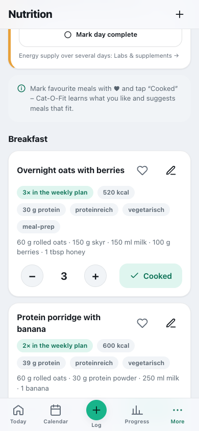
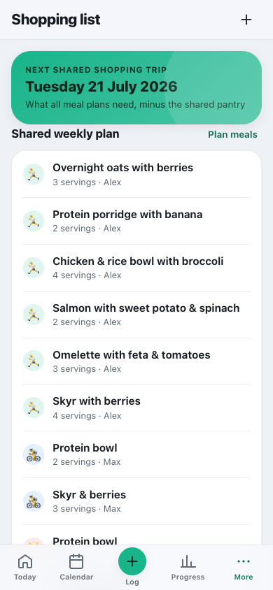

# Nutrition & shopping

**English** · [Deutsch](../de/usage/nutrition.md)

Recipes, calorie balance, food diary, shopping list and shared pantry.

> Part of the [documentation](../README.md) · [All usage pages](../README.md#use)

**On this page:**

- [Nutrition & lists that learn along](#nutrition--lists-that-learn-along)
- [Shopping list & shared pantry (team/family)](#shopping-list--shared-pantry-teamfamily)

---

## Nutrition & lists that learn along

**Quick start:** When you first open it, the list is empty – tap **“Load 48 recipe ideas”** and you
have ~48 recipes ready in one go (breakfast, lunch, dinner, snack: vegetarian, vegan, low-carb,
high-protein, meal prep …). Or create your own with **“Add your own meal”** or the **“+”** at the top.
Every meal has ingredients, kcal and protein; the **“estimate”** button fills in calories & protein
automatically from the ingredients (see below).

Mark meals with **♥** and tap **“Cooked”** after cooking. Cat-O-Fit learns which tags (e.g.
*high-protein*, *vegetarian*) you prefer and suggests suitable meals under **“Recommended for you”**.
Plan meals with **servings** for the week – the shared **shopping list** is built from them
automatically (see below). Frequently used checklist items show up as **quick-add** chips – so
keeping things up to date gets faster and faster over time.

Have you deleted some recipe ideas, or are some from the catalogue missing? The **“Add … recipe
ideas”** button at the end of the list adds exactly the ones you are still missing (the catalogue
holds 48 recipes).

**Calorie balance today.** At the very top, a card shows what you **burned** (basal metabolic rate
by Mifflin-St Jeor + everyday activity + today's training) against what you **ate**, including the
balance and a daily target heading towards your **target weight**. The intake comes from your **food
diary**: when you tap **“Cooked”** on a recipe or log something with **“Log what you ate”** (also via
**＋ Log → Meal**), a dated entry is created. There you either enter **food with an amount** (“200 g
skyr, 1 banana” – the app estimates kcal and protein from its nutrition table), add something from
**“Recently eaten”** again with one tap, type the barcode of a package under **“Barcode”** (where the
browser can do it, the camera works too) and give the amount in grams – the nutrition values come via
your server from **Open Food Facts**, and only the barcode is sent out – or, for eating out, choose a
**portion size** under **“Eating out”** (flat-rate kcal). **“Eaten today”** below the balance lists all
of the day's entries – each can be deleted, with **“Undo”** in the notice. That keeps the diary and the
recipe list separate. Once you have logged everything, tap **“Mark day complete”** below it – only
confirmed days count towards energy availability in the labs module. The daily target uses the
**weekly average** of your scale instead of a single measurement; within 0.5 kg of the target weight
counts as “maintain”, and if you drop below a weight-loss target you get “maintain” – never
automatically “gain”. When losing weight, the target stays above basal metabolic rate and training
needs; a target weight below BMI 18.5 gets no deficit (the app points this out when you save). The
recipe ideas are calculated from their ingredients – the same estimate as the **“estimate”** button.
When you create your own meals, the **“estimate”** button estimates calories **and protein** from the
ingredients. If it is switched on (Settings → Nutrition → *“Fill in nutrition values online”*; off by
default for new profiles), it fetches real values for each ingredient from **Open Food Facts** (an open
database); implausible hits are discarded, otherwise a local estimate applies. Your server sends only
the ingredient name there and caches the results – if the option is off, everything stays purely
local. Everything is meant as a guide. For the balance, enter your height, weight, year of birth and
(optionally) sex in your **Profile**.

 

---

## Shopping list & shared pantry (team/family)

The shopping list is **shared** and is built **automatically from the meal plans of all members** –
nobody maintains it by hand.

1. Each member plans meals with **servings** for the week in **Nutrition** (basket icon on every
   meal).
2. Cat-O-Fit **pulls together everyone's planned meals**, **adds up** the ingredients with real
   amounts (e.g. oats from two people become a single amount) and **subtracts the shared pantry** –
   the list shows, by category, exactly what you still **need**. Due on the central **shopping day**
   (set by admins in the team/family management, default Tuesday).
3. **“Bought everything → add to pantry”** books the amounts into the **shared pantry**. **“Cooked”**
   (in Nutrition) books them out again – so you all know what is at home and what really has to be
   bought.

The weekly plan shows the member for each meal (avatar + name). Ingredients without a fixed amount
(e.g. “spinach”) appear as **“as needed”**.

 
