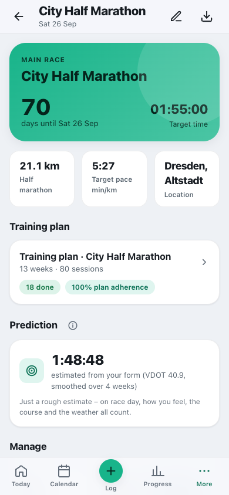
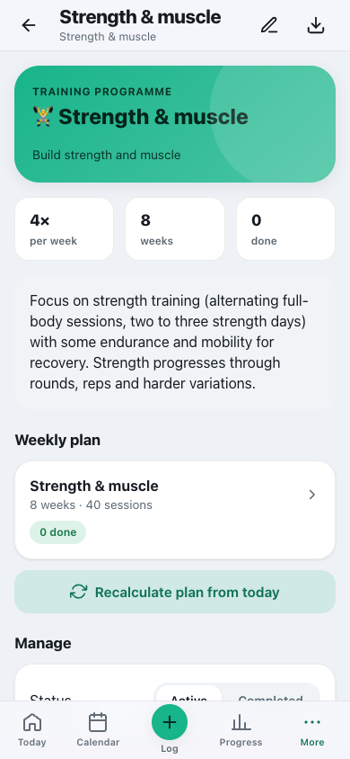
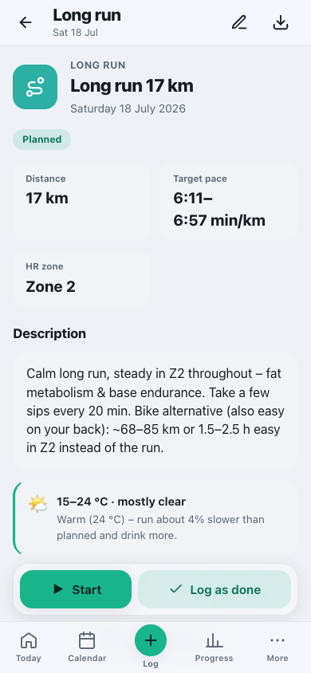
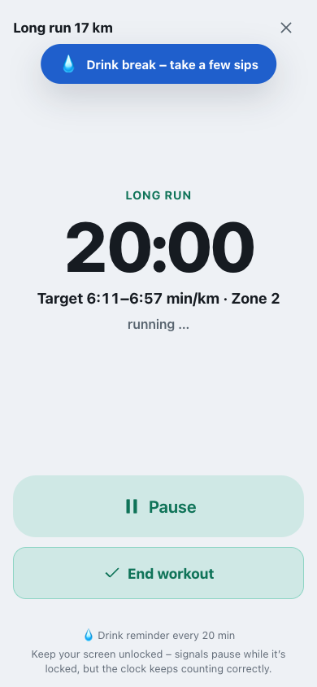
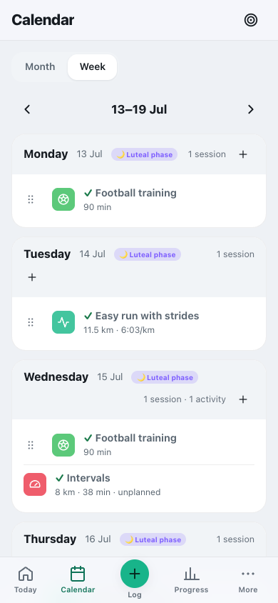
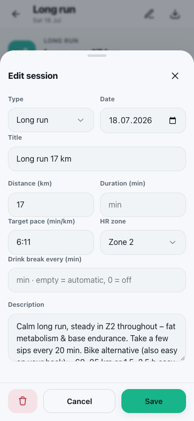
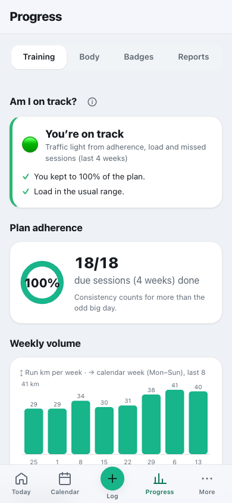
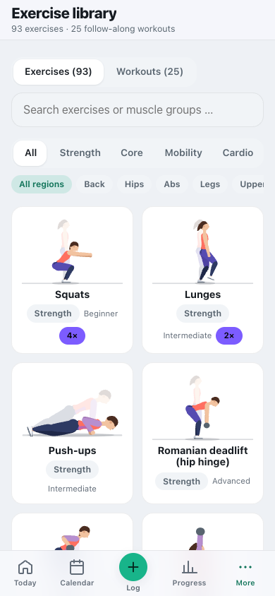
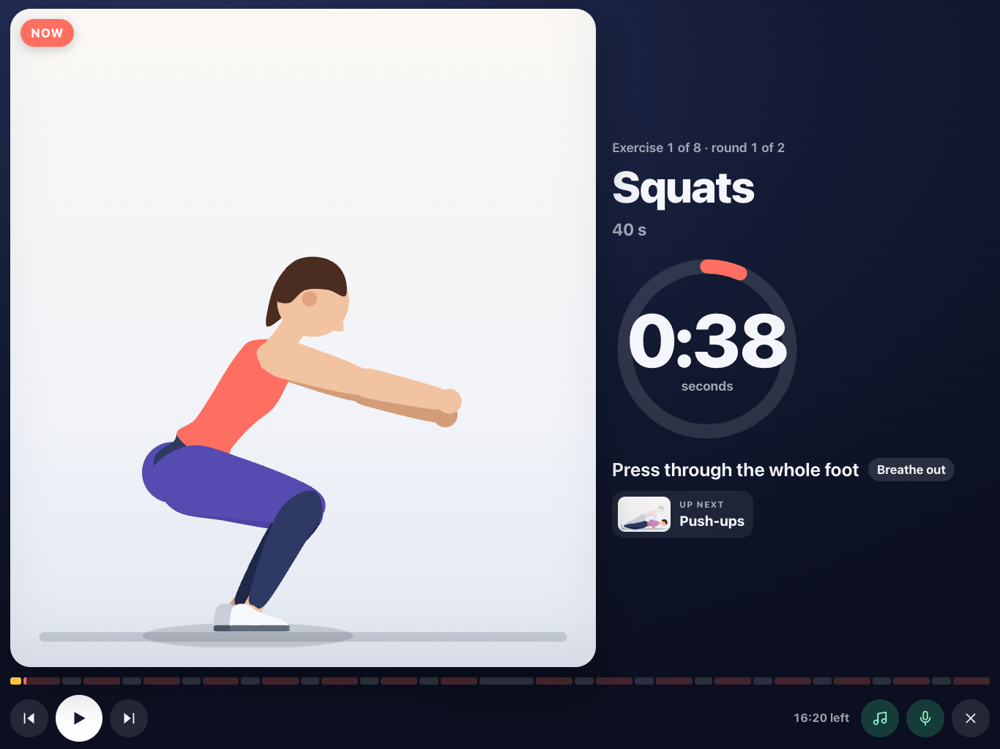
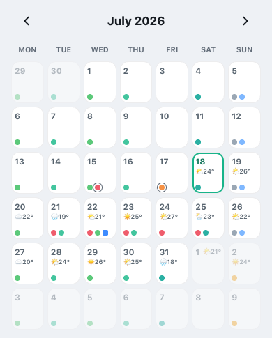

# Plan and do your training

**English** · [Deutsch](../de/usage/training.md)

Races and programmes, the plan, calendar, workout mode, reminders, exercises and weather.

> Part of the [documentation](../README.md) · [All user pages](../README.md#use)

**On this page:**

- [Set up a race & create a plan](#set-up-a-race--create-a-plan)
- [Training programme without a race](#training-programme-without-a-race)
- [Do a training session](#do-a-training-session)
- [Log a training session without a watch](#log-a-training-session-without-a-watch)
- [Import activities from files](#import-activities-from-files)
- [Reschedule a session](#reschedule-a-session)
- [Adjust, add & catch up on sessions](#adjust-add--catch-up-on-sessions)
- [Get reminders on your iPhone](#get-reminders-on-your-iphone)
- [Understand your progress](#understand-your-progress)
- [Exercise library](#exercise-library)
- [Follow along non-stop – with music and voice cues](#follow-along-non-stop--with-music-and-voice-cues)
- [Weather in the plan](#weather-in-the-plan)

---

## Set up a race & create a plan

This is how you set your goal:

1. Open **More → Goals & plans**, tap **“+”** at the top and choose **Race**.
2. Enter **name, date, distance** and **target time** (`h:mm:ss`, e.g. `1:55:00`; a full stop or comma
   also works) and choose the **priority**: **A** – season highlight, the day the plan builds up to;
   **B** – important race; **C** – build-up or fun race. The date is deliberately left empty; if
   something is missing, the app marks the field.
3. **Save** – you land on the goal page with the countdown and target pace.
4. Tap **“Create plan”**. A short set-up asks:
   - **Level** – *Beginner*, *Intermediate* or *Advanced*. The app suggests one based on your last
     four weeks (weekly volume, longest run); you can change it.
   - **Run days per week** – 3 to 6. More days carry more volume; the two key sessions
     (Tuesday, Saturday) never fall on consecutive days.
   - **Fixed commitments** – such as club training or matches. By default there are **none**; you can
     enter them or copy them from another running plan (then they do not appear twice).
   - You also see the **target paces**. They come from your **target time**. If the target time is
     clearly beyond your current form, the app says so – you then train according to your form, while
     race pace stays your goal. Without a target time and without hard runs there are no pace targets yet.
   - If the time until the race is **tight** for your level (e.g. a marathon as a beginner with fewer
     than 18 weeks), the app points it out and names alternatives: a later race, a shorter distance
     or “arriving healthy” without a target time. No plan is created for a race today or in the past.
5. **“Create plan”** – Cat-O-Fit spreads the weeks across the phases
   **Base → Build → Peak → Taper**:
   - The **weekly volume** starts at your current level (lower if you run little) and rises by at
     most 8–12% per week – every **4th week is easier**, and the last two weeks are the **taper**
     (about 70% and 50% of the peak).
   - The **long run** is capped: as a share of the weekly volume, at about 2:30 h (beginners) or
     about 3 h at most, and clearly shorter in the weeks before the race.
   - The **race session** falls on your race day – whether that is a Saturday or Easter Monday. The
     day before is a short shakeout, and two days before is a rest day.
   - **Beginners** training for 5 or 10 km without a running base start with **run/walk intervals**
     (e.g. 6 × 2 min run / 1 min walk) that get longer week by week.
   - **Triathlon and Hyrox** (beta) have their own weeks with a rest day, taper and race format –
     triathlon with swimming, cycling and a brick run, Hyrox with run intervals, strength and
     stations up to a race simulation.

So you do not have to work anything out yourself – the finished plan is ready in seconds and can be
adjusted at any time.

**Recalculate the plan from today.** Via **“…”** at the top of the plan, the app recalculates a running
plan with the current plan logic – with your level and run days, **from today**. Past sessions stay
unchanged: completed, missed (including the reason) and rescheduled ones. Plans from earlier
versions show a card “New plan logic available” for this; nothing changes unless you trigger it.
“Recalculate this week” and saving fixed commitments also leave everything before today untouched.

 

---

## Training programme without a race

You simply want to get **fitter, stronger or healthier** – with no race at all? Then create a
**training programme** instead of a race:

1. Open **More → Goals & plans** → **“+”** → choose **Training programme**.
2. Choose a **focus**:
   - **💪 General fitness** – endurance, strength and mobility following the WHO recommendations:
     endurance grows from about 120 to 150–180 minutes a week (brisk walking counts), plus strength
     on two days.
   - **🏋️ Strength & muscle** – two to three strength days (full body, alternating), complemented by
     endurance and mobility.
   - **⚖️ Weight loss** – plenty of activity (from about 150 to 225–240 minutes a week) plus strength
     on two days; it works together with the **calorie balance**.
   - **🧘 Mobility & health** – a gentle start: mobility, gentle strength and activity that grows to
     150 minutes a week.
3. Set the **training days per week** (3–5) and the **duration** (4, 8 or 12 weeks). Some days have
   two sessions – for example endurance followed by strength.
4. The name is pre-filled with the focus – change it if you like. **Save & create plan** – the weekly
   plan is ready straight away.

The programme **progresses**: endurance gets a little longer week by week (every 4th week is easier),
and strength moves from **getting started** (2 rounds, technique) through **build** (3 rounds, more
repetitions or weight) to **consolidate** (heavier variations). Every session shows its duration and
instructions.

The sessions appear **everywhere as usual**: in the calendar, on “Today”, in the session view
(including **workout mode** with its set counter) and in the statistics. With **“Recalculate plan from
today”** you create the coming weeks afresh – the past and anything already done stays. Via the
status you set a programme to **completed**.

 

---

## Do a training session

Every session has its own page with the **target**: distance, target pace and heart rate zone.

1. Tap **“Today”**, or tap the session in the **calendar** (the ▶ on “Today” starts it directly).
2. Check the target values and tap **“Start”** at the bottom.
3. In **workout mode** the clock runs. For intervals, Cat-O-Fit guides you with sound through
   **warm-up, effort, rest and cool-down**; under the large time you see the **target pace and HR
   zone** of the current phase. Distance intervals (e.g. 8 × 400 m) are converted to time by the app
   using your target pace. In strength training you count sets with a large plus/minus; the **rest
   between sets** runs as a large countdown (tap again to restart it). For every linked exercise you
   enter **repetitions and weight for each set**; above it you see what you managed **last time**, plus
   a progression hint: if you get 12 repetitions in all sets, a little more weight is due next time
   (otherwise increase the repetitions first). The sets then appear in the session summary – with the
   total weight moved. Hold exercises such as the forearm plank or wall sit are counted by time and
   therefore have no set logging.
4. At the end tap **“End workout”** → enter distance, effort (RPE) and feeling → done. To **discard**
   without saving, the app asks once more.

> 📱 **On the iPhone:** if you lock the screen, the signals pause – but the time keeps running
> correctly, and when you unlock, the display jumps to the current phase. Sounds only play with the
> silent switch off; Safari cannot vibrate. It is best to switch off auto-lock for your workout.

### Drink breaks on the long run

On long runs Cat-O-Fit reminds you **to drink automatically** – with a banner and a sound and, where
the device can, vibration (long run every 20 minutes, race/bike ride every 25 minutes).
Tap the banner to confirm. You can set the **interval per session** yourself in the edit dialog under
**“Drink break every (min)”** (empty = automatic, 0 = off).

**Varied intervals.** Besides even intervals (e.g. 6 × 800 m), the plan mixes in **pyramids** (peak
phase, 1–2–3–4–3–2–1 min) and **fartlek** (build phase, e.g. 8 × 1 min fast / 1 min easy). In fartlek
the “rest” is easy **continued running** (float), not a stop – workout mode guides you with sound
through the changing sections.

The screen stays on during training, and your progress is saved continuously – even if the training is
interrupted, nothing is lost.

> 💡 **Tip:** small sips often are better than a lot rarely.

 

---

## Log a training session without a watch

You ran without your phone? No problem:

1. Open the session (via “Today”, the calendar or the plan).
2. Tap **“Log as done”** in the bar at the bottom (it stays visible while you scroll; next to it,
   **“Start”** starts workout mode – the ▶ on “Today” starts it directly, too).
3. Enter what you know – distance, duration in **minutes and seconds**, effort, feeling.
   **Everything is optional.** The effort scale (RPE) names its steps: 1 very light · 3 easy ·
   5 medium · 7 hard · 10 maximal.

Cat-O-Fit links this automatically to the planned session and shows you the **planned-vs-actual
comparison**. It is honest in both directions: running an **easy run far too fast** does not count as
“Target largely hit” – easy runs work when they stay easy. For **intervals and tempo blocks** the app
does not judge the pace by the average of the whole session (warm-up, cool-down and jogging breaks
would distort it); in a **race**, what counts is whether you held your race pace.

**Log a training without a plan.** A spontaneous bike ride, a run on a rest day or training with no
goal at all: tap **＋ Log → Training**, on “Today” tap **“Log activity”**, or in the **calendar** (week
view) tap the **“+”** in the day header.
Choose the sport, date, duration, distance, heart rate and effort. If a matching planned session (same
sport) falls on that day, the app offers to link the training to it – otherwise a **free training**
is created. Free trainings appear in the calendar (month: a dot with a ring, week: a row of their own),
on “Today” and in the statistics under **“Sessions without a plan”**; there you can open, edit and
delete them.

---

## Import activities from files

Under **Progress → Body** → “Health import” icon (top right), or **Settings → Data & backup** →
“Apple Health & file import”, you import recordings from your watch in the **“Activities from files”**
section – everything is read **on your device**:

- **Single files:** GPX, TCX or **FIT** (the format of Garmin, COROS, Polar, Suunto, Wahoo …).
  The app shows the detected activity for confirmation – with sport, moving time, distance,
  heart rate, elevation gain and route.
- **Whole exports:** several files at once or a ZIP – such as the Garmin data export (the
  activities are in `DI_CONNECT/DI-Connect-Uploaded-Files`, also as a ZIP inside a ZIP) or the
  Strava archive (folder `activities` with `.fit.gz`/`.gpx`). Beforehand you see how many activities of
  which sport were detected and how many already exist.

Duplicate activities (same day, distance ± 400 m, duration ± 90 s) are skipped. If an activity matches
a **planned session** on the same day and of the same sport, that session counts as done.
If the file has no sport, the app estimates it from the speed (from 18 km/h, cycling).

**Route without a map service:** the summary of a session shows the route as a line with an
**elevation profile** and **elevation gain** – drawn by the app itself, without map tiles from a
third-party service. A simplified line is stored (at most 150 points); with bulk imports only for
the last 90 days, so the device storage does not fill up.

**How hard was it?** Files and watches do not know how it felt. If the effort is missing, the app
estimates it from your heart rate, and “Today” briefly asks about freshly imported trainings – one
tap on “light”, “medium”, “hard” or “very hard” is enough (see
[Coach & load](coach-and-load.md#checking-whether-your-load-is-healthy)).

---

## Reschedule a session

Life gets in the way – simply move sessions:

1. Open the **calendar** and switch to **“Week”** at the top.
2. Drag a session by its **handle ⠿** to another day – the week scrolls along at the edge of the
   screen. If there is already a session on that day, or a demanding one next to it, the app asks
   first; afterwards a notice offers **“Undo”**.
3. Alternatively: tap the handle, or open the session → **“Reschedule”**. The quick choices
   **“Tomorrow”**, **“Day after tomorrow”** or **“Next free day”** save you the date dialog.

The plan remembers the move; in the statistics your plan adherence stays traceable.

**Appointments in the calendar.** If you enter an appointment with a date in the **checklist**
(e.g. a doctor’s appointment or an errand), it appears in the calendar automatically: in the **week
view** as a row of its own with time and category, in the **month view** as a small **square** dot
(the round dots are training sessions). Tapping the appointment takes you to the checklist to tick it
off or edit it.

**Gentle notice.** If, in the “Reschedule” dialog, you pick a day that **already has a session**, or
one **right next to** a demanding session (tempo, intervals, strength, long run), Cat-O-Fit points
it out – so recovery does not get lost. The notice **blocks nothing**: you can still move the session
if you like.

 

---

## Adjust, add & catch up on sessions

Your plan belongs to you – adjust it whenever you like:

1. Open a session and tap the **pencil icon** at the top. You can edit the **type** (e.g. Easy →
   Tempo), **target pace**, **HR zone**, **distance/duration**, the **interval structure** (rounds ×
   work/rest, which directly drives workout mode) and the description.
2. With the **“+”** in the training plan you create a **brand-new session**. Besides the running and
   strength types there are also **Practice match** (⚑) and **Training camp** (🔥) – ideal for
   entering a match or an intense weekend. These count as **demanding** and feed into the load and
   recovery notices.
3. In the edit dialog you can also **delete** a session.

**Weekly load in view.** If you create a session yourself and a **similarly intense**, still open
session is already in **the same week**, Cat-O-Fit asks whether you want to take that one out of the
plan – so the weekly load does not creep up unnoticed. This is only a suggestion: **“Remove from
plan”** balances it out, **“Keep both”** leaves everything as it is.

**Recalculate one week.** Has something fundamentally changed for a particular week (e.g. start of the
season, a training camp or a longer break)? In the plan’s **“Weeks at a glance”**, **“Recalculate this
week”** sets up exactly this one week afresh. **Trainings you have already done are kept**; rescheduled
or manually changed sessions of this week are replaced.

**Overdue?** Past sessions you have not done are automatically marked **“Overdue”** (calendar, plan,
session). On “Today”, a notice reminds you to reschedule, log or tick them off – without any
finger-wagging.

**Catch up on a key session.** If you have marked a **demanding** session (tempo, intervals, long run,
strength) as **missed**, “Today” suggests a **free day** next week and, if you like, makes it up
there – so an important stimulus does not get lost for nothing. The target day is chosen so that no
two hard sessions land directly next to each other.

 

---

## Get reminders on your iPhone

The most reliable way on iPhone/iPad is the **native calendar**:

1. In the session, tap the download icon **“Add to calendar (.ics)”** at the top – in the plan, under
   **“…” → “Add to calendar (.ics)”**.
2. Choose **“Complete plan”**, **“This session”** or **“Race only”**.
3. The **.ics file** opens in the iOS calendar – including a reminder **1 hour before** and **on the
   evening before**, with a link back to the app.

> In-app notices only work while the app is open. For reliable reminders, the calendar export is the
> right way.

### Subscribe to the calendar

Instead of opening individual files, your calendar can **subscribe** to a whole plan – all sessions
and the race – and then fetches changes by itself. What you subscribe to is always a plan, not the
app’s calendar:

1. **More → Goals & plans** → open a race or programme → tap the download icon
   **“Export”** at the top – or in the plan **“…” → “Add to calendar (.ics)”**.
2. In the “Export to calendar” window, tap **“Copy subscription link”**. The button only appears with
   a connection to the server and after you have signed in with your PIN.
3. Paste the link into your calendar as a subscription:

| Calendar | How |
|---|---|
| iPhone/iPad | Calendar app → “Calendars” → “Add Calendar” → “Add Subscription Calendar” |
| Mac | Calendar → File → “New Calendar Subscription” |
| Google | in a browser on a computer, click **+** next to “Other calendars” → “From URL” (this is not possible in the Google app) |
| Outlook | “Add calendar” → “Subscribe from web” |

> **Only reachable on your home network?** iCloud, Google and Outlook fetch subscriptions over the
> internet – they cannot subscribe to a server they cannot reach. In that case set the subscription up
> directly on the device: on the iPhone via iOS Settings → Apps → Calendar → Calendar Accounts → Add
> Account → Other → “Add Subscribed Calendar”, on the Mac with “Location: On My Mac”. If a sign-in is
> placed in front (Basic Auth), on the iPhone you enter the username and password there; Google and
> Outlook cannot do that.

The link points to the server you copy it from and contains your **personal calendar key** – everyone
gets their own. Anyone who knows it can read the appointments, so share it only with people who are
allowed to see your plan. Calendars poll subscriptions on their own schedule; with Outlook a change
can take over 24 hours, according to Microsoft. Links from versions before 3.20.0 (without a key)
remain valid until 30 November 2026; after that, set the subscription up once more.

---

## Understand your progress

Under **Progress → Training** you see at a glance where you stand:

- **Traffic light “Am I on track?”:** right at the top – green, amber or red, with reasons. It
  combines plan adherence and training load over the last four weeks into one status. In your first
  four weeks it does not rate the load yet (“Your data is still growing”), and absences due to illness
  or injury never colour it.
- **Plan adherence:** how many due sessions you completed in the rolling 4-week window. A session
  is due once its day has passed – today’s counts only once you have done it. Absences due to illness
  or injury and protected cycle days do not count. The same calculation appears on the race and
  programme page, in the badges and in the monthly report.
- **Weekly volume & training load:** **run kilometres** per week and for 7 and 28 days – running only;
  cycling, walking, hiking and swimming do not count here. In addition the **load points** (minutes ×
  effort) across **all sports** – so strength, football, cycling or a practice match count too.
- **Training year:** a **heatmap** of the last 12 months in GitHub style – weeks × weekdays, the
  darker a day, the more training time. Tap/hover shows the date and minutes; a counter gives your
  number of **active days**.
- **Missed sessions:** broken down by reason (Injured/Ill/No time/Other). Absences due to injury
  or illness do not count against your adherence.
- **Sessions by type:** the mix of your training types.
- **Metrics & goals:** weight, weekly volume, easy pace, resting heart rate and VO₂max – each with a trend
  arrow (↑/↓/→) and the label **maintain** or **improve**, weight towards your target weight. The
  **easy pace** only counts runs whose heart rate was in the base zone (Z2) – faster is only better
  if the run was also easy. Without HR zones you see the value but no verdict.
- **Race prediction:** an estimate of your possible time from your current form, smoothed over
  several weeks – so a single good (or bad) run does not shift it.

Everything is meant as **guidance** – not promises, but reference points. Consistency counts for
more than the odd big day.

 

---

## Exercise library

Under **More → Exercise library** you find **93 exercises** for **strength, core, mobility, cardio
and prevention** – to accompany the strength and mobility sessions of your plan: from squats,
push-ups and deadlifts, through Hyrox exercises such as wall balls, kettlebell swings and farmer’s
carry, to stretches for the back and hips and the most important **prevention exercises for running
and football** (Nordic hamstring curl, Copenhagen side plank, clamshells, monster walk, bent-knee
calf raises, running drills, pogo jumps and the **FIFA 11+ football warm-up**).

- **Every exercise is animated.** A drawn instructor shows the movement **in the rhythm of the
  exercise** – for example lowering slowly, holding briefly, pushing up briskly. The working muscles
  light up in the colour of the category; at the top you see the current phase (“Lower”, “Hold” …)
  and, for one-sided exercises, the side.
- **Follow along:** in the detail view you set repetitions (seconds for hold exercises) and sets and
  tap **“Follow along”**. The animation counts along (“Set 1 of 3 · rep 4 of 12”), shows a short
  **technique cue** and when to **breathe in and out**, keeps the rest between sets and shows you
  when to **switch sides**. **“Slow”** slows the rhythm down for learning, **“Sound”** gives it
  audibly – so you do not have to keep looking at the display; that also works when the iPhone or
  iPad is on silent. The screen stays on, and at the end the exercise automatically counts as done.
- There is also a **step-by-step guide**, the **muscle groups** worked, the **equipment** needed, the
  **difficulty**, a **tip**, how to **progress**, and when to be **cautious**.
- If **Reduce Motion** is switched on in your device settings, you see a still image of the start and
  end pose; tapping it plays the animation.
- At the top you can **search** (name, muscle group or an everyday name such as “press-ups”), filter by
  **category** (Strength/Core/Mobility/Cardio) **and** additionally by **body region**
  (Back · Hips · Abs · Legs · Upper body).
- **Football sessions** suggest the FIFA 11+ warm-up and the prevention exercises.
- Every exercise shows a **usage counter** (“used 3×”) – how often you have done it. In the detail view
  you count up with **“Done (+1)”**; it also counts automatically when you have followed along or
  completed a session linked to it.
- **In a training session:** if the description of a session names exercises (“Squats 12× · Push-ups
  8–12× · Plank 30–45 s”), exactly those are listed first – marked **“in your plan”** and in the order of
  the description. Below them come matching suggestions, **sorted by how often you use them**. With
  **“+”** you attach an exercise to the session; when you complete it, it then counts automatically.
  Tap an exercise to see it animated and follow along. The exercises also stay reachable **during the
  workout** (a panel under the clock that you can expand and collapse).

> The animations are deliberately schematic – they show the sequence and rhythm of the basic movement
> and do not replace individual instruction. If you have pain or are unsure, get proper guidance.

 

---

## Follow along non-stop – with music and voice cues

Instead of tapping through exercise by exercise, you play a whole session **in one go** – like a video
to follow along with, meant for an iPad or phone a metre or two away on the floor:

- **From the plan:** in every strength and mobility session, **“Follow along non-stop · ≈ … min”**
  appears above the exercises. The app takes what the description specifies – “Squats 12× · Plank
  30–45 s · 3 rounds · 60–90 s rest” – and appends exercises you added with “+” at the end.
- **Ready-made workouts:** besides the exercises, the exercise library has a catalogue of its own,
  **Workouts** – with search, filters (Strength, Core, Mobility, Cardio, Running & football),
  duration, difficulty and the equipment needed. They include full body without equipment, upper
  body, dumbbells, kettlebell, Hyrox strength, glutes & legs, abs, Tabata, cardio without jumping,
  morning mobility, free hips, shoulders & neck, an evening routine, stretching after a run, running
  drills, feet & calves and football injury prevention – each with fixed work and rest times.

Before the start you see all exercises with amount and duration and set the **rounds** and **rest**.
Then **“Let’s go”** – after that you do not have to tap anything:

- The instructor demonstrates every exercise **in rhythm**; beside her, large, you see the name,
  repetition or time left, a short technique cue and the breathing, with **“Up next”** underneath
  showing the next exercise.
- During the **rest** you already see what is coming (with a trial repetition, or the way into the
  position); one-sided exercises get a **switch of sides** of their own, and between the rounds there
  is a longer rest.
- **Music:** a beat that fits the exercise – strong for strength, calmer for core, spacious for
  mobility, driving for cardio – quieter during the rest, building up shortly before the start. The
  tempo follows the movement: **every movement – down, hold, up – lands on the beat**. The music is
  generated on the device, without files or a streaming service.
- **“Own music”** lets e.g. Spotify keep playing; voice cues and count-in tones come on top. For that,
  the device must not be on silent.
- **Voice cues** come during the rests: the next exercise with its amount, the switch of sides, the
  next round. They are recorded speech and play the same way as the music – even on silent and without
  the music breaking off. **During the exercise, tones guide you:** three tones count down every
  start, the last three repetitions or seconds tick, a double tone says “10 seconds left”, and a low
  tone ends the exercise.
- Tapping shows the control bar: **pause**, **back**, **forward**, music and voice cues on/off, end
  session. The bar below it shows all sections – tapping jumps there. The screen stays on.
- At the end all exercises count as done. If the session came from a planned session, **“Log as done”**
  records the session straight away with the actual duration.

> Tip: stand the iPad in landscape – then the instructor is large on the left and everything
> important on the right.

---

## Weather in the plan

Set your **location** in the settings (**Settings → “Location & weather”**, search for your city). For
ambiguous names (Neustadt, Frankfurt, Halle) you choose from up to five matches with region and
country. The calendar then shows small **weather icons with the temperature** for the coming ~16 days.

In **heat, rain, storms or thunderstorms** you get a suitable **note** in the running session
concerned – e.g. “run early or late, drink plenty”. From 24 °C it gives a concrete **pace
correction**: roughly 0.4% slower per degree above 15 °C (so about 6% at 30 °C, 8% at most). That
way you plan with the weather in mind. Conversely, the form estimate no longer treats **hilly runs**
as weak: every metre climbed counts like 6 m on the flat once there are more than 5 m per km.

The data comes from **Open-Meteo** (no sign-up; your device queries it with the place or coordinates).
Without internet the last loaded data stays in place – the app keeps working normally.

 
